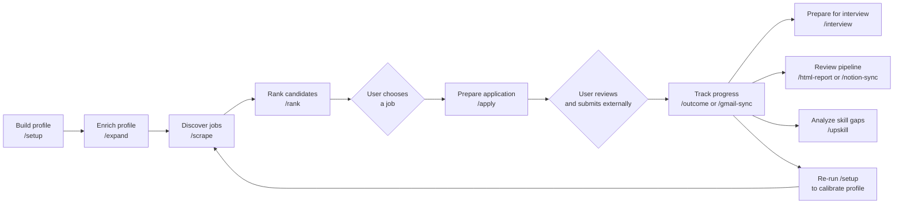
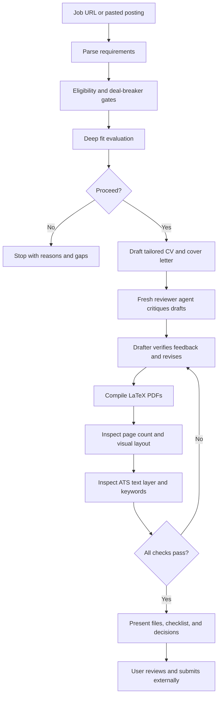
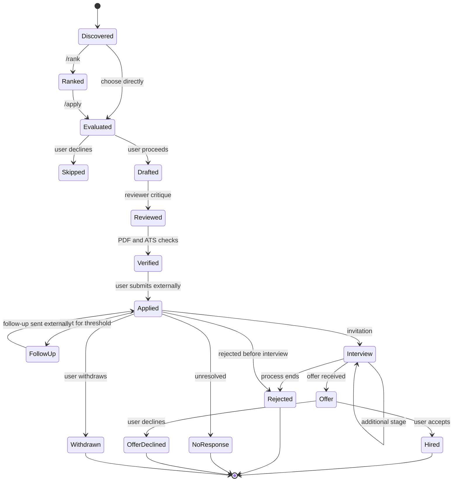
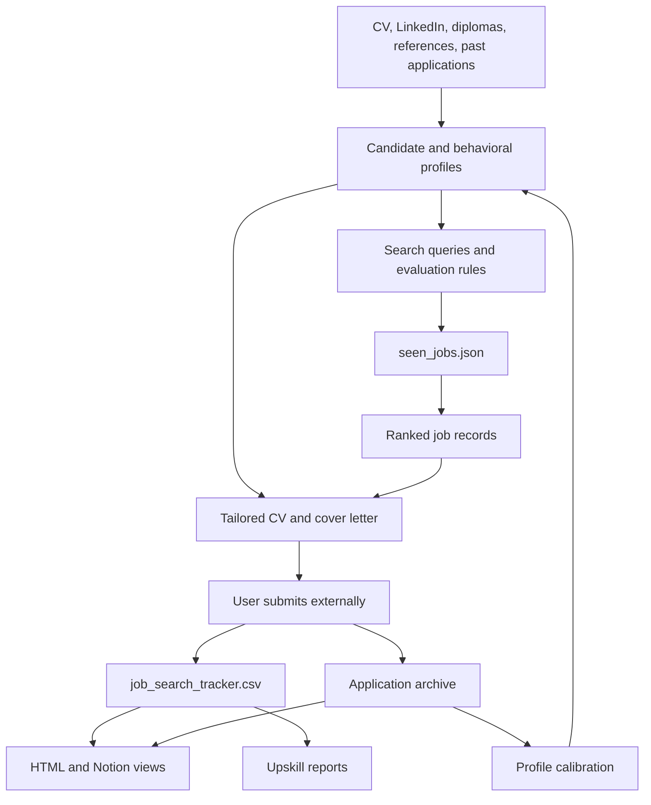

# AI-Driven Job Search: Inherited Repository Functions and User Journeys

**Repository:** [`xzhnshng/ai-job-search`](https://github.com/xzhnshng/ai-job-search)
**Analyzed revision:** `aa7c7073990492c9111fbdda48f6adde24a1d91b`
**Document date:** 2026-07-24

## 1. Purpose

This document describes the repository from a user and product perspective:

- what functions it provides;
- what each function needs;
- what each function produces or changes;
- where the user must make a decision;
- how the functions connect into complete user journeys.

For implementation details, see [Technical Deep Analysis and Understanding Guide](technical-deep-analysis.md). For gaps relative to the customized product vision, see [Discovery Findings](discovery-findings.md).

## 2. Product summary

The inherited AI Job Search repository is a local job-search workspace
operated through an AI coding agent, primarily Claude Code. It is the
foundation being adapted into the Codex-first AI-Driven Job Search product.

It helps a candidate:

1. build a detailed professional profile;
2. discover jobs from supported portals;
3. rank jobs by fit;
4. assess one job in depth;
5. prepare a tailored CV and cover letter;
6. have a second agent review the application;
7. verify the final PDFs and ATS-readable text;
8. track applications and outcomes;
9. prepare for interviews;
10. identify recurring skill gaps;
11. view the pipeline through local or external dashboards.

The repository is designed for high-quality, human-reviewed applications. It does not automatically submit applications.

## 3. Main user loop



The system also supports a shorter journey when the user already has a job posting:

```text
job URL or pasted posting → /apply → fit evaluation → user approval
→ tailored application → reviewer critique → PDF/ATS checks → user submission
```

## 4. Function catalog

The functions fall into six groups:

1. profile and strategy;
2. job discovery and prioritization;
3. application preparation;
4. application tracking and interviews;
5. reporting and learning;
6. framework customization and maintenance.

## 5. Profile and strategy functions

### 5.1 `/setup`

**Purpose**

Build or update the complete candidate profile used by every later function.

**Ways to use it**

```text
/setup
/setup --section search
/setup --section <profile-section>
```

**Input paths**

The command offers three onboarding paths:

1. read files already placed under `documents/`;
2. import a single pasted CV;
3. interview the user section by section.

**Information collected**

- identity and contact information;
- location, commute, relocation, and work-authorization constraints;
- education;
- professional experience;
- technical skills;
- projects;
- publications and awards;
- behavioral traits and preferred work environment;
- writing style;
- career goals;
- target roles and sectors;
- tasks that energize or drain the candidate;
- deal-breakers;
- CV language;
- job-search locations, queries, and portals;
- STAR interview examples.

**Outputs**

The command populates or updates:

- `CLAUDE.md`;
- `.claude/skills/job-application-assistant/01-candidate-profile.md`;
- `.claude/skills/job-application-assistant/02-behavioral-profile.md`;
- `.claude/skills/job-application-assistant/04-job-evaluation.md`;
- `.claude/skills/job-application-assistant/05-cv-templates.md`;
- `.claude/skills/job-application-assistant/07-interview-prep.md`;
- `cv/main_example.tex`;
- `.claude/skills/job-scraper/search-queries.md`.

**User decisions**

- choose the onboarding path;
- resolve conflicting facts found across documents;
- approve additive changes;
- answer missing profile questions;
- confirm job-search priorities.

**Important behavior**

- Document-folder mode is designed to be safe to rerun.
- Existing information is not silently overwritten when conflicts are found.
- Outcomes from prior applications can be used to recalibrate fit preferences.

### 5.2 `/expand`

**Purpose**

Find professional competencies that are not obvious in the current CV or profile.

**Sources scanned**

- files under `documents/`;
- GitHub profile and repositories;
- portfolio or personal site;
- Kaggle;
- Google Scholar;
- ResearchGate;
- course and certification pages;
- public links already present in the profile.

**Processing**

For each source, the command combines:

- direct evidence, such as a framework named in a repository README;
- inferred competencies, such as system-design skills implied by a project.

**Outputs**

A proposed competency map grouped into:

- primary technical skills;
- secondary technical skills;
- domain knowledge;
- methods and engineering practices;
- behavioral signals.

Confirmed additions are written to the candidate and behavioral profiles with source annotations.

**User decisions**

The user can:

- add everything;
- review one source group at a time;
- skip named groups;
- cancel without writing.

**Guardrail**

Inferred behavioral claims are labeled as inferred. They are not silently treated as established facts.

## 6. Job discovery and prioritization functions

### 6.1 `/scrape`

**Purpose**

Search all enabled job portals for new roles matching the candidate’s configured queries.

**Ways to use it**

```text
/scrape
/scrape broad
/scrape data science
/scrape health
/scrape health <portal>
```

**Inputs**

- candidate search configuration;
- role and skill queries;
- location settings;
- installed portal skills;
- previously seen jobs;
- already tracked applications.

**Current portal coverage**

- FreeHire, a multi-market technical job aggregator;
- LinkedIn public job listings;
- Akademikernes Jobbank;
- Jobdanmark;
- Jobindex;
- Jobnet.

The last four are focused on Denmark.

**Processing**

1. discover enabled portal skills;
2. run portal searches, preferably in parallel;
3. fetch detail for promising results;
4. remove jobs already seen or already applied to;
5. consolidate identical postings across multiple locations;
6. assign a quick high, medium, or low fit signal;
7. check whether portal parsers appear healthy;
8. store discovery state.

**Output**

A table of new jobs with:

- quick fit;
- title;
- company;
- location;
- deadline;
- link;
- high-fit explanations;
- possible red flags;
- LinkedIn recruiter and team-member search links.

**State changed**

`job_scraper/seen_jobs.json` is updated with all fetched job keys so later searches can deduplicate them.

**User decisions**

- choose a result for detailed evaluation;
- run `/rank` when many jobs were found;
- disable a degraded portal after confirmation;
- ignore low-value results.

**What it does not do**

- It does not create a full resume for every result.
- It does not perform deep company research.
- It does not submit applications.

### 6.2 `/rank`

**Purpose**

Turn a potentially large scrape result into an explainable shortlist.

**Ways to use it**

```text
/rank
/rank distributed systems
/rank --top 10
/rank --all
```

**Inputs**

- new or selected entries from `job_scraper/seen_jobs.json`;
- the candidate profile;
- behavioral preferences;
- evaluation weights;
- location and legal constraints;
- deal-breakers.

**Processing**

Parallel agents fetch and score small batches of jobs. Each job is evaluated for:

- technical match;
- experience match;
- behavioral/culture alignment;
- career alignment;
- location/logistics;
- work eligibility;
- deadline urgency.

The numeric score uses:

```text
30% technical
25% experience
15% behavioral
30% career alignment
```

Location failures and eligibility failures can exclude a job regardless of score.

**Outputs**

- ranked shortlist;
- score and verdict for each job;
- strongest reasons for the top choices;
- honest gaps;
- below-threshold results;
- excluded or expired results;
- deadline warnings.

**State changed**

Rank fields are added to `job_scraper/seen_jobs.json`.

**State not changed**

`job_search_tracker.csv` is not updated because ranking is not the same as applying.

**User decisions**

- select a job for `/apply`;
- change the shortlist size;
- rerank after the profile changes;
- reconsider the evaluation framework if rankings feel systematically wrong.

### 6.3 Individual portal search skills

The portal skills can also be used directly when a user wants a source-specific search.

| Skill | Primary use |
|---|---|
| `freehire-search` | Technical roles across multiple markets and remote locations |
| `linkedin-search` | General job search in an explicitly supplied location |
| `jobbank-search` | Academic and highly educated jobs in Denmark |
| `jobdanmark-search` | General Danish job listings |
| `jobindex-search` | Danish job listings and individual posting lookup |
| `jobnet-search` | Official Danish government employment portal |

Direct portal use returns job results or posting detail. The `/scrape` skill is the higher-level coordinator that combines all enabled sources and manages deduplication.

## 7. Application preparation functions

### 7.1 Job fit evaluation

Fit evaluation can run:

- by itself when the user asks to evaluate a posting;
- as the first stage of `/apply`;
- in a lighter form during `/scrape`;
- in batch-triage form during `/rank`.

**Deep evaluation includes**

- citizenship, residency, visa, and clearance eligibility;
- technical match;
- relevant experience;
- behavioral and culture fit;
- location and travel;
- career direction and motivation;
- optional salary benchmark;
- strengths;
- gaps;
- recommendation to apply or skip;
- whether calling the employer could clarify important questions.

**Output**

A score table and verdict:

- strong fit;
- good fit;
- moderate fit;
- weak fit;
- poor fit.

The user sees the evaluation before application documents are finalized.

### 7.2 `/apply`

**Purpose**

Prepare one complete, tailored, reviewed, and verified job application.

**Ways to use it**

```text
/apply https://example.com/job
/apply <pasted job description>
```

**Inputs**

- job posting URL or full posting text;
- candidate profile;
- behavioral profile;
- writing style;
- job-evaluation rules;
- master CV;
- CV and cover-letter templates;
- existing verified candidate facts.

**Journey inside `/apply`**



**Generated files**

- `cv/main_<company>_<role>.tex`;
- `cv/main_<company>_<role>.pdf`;
- `cover_letters/cover_<company>_<role>.tex`;
- `cover_letters/cover_<company>_<role>.pdf`.

**Reviewer function**

A second agent:

- independently researches the company;
- compares claims against candidate sources;
- finds missed requirements;
- identifies generic or passive writing;
- checks candidate voice and behavioral fit;
- returns exact replacement edits and narrative recommendations.

The original drafter decides which suggestions to accept. Unsupported suggestions are rejected.

**Quality checks**

The command requires:

- all factual claims grounded in profile sources;
- correct names, dates, metrics, and contact information;
- coverage or honest acknowledgment of every requirement;
- two-page CV;
- one-page cover letter;
- no broken LaTeX layout;
- visual PDF inspection;
- ATS-readable contact details and reading order;
- truthful keyword coverage;
- no invented skills.

**User decisions**

- decide whether to continue after fit evaluation;
- review warnings about weak or stretched claims;
- inspect the final files;
- edit if desired;
- submit through the employer’s normal channel.

**What it does not do**

- log into a job portal;
- fill application forms;
- answer employer screening questions;
- send email;
- click Submit.

### 7.3 Standalone application-assistant functions

The application skill can also handle smaller requests:

- evaluate a job only;
- create or update a CV only;
- create a cover letter only;
- discuss career strategy;
- prepare interview talking points.

These are useful when the user does not want the complete `/apply` workflow.

## 8. Application tracking and interview functions

### 8.1 `/outcome`

**Purpose**

Record what happened after the candidate applied.

**Ways to use it**

```text
/outcome <company>
/outcome <company> <role>
/outcome followup
```

**Statuses and events**

- applied;
- interview invitation;
- interview stages;
- assessment;
- offer;
- hired;
- rejected;
- no response;
- offer declined;
- withdrawn.

**Processing**

1. identify or create the tracker record;
2. collect the event and date;
3. archive the posting and submitted documents;
4. create or update `outcome.md`;
5. update the application tracker;
6. preserve previous notes;
7. suggest profile calibration after enough outcomes exist.

**Outputs**

- updated `job_search_tracker.csv`;
- `documents/applications/<company>_<role>/outcome.md`;
- archived CV, cover letter, and posting where available.

**Follow-up mode**

The command can find applications that have been quiet for a configured period and draft a follow-up.

Guardrails:

- draft only;
- never send;
- use only claims already present in submitted material;
- limit follow-ups to two per application;
- save each draft in the application archive.

### 8.2 `/gmail-sync`

**Purpose**

Find application-status signals in the user’s connected Gmail account.

**Prerequisite**

The Gmail connector must be available.

**Signals classified**

- interview invitation;
- assessment;
- next round;
- final round;
- offer;
- rejection;
- noise or acknowledgment;
- conflicting signal.

**Journey**

1. load open tracked applications;
2. search relevant Gmail threads;
3. ignore previously processed messages;
4. read full message bodies;
5. match messages to applications;
6. present one batch of proposed changes;
7. wait for user approval;
8. update only approved tracker and outcome records;
9. remember processed message IDs.

**User decisions**

- approve all proposals;
- skip selected proposals;
- manually resolve ambiguous cases;
- decide whether an offer became a hire or was declined.

**Guardrail**

It never writes a proposed status before approval. Every proposal cites its source email.

### 8.3 `/interview`

**Purpose**

Prepare for a specific interview using the exact application materials the employer received.

**Ways to use it**

```text
/interview
/interview <company>
/interview <company> <role>
```

**Inputs**

- tracked application;
- original posting;
- submitted CV;
- submitted cover letter;
- previous interview notes;
- STAR story library;
- company and interviewer research.

**Outputs**

A stage-specific preparation pack containing:

- likely questions;
- STAR-answer mapping;
- consistency reminders;
- customized answers for weak areas;
- questions to ask the interviewer;
- logistics and talking points;
- optional mock-interview flow.

**Saved file**

`documents/applications/<company>_<role>/interview_prep_<stage>.md`

Earlier stage packs remain as history.

**Guardrail**

The prepared answers must remain consistent with the submitted application. Missing experience is handled with honest bridge answers, not fabrication.

## 9. Reporting and learning functions

### 9.1 `/html-report`

**Purpose**

Generate a detailed offline dashboard of the application pipeline.

**Input**

- `job_search_tracker.csv`;
- application `outcome.md` files.

**Output**

`reports/application-dashboard.html`

**Dashboard content**

- headline statistics;
- application-status breakdown;
- sector breakdown;
- channel breakdown;
- funnel visualization;
- filterable application table;
- interview-stage information.

The report is one self-contained HTML file with inline CSS, JavaScript, and SVG charts. It needs no server or internet connection.

### 9.2 `/notion-sync`

**Purpose**

Publish a glanceable view of ranked jobs and tracked applications to Notion.

**Prerequisite**

The official Notion connector must be connected.

**Default scope**

- ranked jobs scoring at least 60;
- all tracked applications.

**Output**

- one Notion database row per job;
- a briefing page for newly created rows;
- current status, score, deadline, and application metadata.

**Data direction**

```text
local repository → Notion
```

Nothing flows from Notion back into the repository.

**Privacy rule**

CV and cover-letter bodies are never uploaded. Notion receives filenames only.

### 9.3 `/upskill`

**Purpose**

Find the most valuable skill gaps across target jobs and build a learning plan.

**Ways to use it**

```text
/upskill
/upskill <job-posting-url>
```

**Aggregate mode**

Analyzes tracked jobs and weights recurring gaps using fit scores.

**Targeted mode**

Analyzes one posting and ignores the tracker.

**Outputs**

- hard-skill gap list;
- domain, tooling, soft-skill, and credential gaps;
- priority heatmap;
- current learning resources;
- tailored study direction;
- estimated study time;
- dependency-aware study order;
- changes since the prior report.

**Saved files**

```text
upskill/report-YYYY-MM-DD.md
upskill/report-YYYY-MM-DD-<company>-<role>.md
```

## 10. Framework customization and maintenance

### 10.1 `/add-portal`

**Purpose**

Add a job board that is not already supported.

**Journey**

1. collect portal URL, market, language, and expected filters;
2. investigate search and detail mechanisms;
3. review access restrictions and terms;
4. identify stable parsing anchors;
5. scaffold a portable portal skill and TypeScript CLI;
6. write interface and URL-reference documentation;
7. test a live query;
8. register it for automatic discovery by `/scrape`.

**Output**

```text
.agents/skills/<portal-name>/
├── SKILL.md
├── url-reference.md
└── cli/
```

**Guardrails**

- authentication-walled portals should be declined;
- restrictive terms must be documented;
- the integration must return real data before registration.

### 10.2 `/add-template`

**Purpose**

Register a custom LaTeX CV or cover-letter template.

**Ways to use it**

```text
/add-template
/add-template --list
/add-template --use <name>
/add-template --use default
```

**Processing**

- identify template type;
- collect source files;
- capture compile engine, fonts, style rules, and page limit;
- replace personal content with placeholders;
- store a template skeleton and manifest;
- perform a mandatory test compilation;
- update the active application instructions.

**Output**

```text
templates/cv/<name>/
templates/cover_letters/<name>/
```

### 10.3 `/reset`

**Purpose**

Clear personal profile data or imported documents and return to a blank template state.

**Ways to use it**

```text
/reset profile
/reset documents
/reset all
```

**Safety behavior**

1. show exactly what will be cleared;
2. preserve framework source and tools;
3. require the user to type `RESET`;
4. perform only the selected scope;
5. report what changed and what remained.

## 11. User journey 1: first-time setup

**User goal**

Turn a new fork into a personalized job-search workspace.

**Preconditions**

- repository cloned;
- AI agent available;
- optional source documents copied under `documents/`.

**Journey**

1. User opens the repository in Claude Code.
2. User runs `/setup`.
3. The system detects whether source documents exist.
4. User chooses document ingestion, CV import, or interview mode.
5. The system extracts profile facts and identifies missing information.
6. User resolves conflicts and approves changes.
7. The system generates the candidate profile, job-evaluation rules, master CV, interview examples, and search queries.
8. User optionally runs `/expand`.
9. The system scans linked public sources and proposes new competencies.
10. User approves selected additions.
11. The workspace is ready for discovery and application work.

**Success state**

- candidate facts are populated;
- target roles and locations are configured;
- master CV compiles once the LaTeX toolchain is installed;
- search queries reflect the user’s goals.

## 12. User journey 2: recurring job discovery

**User goal**

Find only new, relevant jobs and decide where to invest application effort.

**Journey**

1. User runs `/scrape`.
2. The system loads seen jobs and existing applications.
3. Enabled portals are searched.
4. Results are normalized and deduplicated.
5. The system presents new jobs with quick-fit signals.
6. If only a few good jobs appear, the user chooses one directly.
7. If many jobs appear, the user runs `/rank`.
8. Batch agents score every new job.
9. The system presents a shortlist, gaps, exclusions, and deadlines.
10. User selects one job for `/apply`.

**Success state**

The user has a small, explainable shortlist instead of a large unfiltered result set.

## 13. User journey 3: applying to an externally found job

**User goal**

Prepare an application for a job found outside the repository.

**Journey**

1. User copies the posting URL or description.
2. User runs `/apply <URL>` or pastes the description.
3. The system evaluates eligibility and fit.
4. The user reviews the verdict.
5. If the user proceeds, the system creates tailored documents.
6. The reviewer agent critiques the drafts.
7. The drafter revises and verifies company-specific claims.
8. The system compiles and checks the PDFs.
9. The user reviews and submits externally.
10. The user runs `/outcome <company>` to register the application.

**Success state**

A grounded, role-specific application is saved locally and the application is tracked.

## 14. User journey 4: complete application lifecycle



The system does not automatically move from `Verified` to `Applied`. Submission is always a user action outside the repository.

## 15. User journey 5: interview preparation

**User goal**

Prepare without contradicting the submitted application.

**Journey**

1. Interview invitation is recorded through `/outcome` or approved in `/gmail-sync`.
2. User runs `/interview <company>`.
3. The system loads the original posting and submitted documents.
4. It researches current company and interviewer context.
5. It maps requirements to existing STAR stories.
6. It identifies likely questions and honest gap explanations.
7. It creates a stage-specific prep pack.
8. User optionally starts a mock interview.
9. User records the completed stage through `/outcome`.

**Success state**

The user has a reusable preparation artifact tied to the exact application and stage.

## 16. User journey 6: outcome-driven improvement

**User goal**

Use real application results to improve future targeting.

**Journey**

1. User consistently records results with `/outcome`.
2. The tracker accumulates applications, scores, channels, and statuses.
3. Application archives accumulate stage-specific outcomes and feedback.
4. User runs `/html-report` to inspect the funnel.
5. User runs `/upskill` to find recurring skill gaps.
6. After several resolved applications, user reruns `/setup`.
7. The system scans outcome records.
8. User reviews proposed calibration changes.
9. Search preferences, profile emphasis, or fit criteria are updated.
10. Future `/scrape`, `/rank`, and `/apply` runs use the improved profile.

**Important limitation**

This is a human-approved feedback loop, not automatic machine learning. The system does not silently rewrite scoring weights based on a small number of outcomes.

## 17. User journey 7: periodic operating routine

A practical recurring routine is:

### Weekly discovery

1. `/scrape`
2. `/rank`
3. inspect the top results
4. run `/apply` for selected jobs

### After every submission

1. `/outcome <company>`
2. verify archived documents and tracker entry

### During active processes

1. `/gmail-sync`
2. approve correct status changes
3. `/interview <company>`
4. `/outcome <company>` after each stage

### Monthly review

1. `/html-report`
2. `/upskill`
3. `/outcome followup`
4. `/setup` if outcomes suggest profile or strategy changes

The repository does not schedule this routine automatically. The user starts each command.

## 18. User touchpoints and approval gates

| Stage | System action | Required user action |
|---|---|---|
| Setup | Extracts and proposes profile data | Resolve conflicts and approve writes |
| Expand | Infers new competencies | Approve selected additions |
| Scrape | Finds and filters jobs | Choose which jobs deserve attention |
| Rank | Scores and orders jobs | Decide whether the ranking matches priorities |
| Apply evaluation | Assesses fit and gaps | Decide whether to proceed |
| Drafting | Produces tailored documents | Review warnings and final content |
| Submission | No automated action | Submit externally |
| Gmail sync | Proposes status changes | Approve or skip each change |
| Offer | Detects that an offer exists | Decide accepted, declined, or undecided |
| Follow-up | Drafts a message | Edit and send externally |
| Reset | Shows deletion scope | Type explicit confirmation |

## 19. Data and artifact journey



## 20. What the repository currently does not provide

The existing repository does not include:

- automatic daily scheduling;
- background job monitoring;
- automatic job application submission;
- browser form completion;
- a graphical application UI;
- a database-backed service;
- a formal project-component knowledge base;
- track-specific project selection across many career variants;
- guaranteed company-culture assessment;
- automatic resume generation for every discovered job;
- automatic learning from outcomes;
- recruiter outreach or message sending;
- universal job-board coverage.

Some of these are intentional human-control boundaries. Others are customization opportunities for the future project.

## 21. Recommended order for a new user

```text
1. Read documents/README.md
2. Add source documents
3. Run /setup
4. Review all populated profile files
5. Run /expand
6. Test /apply on one known job
7. Install or validate LaTeX and Poppler
8. Configure search locations and roles
9. Run /scrape
10. Run /rank
11. Apply selectively
12. Record every outcome
13. Use /interview, /html-report, and /upskill as the pipeline grows
```

This order tests application quality before investing in broad job discovery.

## 22. Summary

The repository provides a complete assisted job-search lifecycle, but the functions have different depths:

- `/scrape` discovers broadly and cheaply;
- `/rank` prioritizes a batch;
- `/apply` performs expensive, high-quality application work;
- `/outcome` and `/gmail-sync` maintain the record;
- `/interview` supports active processes;
- `/html-report`, `/notion-sync`, and `/upskill` turn history into visibility and learning;
- `/add-portal` and `/add-template` extend the framework;
- `/setup` remains the foundation and later calibration point.

The intended user journey is selective and iterative:

> Build a rich profile, discover broadly, rank honestly, apply narrowly, review every artifact, record outcomes, and use the evidence to improve the next cycle.
