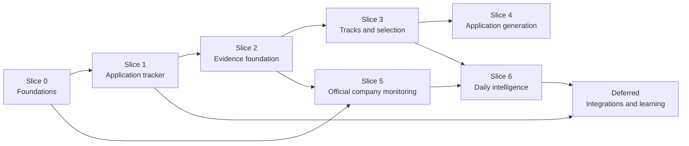

# AI-Driven Job Search: Detailed Implementation Plan

**Status:** Approved lean personal-MVP execution plan
**Version:** 0.4
**Date:** 2026-08-28
**Product specification:** [Product Specification](product-spec.md)
**User experience:** [User Experience Journey](user-experience-journey.md)
**System design:** [System Design](system-design.md)

## 1. Purpose

This is the working plan for implementing AI-Driven Job Search in this repository.

It is intended to be used during implementation, not merely read as a roadmap. It defines:

- the exact delivery order;
- work-package IDs and dependencies;
- expected files and interfaces;
- database migration sequence;
- implementation steps;
- test requirements;
- acceptance gates;
- legacy-data migration and cutover;
- rollback and recovery;
- documentation and security updates;
- completion evidence to record.

The plan implements the approved local-first architecture without prematurely adding a server or web frontend.

### 1.1 Lean-MVP execution boundary

The controlling MVP scope is limited to verified career evidence, official
target-company monitoring, durable freshness, explainable ranking/evidence
selection, on-demand tailored resumes, and application tracking with Excel
export. Earlier work packages are retained for traceability, but integrations,
broad portals, dashboards, automatic learning, speculative artifacts, and
comprehensive legacy migration are deferred unless explicitly reactivated.

## 2. How to use this document

### 2.1 Task status

Use these checkbox states:

- `[ ]` not started;
- `[x]` completed.

When a task starts, add an execution-log entry. When it completes:

1. mark its checkbox;
2. record completion date;
3. record changed files or commit;
4. record tests run;
5. record deviations or follow-up tasks.

Do not mark a slice complete until its exit gate passes.

### 2.2 Task completion rule

A task is complete only when:

- implementation exists;
- deterministic tests cover its critical rules;
- failure behavior is implemented;
- relevant security controls are present;
- documentation matches actual behavior;
- existing repository tests still pass;
- no personal data is added to Git;
- its acceptance statement can be demonstrated.

### 2.3 Change-control rule

If implementation reveals a design change:

1. pause the affected task;
2. document the issue in the decision log;
3. update [System Design](system-design.md);
4. update affected requirement mapping;
5. revise dependent tasks;
6. resume implementation.

Do not silently diverge from the design in code.

## 3. Delivery strategy

Implementation is divided into eight slices.



The original slice numbering is retained for stable references. For the lean
MVP, after the current foundation/tracker/evidence work, priority is:

```text
official target-company monitoring
→ minimum role-track matching and evidence selection
→ freshness-aware daily intelligence
→ on-demand resume generation
→ Excel tracker completion
```

Slice 7 is deferred backlog, not part of MVP completion.

Slices 4 and 5 are technically separable after Slice 3, but completing application quality before daily automation keeps the first automated pipeline from producing more work than the application pipeline can safely handle.

## 4. Global implementation rules

### 4.1 Preserve inherited behavior

- Do not delete legacy commands during development.
- Do not overwrite `job_search_tracker.csv`.
- Do not rewrite existing application archives.
- Do not rewrite candidate profile files during migration.
- Do not make legacy and AI-Driven Job Search code write the same state simultaneously.
- Cut over one workflow only after reconciliation and explicit activation.

### 4.2 Protect personal data

- Use synthetic fixtures only.
- Never commit `.ai-job-search/`.
- Never commit generated databases, exports, reports, backups, logs, source caches, or application artifacts.
- Add ignore rules and security-guard assertions before creating private runtime files.
- Do not include real contact, salary, email, company-application, or interview data in tests.

### 4.3 Keep external input untrusted

- Treat posting text, career pages, portal results, emails, and spreadsheets as data.
- Validate structured responses at every boundary.
- Restrict URLs, paths, response size, and subprocess invocation.
- Never execute spreadsheet formulas, page scripts, or external instructions.
- Never follow links discovered only in untrusted posting prose.

### 4.4 Make state changes explicit

- Use repository and domain services; do not write SQLite from command Markdown.
- Use transactions.
- Use stable IDs.
- Use idempotency keys.
- Use append-only events for application history.
- Use proposal/approval for consequential changes.
- Write audit events in the same transaction as domain changes.

### 4.5 Testing baseline

After every work package:

```text
python -m unittest discover -s tests -t . -v
python tools/security_guards.py
python tools/check_framework_version.py
```

When command or skill files change:

```text
python tools/lint_skills.py
```

When portal CLI code changes, run that adapter’s:

```text
bun run typecheck
bun test
```

Live portal and ATS checks remain manual, opt-in, and outside CI.

## 5. Proposed file changes

### 5.1 New tracked files

```text
pyproject.toml
src/ai_job_search/
├── __init__.py
├── __main__.py
├── cli/
├── application/
├── domain/
├── infrastructure/
└── contracts/

migrations/
├── 0001_foundation.sql
├── 0002_applications.sql
├── 0003_evidence.sql
├── 0004_company_monitoring.sql
├── 0005_matching.sql
├── 0006_resume_plans.sql
└── 0007_external_signals.sql

schemas/
config/
tests/unit/
tests/integration/
tests/contracts/
tests/fixtures/ai_driven/
tests/e2e/

AGENTS.md
.agents/skills/
├── ai-job-setup/SKILL.md
├── ai-job-daily/SKILL.md
├── ai-job-apply/SKILL.md
└── ai-job-applications/SKILL.md
```

### 5.2 Existing tracked files expected to change

```text
.gitignore
.claude/settings.json              # inherited Claude compatibility only
.claude/commands/                  # inherited workflow references
.claude/skills/                    # inherited profile/policy references
.github/workflows/ci.yml
AGENTS.md
README.md
SETUP.md
SECURITY.md
documents/README.md
tools/security_guards.py
tools/lint_skills.py
docs/
```

### 5.3 New private runtime files

```text
.ai-job-search/
├── state.sqlite3
├── state.sqlite3-wal
├── state.sqlite3-shm
├── config.toml
├── source-cache/
├── raw-observations/
├── exports/
├── reports/
├── backups/
└── logs/
```

These paths must be ignored and guarded before the first runtime command creates them.

## 6. Database migration map

| Migration | Tables introduced |
|---|---|
| `0001_foundation.sql` | `schema_migration`, `app_metadata`, `workflow_run`, `workflow_checkpoint`, `proposal`, `approval_event`, `audit_event`, `artifact` |
| `0002_applications.sql` | `company`, `job`, `application`, `application_artifact`, `application_event`, `application_action`, `interview_event`, `compensation_record`, `offer`, `export_run`, `import_run` |
| `0003_evidence.sql` | `source_artifact`, `source_span`, `experience`, `project`, `project_component`, `claim`, `claim_evidence`, `metric`, `claim_metric`, `skill`, `skill_alias`, `claim_skill` |
| `0004_company_monitoring.sql` | `company_plan_entry`, `company_alias`, `company_source`, `source_run`, `source_health_event`, `raw_observation`, `job_source_ref`, `job_snapshot`, `job_freshness`, `job_identity_candidate` |
| `0005_matching.sql` | `role_track`, `role_track_version`, `track_skill`, `search_preference`, `strategy_proposal`, `job_requirement`, `job_track_classification`, `requirement_claim_match`, `fit_assessment`, `fit_factor`, `ranking_feedback` |
| `0006_resume_plans.sql` | `resume_plan`, `resume_plan_item`, `resume_plan_gap`, `plan_override`, `artifact_claim`, `artifact_requirement`, `review_run` |
| `0007_external_signals.sql` | `external_signal`, `connector_cursor`, `calibration_proposal` |

Rules:

- migrations are forward-only;
- every migration runs inside a transaction where SQLite permits;
- migration scripts are immutable after release;
- corrections use a new migration;
- pre-migration backup is mandatory for a nonempty user database;
- migration tests build from empty and upgrade from every supported prior version.

## 7. Milestone summary

| Gate | Slice | Demonstrable outcome |
|---|---|---|
| G0 | Foundations | Safe database, migrations, CLI, audit, proposals, artifacts, backup |
| G1 | Application tracker | Legacy tracker can migrate, update by events, report, and export to Excel |
| G2 | Evidence foundation | Projects and approved claims are structured and traceable to sources |
| G3 | Tracks and selection | Different role tracks produce explainably different resume plans |
| G4 | Application generation | T3 artifacts compile, validate, and trace every bullet to evidence |
| G5 | Company monitoring | Official sources baseline and detect changes without false “new” claims |
| G6 | Daily intelligence | Idempotent daily report survives partial failures and ranks transparently |
| G7 | Integrations and learning | External signals and strategy learning remain controlled and auditable |

## 8. Slice 0 — Foundations

### 8.1 Objective

Create the reusable, secure runtime that every later feature depends on.

No personal workflow cuts over during this slice.

### 8.2 Work packages

| Status | ID | Depends on | Deliverable |
|---|---|---|---|
| [x] | FND-001 | — | Root Python package and dependency definition |
| [x] | FND-002 | FND-001 | Private runtime path resolver |
| [x] | SEC-001 | FND-002 | Git-ignore and security-guard expansion |
| [x] | CFG-001 | FND-001 | Typed layered configuration |
| [x] | CTR-001 | FND-001 | Versioned JSON command envelopes and error codes |
| [x] | DB-001 | FND-001, FND-002 | SQLite connection factory and pragmas |
| [x] | DB-002 | DB-001 | Migration runner and `0001_foundation.sql` |
| [x] | DB-003 | DB-001 | Transaction/unit-of-work boundary |
| [ ] | CORE-001 | FND-001 | Stable IDs, clocks, enums, and validation helpers |
| [ ] | RUN-001 | DB-002, CORE-001 | Workflow run and checkpoint service |
| [ ] | GOV-001 | DB-002, DB-003 | Audit service |
| [ ] | GOV-002 | GOV-001 | Proposal and approval service |
| [ ] | ART-001 | FND-002, DB-002 | Atomic artifact store |
| [ ] | BKP-001 | DB-002, FND-002 | Backup, restore, and integrity verification |
| [ ] | RESET-001 | BKP-001, ART-001 | Scoped preview/confirm reset framework |
| [x] | CLI-001 | CTR-001, DB-002 | CLI dispatcher and `--json` envelope |
| [x] | COD-001 | CLI-001 | Codex-first `AGENTS.md` guidance and runtime contract |
| [x] | COD-002 | COD-001 | Repository Codex workflow-skill skeletons |
| [ ] | CI-001 | all Slice 0 | AI-Driven Job Search CI job and architecture checks |
| [ ] | DOC-001 | all Slice 0 | Setup/security/developer documentation |

### 8.3 FND-001 — Python package

Target files:

```text
pyproject.toml
src/ai_job_search/__init__.py
src/ai_job_search/__main__.py
tests/unit/test_package_entrypoint.py
```

Steps:

1. declare Python 3.12 baseline;
2. add runtime dependencies `pydantic` and `openpyxl`;
3. add a console entry point and module entry point;
4. define package version separately from framework version;
5. keep import side effects at zero;
6. make `python -m ai_job_search --help` work before any database exists;
7. document editable local installation.

Tests:

- package imports without creating files;
- module help exits successfully;
- unsupported Python version produces a clear installation failure;
- version command returns machine-readable output.

Done when:

> A clean environment can install the package and call its help/version commands without touching personal state.

### 8.4 FND-002 and SEC-001 — Private runtime root

Target files:

```text
src/ai_job_search/infrastructure/files/paths.py
.gitignore
tools/security_guards.py
tests/unit/test_runtime_paths.py
tests/test_security_guards.py
```

Steps:

1. resolve workspace root from an explicit option or repository marker;
2. default private root to `<workspace>/.ai-job-search`;
3. reject a root outside the workspace unless explicitly allowed by a future design;
4. create directories with private user permissions where supported;
5. add `.ai-job-search/` to `.gitignore`;
6. add the rule to `REQUIRED_IGNORE_RULES`;
7. test that a negation cannot re-include it;
8. ensure logs, exports, backups, SQLite WAL/SHM, and caches fall below this root;
9. never use `$HOME` as a destructive or implicit runtime target.

Tests:

- normal root resolution;
- path traversal rejection;
- symlink escape rejection;
- missing workspace error;
- security guard fails if ignore rule is removed or negated.

Done when:

> Running path initialization cannot create tracked personal data or escape the approved workspace.

### 8.5 CFG-001 — Configuration

Target files:

```text
config/defaults.toml
src/ai_job_search/contracts/config.py
src/ai_job_search/infrastructure/files/config_loader.py
tests/unit/test_config.py
```

Steps:

1. define tracked defaults;
2. load optional private `.ai-job-search/config.toml`;
3. apply explicit CLI overrides last;
4. validate timezone, intervals, limits, weights, and path policy;
5. reject unknown security-sensitive keys;
6. compute a canonical effective-config SHA-256;
7. expose redacted configuration in diagnostics;
8. never serialize secrets.

Tests:

- precedence;
- invalid timezone;
- negative limits;
- weight validation;
- deterministic hash;
- redaction.

### 8.6 CTR-001 and CLI-001 — Command contracts

Target files:

```text
src/ai_job_search/contracts/envelope.py
src/ai_job_search/contracts/errors.py
src/ai_job_search/cli/main.py
src/ai_job_search/cli/presentation.py
tests/contracts/test_cli_envelope.py
```

Steps:

1. define success and error envelope version `1`;
2. create stable error-code enum;
3. separate stdout response from stderr diagnostics;
4. add `--json`;
5. add `db status`, `db init`, `db migrate`, `db backup`, and `db integrity`;
6. return non-zero for failed operations;
7. attach run ID when a workflow run exists;
8. ensure JSON output never includes banners or logs.

Tests:

- valid JSON on success and failure;
- stable required fields;
- clean stdout;
- retryable flag;
- unknown command behavior.

### 8.7 COD-001 and COD-002 — Codex interaction foundation

Target files:

```text
AGENTS.md
.agents/skills/ai-job-setup/SKILL.md
.agents/skills/ai-job-daily/SKILL.md
.agents/skills/ai-job-apply/SKILL.md
.agents/skills/ai-job-applications/SKILL.md
tests/test_codex_workflow_skills.py
```

Steps:

1. state that Codex is the primary interaction and reasoning environment;
2. state explicitly that Claude Code, Anthropic packages, and an Anthropic
   subscription are not required;
3. point Codex to the typed CLI, product policy, private-data boundaries, and
   evidence-grounding rules;
4. make each skill call deterministic CLI operations with `--json`;
5. keep scoring, transitions, validation, and persistence rules in Python
   rather than duplicating them in skill prose;
6. document explicit `$ai-job-*` invocation and natural-language discovery;
7. specify degraded behavior when a source, compiler, or optional connector is
   unavailable;
8. preserve `.claude/` as an inherited reference, not the active control plane;
9. lint the skill metadata and verify all referenced scripts and files exist.

The interactive path needs no model-provider SDK or separate OpenAI API key:
Codex performs reasoning in the active session. Optional unattended
non-interactive execution is a later adapter with explicit authentication,
cost, and approval behavior.

Tests:

- Codex guidance resolves to existing canonical files;
- every planned skill has valid metadata and a precise trigger description;
- no skill tells Codex to edit SQLite directly;
- mutation examples use preview/proposal/approval boundaries;
- repository setup succeeds without Claude or provider SDK packages.

### 8.8 DB-001 through DB-003 — SQLite foundation

Target files:

```text
src/ai_job_search/infrastructure/sqlite/connection.py
src/ai_job_search/infrastructure/sqlite/migrations.py
src/ai_job_search/infrastructure/sqlite/unit_of_work.py
migrations/0001_foundation.sql
tests/unit/sqlite/
tests/integration/test_migrations.py
```

Steps:

1. open SQLite with foreign keys, WAL, and busy timeout;
2. support read-only and read-write modes;
3. implement explicit transaction context;
4. prohibit nested implicit commits;
5. discover ordered migration resources;
6. store migration name, hash, and applied time;
7. refuse changed hashes for applied migrations;
8. refuse a newer schema;
9. apply pending migrations;
10. expose integrity and foreign-key checks;
11. create foundation tables and indexes;
12. make all date serialization UTC/date-only aware.

Tests:

- empty initialization;
- idempotent migration;
- changed migration hash rejection;
- failed migration rollback;
- newer database refusal;
- foreign-key enforcement;
- two readers plus one bounded writer;
- transaction rollback.

### 8.9 CORE-001 — Shared domain primitives

Target files:

```text
src/ai_job_search/domain/common/ids.py
src/ai_job_search/domain/common/time.py
src/ai_job_search/domain/common/enums.py
src/ai_job_search/domain/common/validation.py
tests/unit/domain/common/
```

Steps:

1. implement prefixed UUIDv4 generation and validation;
2. inject a clock into services;
3. distinguish instant, zoned datetime, and date-only values;
4. normalize canonical JSON for hashing;
5. define confidence and confidentiality enums;
6. reject naive datetimes at persistence boundaries;
7. create deterministic fake clock/ID helpers for tests.

### 8.10 RUN-001, GOV-001, and GOV-002 — Governance

Target files:

```text
src/ai_job_search/application/runs.py
src/ai_job_search/application/proposals.py
src/ai_job_search/domain/governance/
src/ai_job_search/infrastructure/sqlite/repositories/
tests/unit/test_runs.py
tests/integration/test_proposals.py
```

Steps:

1. implement workflow states and legal transitions;
2. store input/config hashes;
3. create named checkpoints;
4. implement proposal states;
5. validate expected row versions at apply time;
6. record user approval separately from application;
7. apply database operations transactionally;
8. mark conflicts without partial writes;
9. write minimal audit entries containing IDs and hashes;
10. prohibit full sensitive payload duplication in audit data.

Tests:

- invalid run transition;
- duplicate idempotency key;
- proposal approval/rejection/expiry;
- stale row-version conflict;
- transactional multi-operation apply;
- audit record written with domain mutation;
- no audit payload leakage.

### 8.11 ART-001 — Artifact store

Target files:

```text
src/ai_job_search/domain/artifacts/models.py
src/ai_job_search/infrastructure/files/artifact_store.py
tests/integration/test_artifact_store.py
```

Steps:

1. allowlist private artifact roots;
2. write to a same-filesystem temporary file;
3. flush, close, hash, and atomically rename;
4. register artifact path, type, size, hash, tier, and confidentiality;
5. detect existing identical content;
6. prevent submitted-artifact overwrite;
7. implement missing/orphan reconciliation;
8. reject symlink and traversal destinations.

### 8.12 BKP-001 — Backup and restore

Steps:

1. use SQLite online backup API;
2. write manifest with schema version and database hash;
3. run integrity check on the backup;
4. list available backups;
5. require explicit target selection for restore;
6. preserve current database before restore;
7. reconcile artifact references after restore;
8. test interrupted/invalid backup behavior.

### 8.13 RESET-001 — Scoped reset framework

Target files:

```text
src/ai_job_search/application/reset.py
src/ai_job_search/domain/reset/models.py
src/ai_job_search/infrastructure/files/reset_executor.py
tests/unit/test_reset_planner.py
tests/integration/test_reset_executor.py
```

Steps:

1. register owned data categories and allowlisted roots;
2. build a reset plan without mutating;
3. resolve and validate every target;
4. show files, database scopes, size, sensitivity, and preserved categories;
5. require backup for database/high-risk scopes by default;
6. store a short-lived plan ID and target hashes;
7. require exact confirmation;
8. revalidate paths and hashes before execution;
9. close database writers before database reset;
10. handle SQLite database, WAL, and SHM consistently;
11. execute only the approved scope;
12. verify removal and preserved targets;
13. write a recovery summary outside a full-reset target.

Initial Slice 0 scopes:

- `cache`;
- `database`.

Later slices register:

- drafts;
- career sources;
- application archives;
- discovery state;
- all private data.

Tests:

- preview has no mutation;
- unknown scope rejected;
- workspace-root target rejected;
- traversal/symlink escape rejected;
- stale plan rejected;
- missing confirmation rejected;
- database backup required;
- WAL/SHM handled;
- preserved file assertion;
- all-private backup cannot be placed inside deletion target.

### 8.14 CI-001

Modify CI to:

- install the root package;
- run existing and AI-Driven Job Search unit tests;
- verify migrations from empty;
- run security guards;
- avoid live network;
- keep portal CLI jobs unchanged;
- cache nothing containing personal runtime data.

Do not remove existing LaTeX, skill, portal, or placeholder checks.

### 8.15 Gate G0

G0 passes when:

- [ ] Codex loads the repository guidance and discovers the `$ai-job-*` skills;
- [ ] setup and tests require neither Claude nor a provider SDK/API key;
- [ ] a clean database initializes;
- [ ] migrations are repeatable;
- [ ] transaction rollback is demonstrated;
- [ ] proposal conflict behavior is demonstrated;
- [ ] artifact escape/overwrite tests pass;
- [ ] backup and restore pass integrity checks;
- [ ] reset preview mutates nothing and cannot target the workspace root;
- [ ] database reset requires backup/confirmation and handles WAL/SHM;
- [ ] `.ai-job-search/` cannot be committed accidentally;
- [ ] existing and new CI checks pass;
- [ ] no legacy workflow writes to the database yet.

## 9. Slice 1 — Application tracker and Excel export

### 9.1 Objective

Deliver the first useful AI-Driven Job Search vertical slice:

- import legacy applications safely;
- maintain full event history;
- edit status, interviews, deadlines, results, and compensation;
- list/filter applications;
- export a usable Excel workbook;
- generate reports from SQLite.

### 9.2 Work packages

| Status | ID | Depends on | Deliverable |
|---|---|---|---|
| [ ] | APP-001 | G0 | `0002_applications.sql` and typed models |
| [ ] | APP-002 | APP-001 | Application repositories |
| [ ] | APP-003 | APP-002, GOV-001 | Event transition and projection service |
| [ ] | APP-004 | APP-002 | Tracker query/filter service |
| [ ] | APP-005 | APP-003, GOV-002 | Manual update proposal service |
| [ ] | APP-006 | APP-004, APP-005 | Tracker CLI commands |
| [ ] | MIG-001 | APP-001 | Legacy inventory and dry-run parser |
| [ ] | MIG-002 | MIG-001, APP-003 | Idempotent legacy importer |
| [ ] | MIG-003 | MIG-002 | Reconciliation, activation, and rollback |
| [ ] | XLS-001 | APP-004, ART-001 | Native `.xlsx` export |
| [ ] | REP-001 | APP-004 | Database-backed HTML/Markdown report |
| [ ] | CMD-APP-001 | APP-006 | `/applications` command specification |
| [ ] | CMD-OUT-001 | APP-003 | `/outcome` AI-Driven Job Search compatibility path |
| [ ] | DOC-APP-001 | all Slice 1 | Tracker and migration documentation |

### 9.3 APP-001 — Tracker schema

Implement:

- company and alias-ready identity;
- minimal canonical job record;
- one application per actual submission;
- artifact linkage;
- append-only events;
- actions;
- interviews;
- compensation records;
- offers;
- export/import metadata.

Important constraints:

- application ID is stable;
- `application.job_id` is required;
- event idempotency key is unique per application;
- offer deadline is date-only;
- interview instant requires timezone;
- compensation amount cannot be negative;
- currency uses uppercase ISO-style code validation;
- submitted artifacts cannot share incompatible roles;
- row version increments on projection changes.

### 9.4 APP-003 — Event and projection service

Implement event types:

```text
application_created
application_submitted
stage_changed
interview_scheduled
interview_completed
assessment_assigned
assessment_completed
action_created
action_completed
contact_added
compensation_recorded
offer_received
offer_decided
rejected
withdrawn
no_response
note_added
correction
```

Steps:

1. validate event payload;
2. validate default stage transition;
3. support legitimate skipped-stage transitions;
4. require a reason for unusual override;
5. append event;
6. supersede rather than delete corrections;
7. recompute current projection;
8. update row version;
9. write audit event;
10. return before/after summary.

Tests must cover every terminal state and direct offer/no-response paths.

### 9.5 APP-004 and APP-006 — Tracker query and CLI

Commands:

```text
applications list
applications show <id>
applications update <id> --proposal <json-or-file>
applications timeline <id>
applications deadlines
applications export
```

Filters:

- company;
- title;
- role track;
- stage;
- result;
- application date range;
- next-action range;
- location;
- compensation range;
- quiet-days threshold.

Sorting:

- next deadline;
- last activity;
- applied date;
- company/title;
- compensation;
- fit score when available.

Use parameterized queries and a fixed mapping of allowed sort fields.

### 9.6 APP-005 — Natural-language update boundary

The CLI core accepts structured input only. The slash command or agent:

1. resolves the application;
2. translates natural language into the versioned update schema;
3. calls preview;
4. presents normalized dates, timezone, stage, and compensation;
5. receives user approval;
6. applies by proposal ID.

The service refuses:

- ambiguous application identity;
- missing timezone for timed interviews;
- impossible date order;
- unknown currency;
- silent history deletion;
- stale row version.

### 9.7 MIG-001 through MIG-003 — Legacy migration

Inputs:

```text
job_search_tracker.csv
documents/applications/**
cv/main_*.tex
cover_letters/cover_*.tex
job_scraper/seen_jobs.json
```

Dry-run output:

- row count;
- archive folder count;
- matched pairs;
- ambiguous pairs;
- duplicate candidates;
- missing posting;
- missing artifact;
- status mapping;
- invalid date;
- proposed application IDs.

Import steps:

1. hash every input;
2. store migration run;
3. create companies;
4. create known or `legacy_unknown_job` jobs;
5. create application;
6. append applied/status/note events;
7. register artifact paths without overwriting;
8. reconcile archive folder;
9. record source row/folder in migration metadata;
10. produce report.

Activation:

- create a verified database backup;
- compare application counts and statuses;
- compare submitted artifact hashes;
- let user approve tracker cutover;
- mark database tracker authoritative;
- keep CSV and archives untouched;
- update `/outcome` and `/html-report` only after activation.

Rollback:

- disable AI-Driven Job Search tracker writer;
- restore pre-cutover database backup if required;
- continue legacy workflow against untouched files;
- preserve migration report for diagnosis.

### 9.8 XLS-001 — Excel export

Workbook sheets:

```text
Applications
Timeline
Offers
Lookups
```

Implementation details:

- frozen header;
- auto-filter;
- stable columns;
- reasonable column widths;
- native dates/datetimes;
- numeric amounts;
- currency formatting;
- explicit links;
- hidden full ID, row version, and export revision;
- export timestamp and schema version;
- formula-injection neutralization;
- opt-in local artifact paths.

Tests:

- reopen generated workbook with `openpyxl`;
- verify sheet names and types;
- verify filters/frozen panes;
- verify Unicode;
- verify formula-like untrusted strings are text;
- verify compensation stays numeric;
- verify date-only values remain date-only;
- verify filtered versus full export;
- verify no source documents are embedded.

### 9.9 REP-001 — Reports

Refactor the existing HTML report to consume a tracker projection exported from SQLite rather than reading CSV directly.

During compatibility:

- retain a legacy CSV reader;
- select one source explicitly;
- never merge both silently;
- indicate data source and generation time in the report.

### 9.10 Gate G1

G1 passes when:

- [ ] a synthetic legacy tracker migrates without changing source files;
- [ ] rerunning migration creates no duplicates;
- [ ] ambiguous company-role matches require review;
- [ ] a first-interview event updates current stage and preserves application date;
- [ ] an offer records salary and decision deadline separately;
- [ ] a correction supersedes rather than deletes;
- [ ] tracker filters and deadlines work;
- [ ] Excel workbook passes native-type and injection tests;
- [ ] database and legacy report counts reconcile;
- [ ] tracker cutover and rollback are documented and demonstrated.

## 10. Slice 2 — Career evidence foundation

### 10.1 Objective

Replace duplicated prose facts with a structured, evidence-backed career library while preserving compatibility views for inherited commands.

### 10.2 Work packages

| Status | ID | Depends on | Deliverable |
|---|---|---|---|
| [ ] | EVD-001 | G0 | `0003_evidence.sql` and evidence models |
| [ ] | EVD-002 | EVD-001 | Source registry and immutable source spans |
| [ ] | EVD-003 | EVD-001 | Project, component, experience, metric, and claim repositories |
| [ ] | EVD-004 | EVD-003 | Claim eligibility and confidentiality policy |
| [ ] | EVD-005 | EVD-003 | Skill normalization and search |
| [ ] | ING-001 | EVD-002 | Document inventory and incremental hashing |
| [ ] | AGT-001 | CTR-001, COD-002 | Codex reasoning task/result contract |
| [ ] | ING-002 | AGT-001, ING-001 | Structured extraction contract |
| [ ] | ING-003 | ING-002, GOV-002 | Diff, conflict, and approval workflow |
| [ ] | EVD-006 | EVD-004, ING-003 | Evidence review/query commands |
| [ ] | CMP-001 | EVD-006 | Generated legacy profile compatibility view |
| [ ] | CMD-EVD-001 | EVD-006 | `/ingest` and `/evidence` command specifications |
| [ ] | DOC-EVD-001 | all Slice 2 | Evidence/confidentiality documentation |

### 10.3 Evidence schema and rules

Implement:

- immutable source identity by hash;
- page/line/locator source spans;
- experiences;
- projects and independently selectable components;
- atomic claims;
- metrics with context;
- normalized skills and aliases;
- evidence edges;
- verification state;
- confidentiality and wording strength.

Eligibility function:

```text
eligible_for_final_application(claim, context)
```

It returns allowed only when:

- claim is approved;
- at least one active evidence reference exists;
- metric references are valid;
- confidentiality permits the target;
- wording strength does not exceed approval;
- claim is not superseded.

### 10.4 AGT-001 — Codex reasoning contract

The contract must:

- accept a task type and versioned payload;
- apply a versioned prompt template;
- let the active Codex session perform extraction, classification, drafting,
  or review;
- record Codex/model metadata when available;
- enforce response schema;
- limit retries;
- return structured validation errors;
- record token/cost metadata when available;
- never allow model output to commit state.

Codex invokes the core to obtain the task payload and returns a schema-valid
proposal. The Python process must not call a provider SDK in the interactive
MVP. Provide a deterministic fake reasoning exchange for tests.

An optional future `codex exec` adapter may automate this exchange, but it must
use the same contracts and declare authentication, cost, and approval behavior.

### 10.5 ING-001 through ING-003 — Ingestion

Supported MVP sources:

- PDF CV;
- LaTeX CV;
- LinkedIn PDF;
- Markdown/text project documentation;
- publication;
- transcript/diploma;
- reference letter;
- previous application;
- user interview note.

Steps:

1. inventory files;
2. classify source type;
3. hash and register;
4. extract text with available local/runtime tools;
5. retain extraction quality and locator metadata;
6. request structured proposed entities;
7. validate every source reference;
8. compare with existing normalized records;
9. group additive changes;
10. show factual conflicts individually;
11. approve/reject;
12. commit proposal;
13. preserve rejected/conflicting history.

Incremental behavior:

- unchanged hash → no duplicate extraction;
- changed source → proposed diff;
- changed extractor version → optional reprocess proposal;
- removed file → mark unavailable, never delete derived records silently.

### 10.6 EVD-005 — Search

Implement:

- exact ID lookup;
- skill/tag lookup;
- normalized keyword search;
- optional FTS5;
- fallback token search when FTS5 is unavailable;
- filtering by verification/confidentiality/project/type.

Do not add embeddings in this slice.

### 10.7 CMP-001 — Compatibility

Generate read-only compatibility views for:

- candidate profile summary;
- project catalog;
- approved claims;
- metrics;
- skills.

Rules:

- generated compatibility output is clearly marked;
- user edits to generated files are not silently imported;
- current legacy canonical files remain untouched until a later explicit cutover;
- comparison report highlights differences.

### 10.8 Gate G2

G2 passes when:

- [ ] at least 20 synthetic projects import;
- [ ] at least 100 synthetic atomic claims validate;
- [ ] every approved claim links to a source span;
- [ ] conflicting dates/metrics require user resolution;
- [ ] rejected claims cannot enter final eligibility;
- [ ] confidentiality blocks or generalizes correctly;
- [ ] unchanged source re-import is idempotent;
- [ ] changed source produces a diff;
- [ ] compatibility view reconciles with normalized records;
- [ ] no original document is rewritten.

## 11. Slice 3 — Role tracks, requirements, and evidence selection

### 11.1 Objective

Make career positioning explicit and demonstrate that the same evidence library produces different plans for different job variants.

### 11.2 Work packages

| Status | ID | Depends on | Deliverable |
|---|---|---|---|
| [ ] | TRK-001 | G2 | Role-track and job-matching schema in `0005_matching.sql` |
| [ ] | TRK-002 | TRK-001 | Versioned track configuration loader |
| [ ] | TRK-003 | TRK-002 | Track query/edit/proposal commands |
| [ ] | JOB-IMP-001 | TRK-001 | Manual URL/text posting import and snapshot |
| [ ] | REQ-001 | AGT-001, JOB-IMP-001 | Requirement-extraction schema and service |
| [ ] | CLS-001 | TRK-002, REQ-001 | Multi-track classification |
| [ ] | MAP-001 | REQ-001, EVD-005 | Requirement-to-claim candidate retrieval |
| [ ] | MAP-002 | MAP-001, AGT-001 | Direct/adjacent/gap validation |
| [ ] | SEL-001 | TRK-002, MAP-002 | `0006_resume_plans.sql` and candidate features |
| [ ] | SEL-002 | SEL-001 | Deterministic constrained greedy selector |
| [ ] | SEL-003 | SEL-002, GOV-002 | Plan explanation, override, and approval |
| [ ] | CMD-PLAN-001 | SEL-003 | `/tracks` and `/plan` command specifications |
| [ ] | DOC-SEL-001 | all Slice 3 | Track and selection documentation |

### 11.3 TRK-001 through TRK-003 — Role tracks

Implement versioned:

- canonical name;
- aliases;
- seniority expectations;
- must-have/preferred/differentiator/adjacent skills;
- evidence patterns;
- component preferences;
- ranking weights;
- selection weights;
- page/project policy;
- hard disqualifiers;
- allowed bridges;
- non-bridgeable gaps.

Initial tracked configuration should include representative system-oriented and ML-oriented fixtures. Final user track choices remain configuration decisions, not hard-coded schema.

Any edit creates a new version. Past assessments keep the old version.

### 11.4 JOB-IMP-001 — Manual job import

Before company monitoring exists, support:

```text
jobs import --url <url>
jobs import --file <posting.txt>
jobs import --stdin
```

Create:

- canonical job;
- source reference;
- immutable snapshot;
- content hash;
- source authority;
- observed time;
- raw/normalized text boundary.

Posting text remains untrusted.

### 11.5 REQ-001 and CLS-001

Requirement schema includes:

- normalized text;
- source span;
- category;
- required/preferred;
- priority;
- years/seniority;
- skill/domain;
- logistics;
- compensation;
- ambiguity;
- extraction confidence.

Track classification:

- allows multiple tracks;
- probabilities/confidence do not have to total 100 when evidence is incomplete unless the chosen representation requires it;
- records model/prompt/track versions;
- exposes explanation and missing information.

### 11.6 MAP-001 and MAP-002

For each requirement:

1. retrieve eligible claims;
2. score lexical/tag evidence;
3. let the agent propose semantic relation;
4. validate claim and evidence IDs;
5. classify `direct`, `adjacent_supported`, `unsupported`, `unknown`, or `not_applicable`;
6. store link strength and explanation;
7. preserve unsupported gaps.

The mapping service cannot create a new candidate claim merely to cover a requirement.

### 11.7 SEL-001 through SEL-003

Implement product-spec weights exactly:

```text
30% requirement coverage
20% track relevance
15% impact
15% seniority
10% evidence strength
 5% recency
 5% uniqueness
```

Implement penalties:

- redundancy;
- weak ownership;
- confidentiality;
- explanation cost;
- page cost.

Selector steps:

1. include eligible pins;
2. exclude bans/ineligible claims;
3. compute marginal coverage;
4. choose highest marginal value;
5. apply diversity/redundancy;
6. stop at page/project budget;
7. compare top exclusions;
8. expose gaps.

Tests:

- same inputs always yield same plan;
- project pin/ban/replace;
- no ineligible claim selected;
- page budget enforced;
- diversity penalty;
- direct evidence outranks weak keyword match;
- distributed-system fixture and ML fixture select different components;
- approval row-version conflict.

### 11.8 Gate G3

G3 passes when:

- [ ] role-track changes are versioned;
- [ ] one mixed job classifies to multiple tracks;
- [ ] every requirement preserves a source span;
- [ ] unsupported requirements stay visible;
- [ ] selection is deterministic;
- [ ] pin, ban, replace, and project-count override work;
- [ ] plan explains selections and high-scoring exclusions;
- [ ] system-oriented and ML-oriented fixtures choose materially different project sets;
- [ ] only approved claims appear in an approvable plan.

## 12. Slice 4 — Application generation and verification

### 12.1 Objective

Move `/apply` onto structured evidence and plan boundaries while preserving the inherited drafter-reviewer, LaTeX, PDF, and ATS strengths.

### 12.2 Work packages

| Status | ID | Depends on | Deliverable |
|---|---|---|---|
| [ ] | GEN-001 | G3 | Artifact tiers and structured draft schema |
| [ ] | GEN-002 | GEN-001 | Track baseline and template resolver |
| [ ] | GEN-003 | GEN-002, AGT-001 | Drafter service |
| [ ] | GEN-004 | GEN-003, EVD-004 | Claim-ID grounding audit |
| [ ] | REV-001 | GEN-004, AGT-001 | Fresh-context reviewer contract |
| [ ] | REV-002 | REV-001 | Safe revision engine |
| [ ] | TEX-001 | REV-002, ART-001 | LaTeX rendering and compile wrapper |
| [ ] | PDF-001 | TEX-001 | Visual/page/layout verification |
| [ ] | ATS-001 | TEX-001 | ATS text-layer verification |
| [ ] | GEN-005 | PDF-001, ATS-001 | T3 finalization gate |
| [ ] | SUB-001 | GEN-005, APP-003 | Submission archive and application creation |
| [ ] | CMD-APPLY-001 | all above | `/apply` AI-Driven Job Search orchestration |
| [ ] | DOC-GEN-001 | all Slice 4 | Application-generation documentation |

### 12.3 GEN-001 — Structured draft

Every bullet/object includes:

- section;
- order;
- project component or experience;
- claim IDs;
- metric IDs;
- text;
- allowed transformations;
- requirement IDs covered.

Artifact tiers:

```text
T0 track baseline
T1 evidence plan / skeleton
T2 tailored draft
T3 reviewed and verified final
```

### 12.4 GEN-003 and GEN-004 — Draft and grounding

Drafter input contains only approved:

- plan;
- claims;
- metrics;
- track baseline;
- job requirements;
- writing rules;
- explicit gaps;
- template policy.

Grounding audit rejects:

- missing claim IDs;
- unknown claim IDs;
- unapproved claims;
- unsupported numbers;
- escalated ownership;
- title/date drift;
- confidentiality violations;
- requirement coverage asserted without evidence.

Test malicious and accidental drift.

### 12.5 REV-001 and REV-002 — Reviewer

Reviewer output:

- structured exact edits;
- narrative concerns;
- company claims with independently resolved sources;
- grounding objections;
- unmet requirement notes.

Revision engine:

- validates exact old text;
- rejects edits adding unknown claim/metric IDs;
- requires separate verification for new company facts;
- records accepted/rejected reviewer edits;
- preserves reviewer run provenance.

### 12.6 TEX-001, PDF-001, and ATS-001

Wrap existing toolchain:

- LuaLaTeX for CV;
- XeLaTeX for cover letter;
- Poppler tools when available;
- `tools/verify_pdf.py`;
- visual inspection workflow through the active agent runtime.

Code-enforced checks:

- compile exit;
- expected files;
- page count;
- extractable text;
- required literal contact text;
- forbidden extraction markers;
- artifact hashes.

Agent-assisted checks:

- orphaned headings;
- awkward whitespace;
- visual hierarchy;
- signature visibility;
- font mismatch.

Missing optional Poppler yields a visible degraded state and blocks claims of ATS verification, but may follow the product’s approved fallback policy.

### 12.7 GEN-005 and SUB-001

T3 finalization requires:

- approved plan;
- successful grounding;
- reviewer completion;
- compile success;
- required page/layout result;
- ATS status;
- explicit user approval.

Submission remains external and manual.

After user confirms submission:

1. create or update application;
2. append submission event;
3. copy exact final artifacts to stable application directory;
4. hash and mark immutable;
5. link job snapshot and plan;
6. preserve submission channel/date/contact.

### 12.8 Gate G4

G4 passes when:

- [ ] a T2 draft uses approved claim IDs only;
- [ ] unsupported metric injection fails;
- [ ] reviewer cannot add a new unsupported claim;
- [ ] CV and cover-letter compile checks run;
- [ ] page and ATS states are recorded accurately;
- [ ] final bullet provenance resolves to source evidence;
- [ ] user approval is required for T3;
- [ ] no command submits an application;
- [ ] submitted artifacts are immutable and hash-verifiable;
- [ ] existing `/apply` quality controls remain represented.

## 13. Slice 5 — Official target-company monitoring

### 13.1 Objective

Monitor employer career sources as the source of truth and implement literal job freshness.

### 13.2 Work packages

| Status | ID | Depends on | Deliverable |
|---|---|---|---|
| [x] | COM-001 | G2 | Company/source schema in `0004_company_monitoring.sql` |
| [ ] | COM-002 | COM-001 | Company registry, aliases, tiers, track interests |
| [ ] | SRC-001 | COM-001 | Official adapter interface and HTTP safety layer (partial: bounded HTTPS fetch implemented) |
| [ ] | DET-001 | SRC-001 | Official ATS/source detection |
| [ ] | ADP-GH-001 | SRC-001 | Greenhouse adapter |
| [ ] | ADP-AS-001 | SRC-001 | Ashby adapter (partial: health, full-snapshot poll, and normalization implemented) |
| [ ] | ADP-LV-001 | SRC-001 | Lever adapter |
| [ ] | ADP-SR-001 | SRC-001 | SmartRecruiters adapter |
| [ ] | JOB-001 | adapters | Observation normalizer (partial: Ashby implemented) |
| [ ] | JOB-002 | JOB-001 | Canonical identity and deduplication |
| [ ] | SNAP-001 | JOB-002 | Immutable snapshots and lifecycle (partial: Ashby snapshots/open lifecycle implemented) |
| [ ] | FRESH-001 | SNAP-001 | Freshness decision engine (partial: baseline/new/update/reopen implemented) |
| [ ] | HEALTH-001 | SRC-001 | Source health and semantic checks (partial: health and poll failures persist) |
| [ ] | VERIFY-001 | FRESH-001 | Pre-report verification |
| [ ] | CMD-COM-001 | all above | `/companies` and `/watch-companies` specifications |
| [ ] | DOC-COM-001 | all Slice 5 | Source/authority documentation |

### 13.3 SRC-001 — Adapter and HTTP safety

Implement:

- adapter detection, poll, detail, and health contracts;
- HTTPS default;
- hostname allowlist per registered source;
- controlled redirects;
- timeouts;
- response-size cap;
- content-type validation;
- bounded retry/backoff;
- per-host concurrency;
- stable user agent;
- no authentication bypass;
- clear error codes.

Use recorded synthetic fixtures in CI.

### 13.4 DET-001 — Source detection

Input is a user-supplied official career URL.

Steps:

1. normalize URL;
2. resolve official domain;
3. inspect allowed page metadata/links;
4. detect supported ATS identifiers;
5. propose adapter and account/org token;
6. health-check;
7. show sample roles;
8. require user confirmation;
9. store source authority and polling policy.

Unsupported, blocked, or authenticated sources remain registered with visible status.

### 13.5 Adapter tasks

Each adapter must support:

- account/source validation;
- pagination;
- stable external ID;
- canonical job URL;
- application URL;
- title/company/location;
- description;
- explicitly typed source publication/update dates;
- open-state semantics;
- health result;
- fixture coverage for missing/changed fields.

Never reinterpret an update timestamp as original publication.

### 13.6 JOB-001 and JOB-002

Identity precedence:

1. official source + external ID;
2. canonical official URL;
3. exact requisition evidence;
4. high-confidence cross-source candidate;
5. user review for ambiguity.

Store candidate matches instead of auto-merging uncertain descriptions.

Tests include:

- same requisition across two sources;
- same title but distinct requisitions;
- identical multi-location template;
- changed title under same ID;
- new ID with near-identical recently closed posting.

### 13.7 SNAP-001 and FRESH-001

Implement:

- first baseline;
- incremental observation comparison;
- material field/content hashes;
- open/closed/reopened lifecycle;
- publication/update/first-seen/last-seen/detection-window separation;
- classifications from the product specification;
- confidence and evidence;
- versioned decision rule.

Required test table:

| Scenario | Expected |
|---|---|
| First poll finds 100 jobs | All `baseline_existing` |
| New official ID with publication inside window | `verified_new` |
| New official ID without publication date | `newly_detected_date_unknown` |
| Existing ID description changes | `recently_updated` |
| Closed ID returns | `reopened` |
| New ID resembles recently closed equivalent | `likely_repost` |
| LinkedIn-only job | `aggregator_only` |
| Source fails | Visible failure, not zero jobs |

### 13.8 HEALTH-001 and VERIFY-001

Health states:

```text
healthy
degraded
rate_limited
blocked
authentication_required
changed_structure
failed
not_checked
```

Semantic checks validate not just HTTP success but recognizable job structures and sentinel fields.

Pre-report verification rechecks the official record and application URL. Failure marks verification state and source health; it never fabricates closure.

### 13.9 Gate G5

G5 passes when:

- [ ] at least four ATS adapter fixture suites pass;
- [ ] company source detection requires confirmation;
- [ ] first poll never calls existing jobs new;
- [ ] incremental poll distinguishes added/changed/closed/reopened;
- [ ] all timestamp meanings remain distinct;
- [ ] likely repost logic does not suppress the role;
- [ ] official source outranks supplemental data;
- [ ] source failure is visible;
- [ ] pre-report verification catches stale/invalid roles;
- [ ] no CI test contacts a live employer.

## 14. Slice 6 — Daily intelligence, ranking, and operations

### 14.1 Objective

Combine official monitoring and supplemental discovery into an idempotent daily review queue.

### 14.2 Work packages

| Status | ID | Depends on | Deliverable |
|---|---|---|---|
| [ ] | SUP-001 | G0 | Existing Bun CLI discovery and manifest registry |
| [ ] | SUP-002 | SUP-001 | Safe subprocess and JSON validation wrapper |
| [ ] | RNK-001 | G3, `0005` | Deterministic hard-filter service |
| [ ] | RNK-002 | RNK-001, AGT-001 | Structured factor-assessment contract |
| [ ] | RNK-003 | RNK-002 | Weighted score and confidence calculator |
| [ ] | RNK-004 | RNK-003, GOV-002 | Ranking feedback and calibration proposal |
| [ ] | DAY-001 | G5, RNK-003 | Daily workflow coordinator |
| [ ] | DAY-002 | DAY-001, RUN-001 | Idempotency, checkpoints, and bounded concurrency |
| [ ] | DAY-003 | DAY-002, VERIFY-001 | Daily report and review queue |
| [ ] | OBS-001 | RUN-001 | Source, phase, token, cost, and latency reporting |
| [ ] | SCHED-001 | DAY-002, COD-002 | Codex scheduled task plus deterministic scheduler fallback |
| [ ] | CMD-DAY-001 | all above | Codex daily, rank, and report skill specifications |
| [ ] | DOC-DAY-001 | all Slice 6 | Operations runbook |

### 14.3 SUP-001 and SUP-002

Steps:

1. discover registered `.agents/skills/*` adapters;
2. use a tracked manifest describing safe entry point and contract;
3. honor enabled state;
4. construct arguments from adapter capabilities;
5. invoke allowlisted Bun paths only;
6. set timeout and output limit;
7. validate JSON envelope/results;
8. record adapter version and health;
9. import as supplemental observations;
10. degrade per adapter without aborting the run.

Do not parse human-formatted tables.

### 14.4 RNK-001 — Hard filters

Implement three-valued results:

```text
pass | fail | unknown
```

Cover:

- authorization/sponsorship;
- clearance;
- location/relocation;
- work model;
- employment type;
- compensation floor;
- industries/companies excluded;
- user deal-breakers.

Every failure and unknown stores source evidence or missing information.

### 14.5 RNK-002 and RNK-003

Factor output:

- score 0–100;
- confidence;
- evidence references;
- missing data;
- short explanation.

Code computes product-spec weighted score. Compensation and logistics remain hard gates when configured and visible factors otherwise.

Tests:

- arithmetic;
- missing factor;
- invalid score;
- configurable track weights;
- score reproducibility;
- confidence separate from score;
- unknown does not silently become neutral.

### 14.6 DAY-001 through DAY-003

Daily phases:

1. create/reuse daily run;
2. find due company sources;
3. poll official sources;
4. call supplemental sources;
5. normalize/snapshot/deduplicate;
6. hard-filter;
7. classify tracks;
8. rank within configured budget;
9. pre-report verify shortlist;
10. generate report;
11. persist review actions.

Review actions:

```text
apply
investigate
save
skip
wrong_track
not_interested
duplicate
```

Daily report sections:

- source health;
- verified new;
- newly detected/date unknown;
- recently updated;
- reopened;
- likely repost;
- aggregator only;
- expired/closed changes;
- top-ranked recommendations;
- hard-filtered jobs;
- pending review;
- run warnings and cost.

### 14.7 DAY-002 — Idempotency and failure

Logical run key:

```text
daily:<local-date>:<config-hash>
```

Tests:

- duplicate invocation;
- interrupted after official polling;
- interrupted after normalization;
- one adapter timeout;
- all supplemental sources fail;
- authoritative source degraded;
- changed config creates new revision;
- retry does not duplicate snapshots or rankings;
- overlapping scheduler run is blocked.

### 14.8 SCHED-001

Implement:

- documented Codex scheduled-task definition for `$ai-job-daily`;
- local-project scope and visible report path;
- prerequisite check that the computer and Codex app must be running at the
  scheduled time;
- separation between full reasoning-rich Codex scheduling and a deterministic
  OS-scheduler fallback;
- print planned scheduler definition;
- install only after user confirmation;
- status;
- run-now;
- remove;
- macOS `launchd`;
- later Windows/Linux adapters;
- least-privileged command;
- no automatic application/drafting;
- fallback queues reasoning-required work for the next Codex session;
- local report path;
- process lock;
- redacted notification.

Installation/removal are external state changes and require approval.

### 14.9 Gate G6

G6 passes when:

- [ ] supplemental CLIs are consumed through validated JSON;
- [ ] hard-filter failures and unknowns are visible;
- [ ] weighted score is deterministic;
- [ ] confidence is separate;
- [ ] daily run is idempotent;
- [ ] partial source failure still yields a useful report;
- [ ] official-source verification occurs before top recommendation;
- [ ] review actions persist without creating applications automatically;
- [ ] scheduling cannot overlap or auto-apply;
- [ ] source health, latency, and cost are reportable.

## 15. Deferred backlog — Controlled integrations and learning

### 15.1 Objective

Add optional external signals, spreadsheet round-trip, interview consistency, and evidence-based calibration without weakening user control.

This entire section is retained for traceability and is not required for the
lean personal MVP. None of these work packages should start without a new,
explicit user-approved scope decision.

### 15.2 Work packages

| Status | ID | Depends on | Deliverable |
|---|---|---|---|
| [ ] | EXT-001 | G6 | `0007_external_signals.sql` |
| [ ] | GML-001 | EXT-001, APP-005 | Gmail read-only signal ingestion |
| [ ] | GML-002 | GML-001, GOV-002 | Matching, proposal, and processed-state workflow |
| [ ] | XLS-002 | XLS-001, APP-005 | Excel round-trip preview/import |
| [ ] | INT-001 | G4, G1 | Submitted-artifact interview prep |
| [ ] | UPS-001 | G3, G6 | Track-specific gap/upskill report |
| [ ] | CAL-001 | G1, G6 | Outcome aggregation |
| [ ] | CAL-002 | CAL-001, GOV-002 | Sparse-data-safe calibration proposals |
| [ ] | VIEW-001 | APP-004 | Optional disposable external views |
| [ ] | LEG-001 | all migrated workflows | Legacy write-path retirement plan |
| [ ] | DOC-EXT-001 | all Slice 7 | Connector and learning documentation |

### 15.3 GML-001 and GML-002

Rules:

- read-only mailbox access;
- search only approved scope;
- fetch full content before classification;
- store minimal excerpt, message/thread ID, date, sender, and subject;
- match only open applications;
- expose confidence and rationale;
- unmatched/conflicting signals remain review items;
- all writes use the application proposal service;
- user decides `hired`, `offer_declined`, and withdrawal;
- processed IDs make reruns idempotent;
- absence of connector is graceful.

### 15.4 XLS-002 — Spreadsheet import

Editable fields are explicitly allowlisted.

Steps:

1. register workbook hash;
2. validate schema;
3. match full stable ID;
4. compare row version/export revision;
5. parse native cells;
6. sanitize strings;
7. ignore formulas as instructions;
8. convert changes into application events;
9. identify stale conflicts;
10. preview row-by-row;
11. approve;
12. apply transactionally;
13. record import result.

Tests:

- valid status/date update;
- missing ID;
- duplicate ID;
- stale row version;
- deleted row;
- unknown status;
- formula cell;
- invalid currency;
- timezone conflict;
- local update after export;
- partial approval.

### 15.5 INT-001 and UPS-001

Interview prep uses:

- exact submitted artifacts;
- job snapshot;
- selected claims;
- recorded earlier feedback;
- current interview stage.

Upskill uses:

- track version;
- job requirement history;
- supported versus unsupported gaps;
- frequency and strategic importance.

Neither may rewrite approved evidence or imply that planned learning is current experience.

### 15.6 CAL-001 and CAL-002

Aggregate outcomes by:

- role track;
- source/channel;
- company type;
- project/component;
- claim usage;
- artifact version;
- funnel stage.

Calibration proposal requirements:

- minimum configured sample;
- show sample size;
- show confounders;
- state correlation, not causation;
- show proposed weight/preference change;
- preserve old strategy version;
- require approval.

### 15.7 LEG-001 — Legacy retirement

Retire a legacy writer only when:

- migration and reconciliation pass;
- AI-Driven Job Search replacement reaches its gate;
- command spec calls the AI-Driven Job Search service;
- rollback instructions exist;
- user has approved cutover;
- legacy data remains archived.

Potential retirement order:

1. tracker CSV writes;
2. legacy outcome Markdown writes as primary state;
3. direct `seen_jobs.json` writes;
4. duplicated profile edits;
5. legacy report readers.

Do not remove human-readable exports or application archives.

### 15.8 Gate G7

G7 passes when:

- [ ] Gmail cannot write before approval;
- [ ] Gmail rerun does not duplicate a signal;
- [ ] Excel import previews and detects conflicts;
- [ ] spreadsheet row deletion cannot delete local data;
- [ ] interview prep uses submitted versions;
- [ ] upskill distinguishes future learning from current evidence;
- [ ] calibration warns on sparse/confounded data;
- [ ] strategy changes create new versions;
- [ ] optional external views remain non-authoritative;
- [ ] each retired legacy path has a tested rollback.

## 16. Cross-slice security backlog

| Status | ID | Trigger | Required control |
|---|---|---|---|
| [ ] | SEC-002 | Agent gateway | Schema, prompt-injection boundary, payload limit |
| [ ] | SEC-003 | Source adapters | Domain/redirect/size/timeout restrictions |
| [ ] | SEC-004 | Excel | Formula injection and path/hyperlink controls |
| [ ] | SEC-005 | Scheduler | Least privilege and explicit install/remove |
| [ ] | SEC-006 | Gmail | Read-only scope, minimal retention, approval |
| [ ] | SEC-007 | Artifacts | Confidentiality propagation and export redaction |
| [ ] | SEC-008 | Final release | Threat-model review and personal-data audit |
| [ ] | SEC-009 | Reset scopes | Path allowlist, backup, confirmation, and preserved-target tests |

Every item must add tests, not only documentation.

## 17. Cross-slice documentation backlog

| Status | Document | Update point |
|---|---|---|
| [ ] | `README.md` | Each user-visible command cutover |
| [ ] | `SETUP.md` | Package install, database init, migration, scheduler |
| [ ] | `SECURITY.md` | Database, external input, Excel, connectors |
| [ ] | `documents/README.md` | New application-ID archive convention |
| [ ] | `AGENTS.md` | Each new Codex workflow/canonical boundary |
| [ ] | `.agents/skills/ai-job-*/SKILL.md` | When the corresponding service is ready |
| [ ] | `.claude/commands/*.md` | Compatibility note or generated reference only |
| [ ] | Product and journey docs | When behavior changes from approved design |
| [ ] | System design | On architecture decisions/deviations |
| [ ] | This plan | On every completed task and scope change |

## 18. Test fixture plan

Create synthetic fixture families.

### 18.1 Candidate evidence

- 20 projects;
- 100 claims;
- direct and conflicting metrics;
- public, confidential, and blocked claims;
- distributed-system, backend, full-stack, ML, and research components;
- multiple source types;
- source quality variations.

### 18.2 Jobs

- distributed-systems role;
- backend role;
- full-stack role;
- ML research role;
- AI application role;
- mixed AI platform role;
- hard-filter failure;
- missing salary/date;
- duplicate official/aggregator;
- repost and reopening.

### 18.3 Applications

- applied only;
- recruiter screen;
- assessment;
- multi-stage interview;
- rejection;
- offer with full compensation;
- offer declined;
- hired;
- no response;
- multiple applications to one company;
- corrections and superseded events.

### 18.4 External content attacks

- prompt instructions in posting;
- malicious URL;
- oversized response;
- path traversal string;
- spreadsheet formula string;
- malformed JSON;
- reviewer adds unknown claim;
- email ambiguously matches two applications.

Fixtures must use fictional names and reserved example domains.

## 19. CI evolution

### 19.1 Slice 0

Add:

- root package install;
- AI-Driven Job Search unit tests;
- migration tests;
- security guard extensions.

### 19.2 Slice 1–4

Add:

- Excel tests;
- legacy migration fixtures;
- evidence/selection contracts;
- LaTeX and provenance integration tests.

### 19.3 Slice 5–7

Add:

- adapter fixture contracts;
- daily idempotency;
- connector fakes;
- end-to-end synthetic scenario.

CI prohibitions:

- no live job sites;
- no real mailbox;
- no real personal sources;
- no generated private database uploaded as artifact;
- no secret-dependent pass requirement.

## 20. Cutover model

### 20.1 Feature authority states

Each workflow has:

```text
legacy
ai_driven_preview
ai_driven_authoritative
```

The state is explicit in private configuration.

### 20.2 Cutover steps

For each workflow:

1. implement the AI-Driven Job Search path;
2. run synthetic tests;
3. run read-only preview against local legacy data;
4. resolve migration ambiguity;
5. back up database;
6. reconcile counts/hashes;
7. show cutover summary;
8. obtain approval;
9. switch authority flag;
10. run smoke workflow;
11. retain rollback path.

### 20.3 No dual writes

Do not write both SQLite and legacy files as independent authorities.

Human-readable CSV/Markdown generated from SQLite is an export, not dual authority.

## 21. Rollback and recovery

### 21.1 Code rollback

- retain forward-compatible database readers where possible;
- never downgrade schema automatically;
- restore the pre-migration backup when an older executable cannot read the new schema;
- preserve generated artifacts by hash.

### 21.2 Workflow rollback

- return authority flag to legacy;
- stop the AI-Driven Job Search writer;
- keep the AI-Driven Job Search database for diagnosis;
- use untouched legacy files;
- do not reverse-import partial AI-Driven Job Search state without a reviewed plan.

### 21.3 Source-run recovery

- checkpoint completed phases;
- retry bounded network failures;
- do not duplicate observations;
- show authoritative-source failure;
- resume without automatic approval.

### 21.4 Artifact recovery

- reconcile database and filesystem;
- never reconstruct missing submitted artifacts from newer drafts;
- mark missing;
- allow user to relink an exact verified copy.

## 22. Performance verification

Create benchmark fixtures and commands for:

- 10,000 applications;
- 10,000 claims;
- 100 watched companies;
- 50,000 job snapshots;
- large timeline export.

Measure:

- tracker query;
- evidence search;
- daily normalization/dedup;
- Excel export;
- backup;
- migration;
- selector runtime.

Benchmarks are informational in early slices. Turn them into regression thresholds only after stable baselines exist.

## 23. Implementation commit boundaries

Recommended commits:

1. one commit for package/runtime/security scaffolding;
2. one per migration plus model/repository tests;
3. one per domain service;
4. one per adapter;
5. one per command cutover;
6. one for docs/acceptance evidence.

Each commit should:

- be independently understandable;
- avoid unrelated formatting;
- avoid generated/private files;
- pass relevant tests;
- mention task IDs in the message.

Do not combine schema changes, migration of personal data, and command cutover into one irreversible step.

## 24. Definition of done for MVP

The lean personal MVP is done when the relevant G0–G6 acceptance checks pass
for the approved scope and:

- Codex is the primary supported agent environment;
- no Claude subscription, Anthropic dependency, or direct provider API key is
  needed for interactive use;
- P0 requirements outside the controlling lean scope are recorded as deferred;
- user can import career evidence and approve claims;
- at least two materially different tracks work;
- official monitoring covers the source families required by the target-company list and visibly reports unsupported sources;
- daily report distinguishes verified new, date unknown, updated, reposted, and reopened;
- resume plans select project components and explain exclusions;
- selected-job resumes use approved claims only;
- final artifacts pass required validation;
- applications have event history, deadlines, compensation, and immutable submitted versions;
- Excel export is usable;
- backup and restore are demonstrated;
- security and data-retention documentation is complete;
- existing inherited functionality not yet cut over still works.

Deferred features are reconsidered only after actual use shows a recurring need.

## 25. First implementation session

When implementation begins, perform only Slice 0 foundation work in this order:

1. confirm clean understanding of existing user changes;
2. create implementation branch if requested;
3. implement FND-001;
4. implement FND-002 and SEC-001 before creating runtime state;
5. implement CFG-001 and CTR-001;
6. implement DB-001 and DB-002;
7. implement CLI-001, COD-001, and COD-002;
8. run migration/security/skill tests;
9. implement DB-003 and CORE-001;
10. implement RUN-001, GOV-001, and GOV-002;
11. implement ART-001 and BKP-001;
12. update CI/docs;
13. run full repository validation;
14. demonstrate G0;
15. update this plan’s checkboxes and execution log.

Do not begin tracker migration in the same change set as the foundational schema unless G0 is already reviewed.

## 26. Execution log

Add entries newest last.

| Date | Task IDs | Result | Tests/evidence | Deviations/follow-up |
|---|---|---|---|---|
| — | — | Plan created; implementation not started | Document validation | — |
| 2026-07-26 | FND-001, FND-002, SEC-001, CFG-001, CTR-001, DB-001–003, CLI-001, COD-001–002 | Foundation package, private paths, configuration, JSON CLI, three migrations, Codex skills, empty local database; tracker/evidence vertical slices started | 150 tests pass; SQLite integrity, security guard, framework-version guard | Proposal/audit/run depth, restore, full reset scopes, legacy tracker migration, and Excel remain open; evidence inventory is now blocked on real CV/project input |
| 2026-08-19 | ING-001, ING-002 partial | Registered and extracted the first real resume through the CLI; added source-bound structured extraction proposals and created one pending resume proposal | Resume PDF rendered and text-checked; source hash and private cache recorded; proposal contains 4 experiences, 4 resume-derived projects, 37 skills, and 1 education record | Proposal remains unapproved; Overleaf source and project documents are still needed for editable-template validation and stronger project evidence |
| 2026-08-19 | COM-002 partial | Added a private, source-bound target-company plan importer and normalized separate technology and trading company tables | 35 technology and 16 trading entries parsed; market-specific ranks and ratings preserved; synthetic parser/proposal tests pass | Plans remain proposals until the company registry and official-source monitoring slice lands; no live monitoring is claimed |
| 2026-08-27 | EVD-003–006 partial | Added read-only claim inspection, fallback token/skill/tag search, and explainable final-application eligibility | Synthetic policy/search tests plus real approved-evidence CLI smoke check; full repository gates pass on the implementation branch | Collaboration boundaries remain visible guardrails but are excluded from selection; role-track mapping and resume-plan selection remain next |
| 2026-09-01 | COM-001, COM-002 partial, DET-001 partial | Added the official-monitoring schema, atomic plan approval, registry queries, and proposal-gated HTTPS/ATS source registration; approved both market plans and registered verified Etched and Fireworks AI sources locally | Pre-migration verified backup; SQLite integrity; 54 active entries (38 technology, 16 trading); 2 disabled sources awaiting health checks; synthetic URL-policy, stale-version, replacement, idempotency, and application-regression tests | No source is health-checked, enabled, or polled yet; 52 targets still need verified official sources; stale superseded proposals remain visible history |
| 2026-09-01 | SRC-001 partial, ADP-AS-001 partial, HEALTH-001 partial | Added a bounded HTTPS client and persistent source-health command; live-checked the two registered sources without enabling either | Public-IP and host allowlist, redirect, content-type, response-size, ATS-schema, and failure-recording tests; Etched Ashby schema healthy with 108 records; Fireworks careers page reachable but unverified | Poll/detail contracts, retry/backoff, enablement, observations, and freshness remain; two initial sandbox DNS failures are preserved as health history rather than erased |
| 2026-09-01 | ADP-AS-001 partial, JOB-001 partial, SNAP-001 partial, FRESH-001 partial | Added proposal-gated source enablement, Ashby full-snapshot ingestion, immutable observations/snapshots, open/closed/reopened lifecycle, freshness records, and monitored-job queries | Synthetic first poll is entirely `baseline_existing`; incremental fixtures distinguish new/updated/unchanged/closed/reopened; failures degrade source health; real Etched enablement proposal is pending and no real jobs were imported | Etched remains disabled pending explicit approval; publication-window, likely-repost, detail verification, retry/backoff, ranking, reports, and scheduling remain |
| 2026-09-01 | DET-001 partial, DAY-002 partial | Added bounded ATS-link detection and a read-only daily JSON report with source coverage, health, and baseline exclusion | Synthetic ATS-link deduplication and report grouping; live Fireworks official page resolves to Ashby key `fireworks`; real report truthfully shows 54 targets, 2 registered, 0 enabled, 0 findings | Fireworks Ashby registration proposal is pending; report is intentionally unranked; output persistence, ranking, recommendations, and scheduling remain |
| 2026-09-02 | ADP-AS-001 partial, SNAP-001 partial, FRESH-001 partial | With explicit user authorization, approved Etched enablement and Fireworks Ashby registration/enablement, then established both real baselines | Verified pre-action backup; healthy Ashby checks; first polls imported 108 Etched and 66 Fireworks roles; all 174 are `baseline_existing`, zero new; daily report shows 2 healthy enabled companies and 0 reportable findings; SQLite integrity passes | Recurring scheduling is not active; 52 target companies still lack registered sources; the disabled Fireworks custom-page source remains as audit history; matching/ranking is not implemented |

## 27. Decision log

| ID | Date | Decision | Reason | Affected tasks |
|---|---|---|---|---|
| IMP-DEC-001 | 2026-07-25 | Implement tracker before evidence intelligence | Delivers value early and validates database/event/export architecture | Slice 1 onward |
| IMP-DEC-002 | 2026-07-25 | Use `unittest` for continuity | Existing repository uses standard-library test discovery | All |
| IMP-DEC-003 | 2026-07-25 | Avoid dual writes | Prevents conflicting authorities and rollback ambiguity | Migration/cutover |
| IMP-DEC-004 | 2026-07-25 | Keep live source checks outside CI | Avoids flaky, abusive, or terms-incompatible automated traffic | Slices 5–6 |
| IMP-DEC-005 | 2026-07-25 | Make Codex the only required agent environment | Matches the user's available tool and removes the Claude subscription dependency | COD-001, COD-002, AGT-001 |
| IMP-DEC-006 | 2026-07-25 | Use Codex scheduling for reasoning and OS scheduling only as a deterministic fallback | Keeps unattended polling reliable without pretending deterministic code can perform interactive reasoning | SCHED-001, DAY-001–003 |
| IMP-DEC-007 | 2026-08-28 | Narrow the product to a lean personal MVP with five durable capabilities | Codex already provides flexible reasoning; custom code should focus on persistent state, repeatable monitoring, safety, and export | Slices 1–7; deferred backlog |
| IMP-DEC-008 | 2026-09-01 | Move official-company monitoring schema ahead of matching and resume-plan migrations | Monitoring the approved target list is the highest-value lean-MVP automation, and migrations 0004+ had not yet shipped | COM-001 onward; TRK-001; SEL-001 |

## 28. Plan summary

```text
First:
secure runtime + SQLite + migrations + proposals + artifacts + backup

Then:
career evidence + official target-company monitoring + literal freshness

Then:
minimum role tracks + explainable project selection + daily ranking

Then:
on-demand tailored .tex resume + PDF/ATS validation

Then:
application event tracker + Excel export

Deferred unless usage justifies it:
broad portals + integrations + dashboards + automatic learning + legacy migration
```

This order lets every later feature reuse tested state, approval, provenance, recovery, and reporting foundations.
