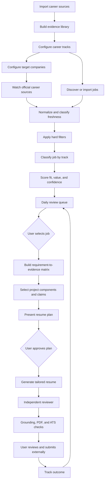
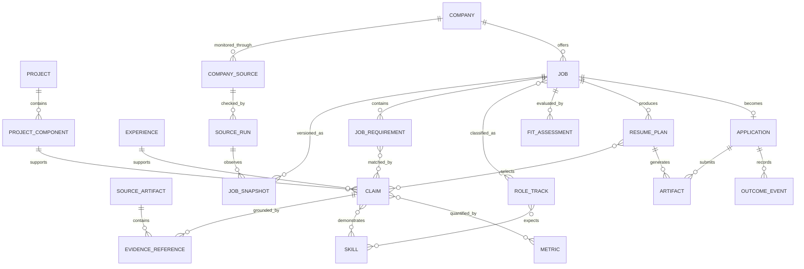

# AI-Driven Job Search: Product Specification

**Status:** Approved lean personal-MVP scope
**Version:** 0.6
**Date:** 2026-08-28
**Repository:** [`xzhnshng/ai-job-search`](https://github.com/xzhnshng/ai-job-search)
**Product owner:** Repository owner

## 1. Document purpose

This specification defines AI-Driven Job Search: a local-first,
evidence-grounded system for discovering jobs, evaluating opportunities across
multiple career tracks, selecting the strongest relevant project evidence, and
preparing high-quality applications.

### 1.1 Product and technical names

- **Product name:** AI-Driven Job Search
- **Inherited repository:** `xzhnshng/ai-job-search`
- **Current workspace folder:** `AI-Job-Search`
- **Planned Python package:** `ai_job_search`
- **Planned private runtime folder:** `.ai-job-search/`

The technical identifiers remain unchanged for repository compatibility and
shorter commands. They do not represent a different product or an older
product name.

### 1.2 Controlling lean-MVP decision

The approved personal MVP is intentionally narrower than the inherited feature
catalog and earlier sections of this specification. When a detailed
requirement conflicts with this decision, this section controls MVP scope.

The MVP has five durable product capabilities:

1. maintain a verified career-evidence and project library;
2. monitor official career sources for the user's target companies;
3. preserve observations so job freshness is evidence-based;
4. rank jobs and select the strongest truthful resume evidence;
5. track applications and export the tracker to Excel.

Codex remains the reasoning interface. It may research companies, draft and
review a tailored resume, prepare interview material, or write a cover letter
on request. Those useful interactive abilities do not require separate
subsystems in the personal MVP.

Every qualifying daily job may receive a lightweight fit and resume-evidence
plan. A complete `.tex` resume is generated only for a user-selected or
explicitly high-priority job. Cover letters are generated only when required.
No application is submitted automatically.

It converts the earlier analysis into product requirements:

- [Discovery Findings](discovery-findings.md)
- [Technical Deep Analysis](technical-deep-analysis.md)
- [Functions and User Journeys](functions-and-user-journeys.md)

This document defines what the product should do and how success will be judged. Detailed component architecture and execution sequencing are maintained separately in [System Design](system-design.md) and [Detailed Implementation Plan](implementation-plan.md).

## 2. Executive summary

The inherited repository is strong at preparing one grounded, reviewed job application. Its central strengths are:

- rich candidate profiling;
- job fit evaluation;
- drafter–reviewer separation;
- factual grounding;
- LaTeX/PDF verification;
- ATS text-layer inspection;
- local ownership of personal data;
- explicit human approval before submission.

The next product must retain those strengths while solving a broader problem:

> The user has a large body of projects, experiences, research, and technical evidence that should be selected and framed differently for software engineering, distributed systems, AI/ML engineering, research, quantitative, and biotech roles.

The product must therefore combine five things: structured evidence,
official-company monitoring, durable freshness state, explainable job and
project selection, and application tracking. Tailored resume generation is an
on-demand Codex workflow built on that durable core.

The product remains selective rather than volume-oriented. It will not automatically submit applications.

## 3. Product vision

### 3.1 Vision statement

Build a personal career intelligence and application system that can understand the user’s complete body of work, identify the best opportunities across several technical career directions, explain why each role is or is not valuable, and compose truthful, role-specific applications from verified evidence.

### 3.2 Product promise

For every recommended job, the system should answer:

1. Why is this role worth the user’s attention?
2. Which career track does it belong to?
3. Which requirements are supported by evidence?
4. Which requirements are genuine gaps?
5. Which projects and project components should appear in the resume?
6. Why were those projects selected over the alternatives?
7. What claims can be made safely?
8. What application artifact is ready now?
9. What user decision is required next?

### 3.3 Product positioning

The system is:

- a personal career evidence repository;
- a job intelligence and prioritization assistant;
- an evidence-to-resume composition engine;
- a human-supervised application workflow;
- a durable application tracker.

The system is not:

- a mass-application bot;
- an automatic job-submission service;
- a source of invented experience;
- a definitive judge of company culture;
- a replacement for networking, negotiation, or user judgment.

## 4. Target user

### 4.1 Primary persona

An experienced, technically broad candidate who:

- uses Codex as the product's conversational and reasoning environment;
- does not require a Claude Code or Anthropic subscription;
- targets multiple adjacent and non-adjacent technical career paths;
- has many professional, academic, independent, and research projects;
- cannot fit all credible experience into one resume;
- needs different evidence for different roles;
- values future learning, business relevance, and career optionality;
- wants automation without losing factual control;
- is willing to review applications before submission.

### 4.2 Current target career tracks

The product must support these target directions:

1. Senior Backend Software Engineer
2. Senior Distributed Systems Engineer
3. Senior Full-Stack Software Engineer
4. Senior AI Software Engineer
5. Machine Learning Engineer
6. Applied Scientist
7. Machine Learning Researcher
8. Quantitative Researcher
9. Quantitative Developer
10. Biotech Researcher
11. Biotech Software/ML Engineer

These are not interchangeable job-title synonyms. Each track needs its own requirements, evidence preferences, ranking weights, resume strategy, and seniority signals.

### 4.3 Secondary users

The initial product is single-user. Future forks may serve other candidates, but multi-user accounts, teams, coaches, and commercial tenancy are outside the first scope.

## 5. Problems to solve

### P1. Career evidence is fragmented

Project details are spread across CVs, documents, repositories, research notes, publications, and memory. The system cannot reliably select from A–Z if the projects are stored only as prose.

### P2. One global profile cannot represent every target role

Backend engineering, ML research, quantitative research, and biotech roles value different evidence. A single undifferentiated skill list and one fit formula produce weak prioritization.

### P3. Project selection and writing are conflated

The current workflow jumps from job requirements to tailored prose. It needs a separate, inspectable selection stage before wording begins.

### P4. Job ranking lacks enough strategic dimensions

Qualification is not the only objective. The user also cares about:

- compensation;
- location and work model;
- company durability;
- team and culture signals;
- learning value;
- future-career leverage;
- relevance to a future business;
- quality and importance of the work.

### P5. Daily discovery is manual

The user wants an end-of-day report of genuinely new, filtered, ranked jobs. The current repository requires manual invocation, has no durable scheduled-run model, and relies too heavily on aggregator timestamps that may be delayed or reset by reposting.

### P6. Job-board dates are not authoritative

LinkedIn and other aggregators may discover a role after it first appeared on the employer’s site, and a repost may look newly published. “New to this source,” “newly detected by us,” “updated,” and “first published by the employer” are different events and must not be collapsed into one date.

### P7. Resume generation is expensive

Creating a fully reviewed and compiled resume for every discovered job would waste time and model cost. The system needs artifact tiers.

### P8. Outcome data does not automatically improve selection

Application results are recorded, but the system needs a clearer process for learning which tracks, projects, claims, and channels perform well—without silently overfitting to sparse outcomes.

## 6. Goals

### G1. Build a complete, evidence-backed career knowledge base

Every important professional claim must link to one or more sources.

### G2. Support explainable multi-track positioning

The same project may contribute different components to different career tracks, while underlying facts remain unchanged.

### G3. Make project selection explicit and reviewable

Before resume writing, show which projects and claims were selected, what requirements they cover, and why alternatives were excluded.

### G4. Rank jobs by both fit and strategic value

Separate employability, opportunity quality, company evidence, career leverage, and user constraints.

### G5. Preserve application quality

Keep the inherited reviewer, factual audit, PDF layout, and ATS verification loops.

### G6. Produce a useful daily job report

Monitor target companies directly, distinguish verified-new jobs from newly detected or reposted jobs, deduplicate them, show freshness confidence and ranking factors, and create the appropriate artifact tier.

### G7. Keep the user in control

Require approval before profile changes, sensitive external writes, application finalization, or submission.

### G8. Remain local-first and portable

Private source documents and generated applications remain local by default.

### G9. Make official employer sources authoritative

For watched companies, use the employer’s official ATS or career site as the primary record of whether a job exists and is open. LinkedIn and aggregators provide supplemental discovery, not the authoritative publication timestamp.

## 7. Non-goals

The first release will not:

- automatically submit applications;
- automatically send recruiter or follow-up messages;
- answer legal, demographic, or sensitive screening questions on the user’s behalf;
- support multiple user accounts;
- promise comprehensive coverage of every job board;
- guarantee company-culture accuracy;
- train or fine-tune a custom model;
- implement compensation negotiation;
- replace user networking activity;
- generate unsupported metrics or experience;
- create a web SaaS platform;
- rank jobs using opaque scores without evidence;
- guarantee an original publication time when the employer source does not expose one.

## 8. Product principles

### 8.1 Evidence before expression

Determine what is true before deciding how to write it.

### 8.2 Selection before generation

Choose projects and claims before composing resume bullets.

### 8.3 Gaps remain visible

A missing requirement is not solved by wording.

### 8.4 High signal over high volume

Spend full application effort on a shortlist, not every scraped result.

### 8.5 Explain every important model decision

Rankings and evidence selections require factor-level reasons.

### 8.6 Confidence is separate from score

A high score based on weak evidence must be visibly less reliable.

### 8.7 Human approval at irreversible boundaries

The user controls final facts, profile changes, external communication, and submission.

### 8.8 Private by default

Personal artifacts stay local unless the user explicitly enables a named integration.

### 8.9 Deterministic validation around probabilistic work

Use schemas, validators, page checks, and traceability around model-generated analysis.

### 8.10 Freshness claims must be literal

Never label a job “published today” unless an authoritative source provides that timestamp. Otherwise use “first detected today” and show the detection window.

## 9. Release scope

### 9.1 MVP objective

The MVP proves that official-source monitoring plus structured evidence can
reliably identify new target-company jobs, explain their fit, select the right
projects, prepare a truthful resume on demand, and preserve application state.

### 9.2 MVP role-track waves

#### Wave 1: Software systems

- Senior Backend Software Engineer
- Senior Distributed Systems Engineer
- Senior Full-Stack Software Engineer

#### Wave 2: AI and ML

- Senior AI Software Engineer
- Machine Learning Engineer
- Applied Scientist
- Machine Learning Researcher

#### Wave 3: Specialized domains

- Quantitative Researcher
- Quantitative Developer
- Biotech Researcher
- Biotech Software/ML Engineer

The underlying schema must support every track from the start. Track templates and validation will be developed in waves so quality can be evaluated before expanding.

### 9.3 MVP functional scope

The MVP includes:

- CV and project-document ingestion with approved claims and metrics;
- role-track definitions needed for the user's active job variants;
- target-company registry and official ATS/career-source monitoring;
- durable baselines, incremental observations, deduplication, source health,
  and literal freshness classification;
- scheduled or manually triggered daily reports;
- hard filters, explainable ranking, and visible gaps;
- requirement-to-evidence mapping and project-component selection;
- lightweight evidence plans for qualifying jobs;
- on-demand tailored `.tex` resume generation, review, PDF compilation, and
  ATS verification for selected jobs;
- application events, interviews, results, compensation, deadlines, and Excel
  export.

### 9.4 Deferred scope

The following are not required for the personal MVP:

- broad daily scraping of LinkedIn or general job boards;
- automatic portal-adapter generation and monitoring outside the target list;
- speculative full resumes or cover letters for every detected job;
- an autonomous multi-agent application service or automatic submission;
- diploma, transcript, publication, reference-letter, citation, and public
  profile expansion pipelines;
- Gmail, calendar, Notion, Airtable, cloud-storage, or other account
  integrations;
- automatic email follow-ups;
- a web/mobile interface, hosted service, accounts, or multi-user support;
- embeddings, a vector database, distributed workers, or multi-provider AI
  abstractions;
- automatic outcome learning, self-adjusting ranking weights, labor-market
  analytics, and dedicated upskilling engines;
- dedicated interview, mock-interview, HTML-dashboard, and compensation-data
  subsystems;
- spreadsheet re-import and full inherited-workflow migration.

Codex may still perform one-off browsing, company research, cover-letter
drafting, interview preparation, or learning-plan work without turning those
activities into permanent product infrastructure. Deferred features require a
new user-approved scope decision supported by actual usage evidence.

## 10. Product experience overview



## 11. Functional requirements

Priority labels:

- **P0:** required for MVP;
- **P1:** required for first usable extended release;
- **P2:** future enhancement.

## 12. Career source ingestion

### FR-ING-001 — Source registration — P0

The system must register source artifacts with:

- stable ID;
- type;
- file or URL;
- title;
- date;
- owner;
- confidentiality;
- content hash;
- import date;
- last processed date.

Supported source types:

- CV/resume;
- LinkedIn export;
- project document;
- GitHub repository;
- portfolio page;
- publication;
- transcript;
- reference letter;
- previous application;
- user interview note.

### FR-ING-002 — Immutable originals — P0

The original source must not be rewritten during extraction. Corrections belong in normalized records.

### FR-ING-003 — Structured extraction — P0

The system must extract proposed:

- experiences;
- projects;
- project components;
- claims;
- metrics;
- skills;
- domains;
- methods;
- artifacts;
- STAR stories.

### FR-ING-004 — Source traceability — P0

Each extracted fact or claim must reference:

- source artifact;
- source location or excerpt where possible;
- extraction method;
- confidence;
- user-verification status.

### FR-ING-005 — Conflict handling — P0

When sources disagree on titles, dates, numbers, or ownership, the system must:

1. show the conflicting values;
2. cite each source;
3. avoid selecting a winner automatically;
4. request user resolution;
5. preserve the conflict history.

### FR-ING-006 — Incremental reprocessing — P1

Re-importing an unchanged source must not create duplicate records. Changed sources should produce a proposed diff.

## 13. Career evidence library

### FR-EVD-001 — Project records — P0

Each project must support:

- project ID and name;
- project type;
- organization or context;
- start/end dates;
- problem statement;
- goals;
- constraints;
- user role;
- collaborators;
- technologies;
- domains;
- architecture;
- methods;
- outcomes;
- public artifacts;
- confidentiality;
- maturity;
- evidence sources.

### FR-EVD-002 — Project components — P0

A project must contain independently selectable components, such as:

- system architecture;
- backend services;
- distributed processing;
- frontend/application;
- model development;
- experimentation;
- data engineering;
- infrastructure;
- evaluation;
- research methodology;
- domain application;
- leadership or collaboration.

One project may contribute different components to different resumes.

### FR-EVD-003 — Atomic claim ledger — P0

Claims must be stored separately from generated resume bullets.

Each claim must include:

- claim ID;
- subject project/experience;
- action;
- object or system;
- outcome;
- metric IDs;
- skill/domain tags;
- evidence links;
- confidence;
- user verification;
- confidentiality;
- allowed wording strength;
- disallowed extrapolations.

### FR-EVD-004 — Metric records — P0

Metrics must include:

- value;
- unit;
- baseline or comparison;
- measurement method;
- scope;
- time range;
- evidence;
- whether the metric may appear publicly.

### FR-EVD-005 — Claim approval — P0

Only user-approved claims may appear in a finalized application.

Unapproved claims may appear in a review queue but not in a final resume.

### FR-EVD-006 — Claim variants — P1

The system may store approved wording variants for different audiences, provided they map to the same underlying claim.

### FR-EVD-007 — Confidentiality enforcement — P0

Confidential claims must be blocked or generalized according to explicit user rules.

## 14. Role-track management

### FR-TRK-001 — Role-track object — P0

Each role track must define:

- canonical name;
- title synonyms;
- track description;
- seniority expectations;
- must-have skills;
- differentiators;
- relevant project-component types;
- expected evidence patterns;
- target industries;
- resume section order;
- preferred project count;
- scoring weights;
- hard disqualifiers;
- common adjacent-skill bridges;
- common non-bridgeable gaps.

### FR-TRK-002 — Multi-track jobs — P0

A job may map to multiple tracks with probabilities or confidence values.

Example:

```text
Senior AI Platform Engineer
70% Senior AI Software Engineer
30% Senior Distributed Systems Engineer
```

### FR-TRK-003 — Track-specific resume baseline — P0

Each validated track must have a reusable baseline containing:

- headline/profile strategy;
- competency ordering;
- default experience emphasis;
- candidate project pool;
- preferred project-component types;
- track-specific seniority signals.

### FR-TRK-004 — Track versioning — P1

Changes to track definitions must be versioned so past assessments remain reproducible.

### FR-TRK-005 — User customization — P1

The user must be able to adjust track priorities and weights without editing core application logic.

## 15. Target-company monitoring, job ingestion, and freshness

### FR-COM-001 — Target-company registry — P0

The system must maintain a user-managed target-company registry containing:

- stable company ID and aliases;
- official careers URL;
- company priority;
- relevant role tracks;
- desired locations;
- company-specific include/exclude terms;
- detected ATS or career-site type;
- board/account identifier where applicable;
- polling policy;
- enabled status;
- last successful check;
- source-health status.

### FR-COM-002 — Company priority tiers — P0

The user must be able to assign:

- Tier A: highest-priority companies;
- Tier B: strong-interest companies;
- Tier C: broader target companies.

Priority affects polling frequency and report ordering, not job-fit score.

### FR-COM-003 — Official-source detection — P0

For each company, the system must identify the official job source where possible:

- Greenhouse;
- Ashby;
- Lever;
- SmartRecruiters;
- Workday;
- Workable;
- iCIMS;
- SuccessFactors;
- RSS, sitemap, or structured feed;
- custom company career site.

Detection must record the evidence used and may require user confirmation when ambiguous.

Initial official adapter references:

- [Greenhouse Job Board API](https://developer.greenhouse.io/job-board.html)
- [Ashby Job Postings API](https://developers.ashbyhq.com/docs/public-job-posting-api)
- [Lever Postings API](https://github.com/lever/postings-api)
- [SmartRecruiters Posting API](https://developers.smartrecruiters.com/docs/get-job-postings)

LinkedIn’s own documentation notes that Job Library entries and updates can take 24–48 hours to appear, and that reposted jobs are treated as new posts. This supports using LinkedIn as supplemental discovery rather than the authoritative freshness clock: [LinkedIn Job Library](https://www.linkedin.com/help/linkedin/answer/a7436022), [LinkedIn reposting behavior](https://www.linkedin.com/help/linkedin/answer/a522130/renewability-and-duration-of-a-job-posting).

### FR-COM-004 — Source precedence — P0

For watched companies, source authority must be:

1. official employer ATS or structured career feed;
2. official employer career page;
3. approved specialist aggregator;
4. LinkedIn or general job board.

LinkedIn and aggregator timestamps must not override an official employer timestamp or the local observation history.

### FR-COM-005 — Baseline snapshot — P0

The first successful company check must create a baseline of all currently open jobs. Baseline jobs are labeled `baseline_existing`, not “new today.”

### FR-COM-006 — Incremental snapshots — P0

Each subsequent check must compare:

- posting ID;
- requisition ID;
- title;
- location;
- department/team;
- source timestamps;
- description hash;
- application URL;
- open/closed status.

Changes must be classified without overwriting prior snapshots.

### FR-COM-007 — Polling policy — P1

The default scheduled policy should support:

- Tier A: every 2 hours;
- Tier B: every 4–6 hours;
- Tier C: once daily.

Intervals must be configurable and bounded by source terms, rate limits, and health.

### FR-COM-008 — Freshness timestamps — P0

The canonical job record must keep distinct:

- `source_published_at`;
- `source_updated_at`;
- `first_seen_at`;
- `last_seen_at`;
- `previous_checked_at`;
- `detection_window_start`;
- `detection_window_end`.

The system must record what each source timestamp means. An “updated” or “last published” timestamp must not automatically become the original publication time.

### FR-COM-009 — Freshness classification — P0

Every active job must have one of:

- `verified_new`;
- `newly_detected_date_unknown`;
- `recently_updated`;
- `likely_repost`;
- `reopened`;
- `aggregator_only`;
- `baseline_existing`;
- `date_unknown`.

Every classification must include a confidence level and explanation.

### FR-COM-010 — Repost detection — P0

The system must identify likely reposts using:

- repeated requisition ID;
- previously seen employer posting ID;
- normalized company/title/location match;
- description similarity;
- recently closed equivalent posting;
- aggregator “new” date inconsistent with employer history.

A likely repost may still be ranked, but it must not be presented as a verified-new requisition.

### FR-COM-011 — Pre-report verification — P0

Before a watched-company job enters the daily report, the system must recheck the official source and confirm:

- the job remains open;
- the application URL works;
- the posting/requisition ID is consistent;
- the content has not materially changed;
- the freshness classification remains valid.

### FR-COM-012 — Source health and transparent fallback — P0

Each company source must report:

- healthy;
- degraded;
- rate-limited;
- blocked;
- authentication required;
- changed structure;
- failed;
- not checked.

Failure of the official source must be visible. The system may use a lower-authority fallback, but it must label the job accordingly and must not silently report zero jobs.

### FR-JOB-001 — Job sources — P0

The system must accept:

- official target-company ATS and career-site results;
- supplemental portal or aggregator results;
- direct job URL;
- pasted description;
- manually created job record.

### FR-JOB-002 — Canonical job record — P0

Each job must store:

- stable internal ID;
- source and source ID;
- canonical URL;
- title;
- company;
- employer requisition ID when available;
- location;
- remote/hybrid/on-site status;
- employment type;
- compensation if stated;
- source-specific publication and update timestamps;
- local first-seen and last-seen timestamps;
- freshness classification and confidence;
- deadline;
- retrieved timestamp;
- raw posting snapshot;
- normalized description;
- requirements;
- responsibilities;
- preferred qualifications;
- legal/work-authorization language;
- status;
- company-source ID;
- duplicate-group ID.

### FR-JOB-003 — Posting snapshots — P0

The exact posting text used for evaluation must be stored locally with retrieval time and content hash.

### FR-JOB-004 — Deduplication — P0

The system must detect:

- exact URL duplicates;
- source-ID duplicates;
- canonical company/title duplicates;
- cross-portal duplicates;
- substantially identical postings across locations.

Potential duplicates must retain source provenance.

### FR-JOB-005 — Portal and company-source health — P1

The system must preserve existing semantic health checks:

- missing critical fields;
- invalid URLs;
- garbled content;
- zero-yield anomalies;
- detail-fetch failures;
- rate-limit distinction.

### FR-JOB-006 — Expiration — P0

Closed, deleted, or expired jobs must not enter the active recommendation queue.

## 16. Job classification, filters, and ranking

### FR-RNK-001 — Hard filters first — P0

Before scoring, evaluate:

- citizenship/residency eligibility;
- security clearance;
- visa sponsorship constraints;
- location and relocation;
- work model;
- compensation floor when known;
- employment type;
- user-defined deal-breakers.

Hard-filter failures must be shown with the exact reason and source text. They must not be hidden.

### FR-RNK-002 — Separate ranking dimensions — P0

The system must score and display:

1. requirement fit;
2. evidence strength;
3. career-track alignment;
4. work-content quality;
5. learning and career leverage;
6. future-business leverage;
7. company outlook;
8. culture/team evidence;
9. compensation;
10. logistics.

Not every dimension must contribute equally. Missing data must not be treated as a neutral fact without disclosure.

### FR-RNK-003 — Confidence — P0

Each dimension must include:

- score;
- confidence;
- supporting evidence;
- missing information.

Example:

```text
Culture: 76/100
Confidence: Low
Evidence: job posting language and two public employee sources
Missing: target team and manager information
```

### FR-RNK-004 — Baseline overall score — P0

For MVP, use:

```text
35% requirement fit
15% evidence strength
15% career-track alignment
10% work-content quality
10% learning/career leverage
 5% future-business leverage
 5% company outlook
 5% culture/team evidence
```

Compensation and logistics act as:

- hard gates when a threshold is configured;
- visible factors otherwise.

Weights must be configurable by role track and user preferences.

### FR-RNK-005 — Score explanation — P0

Every recommended job must show:

- track classification;
- overall score;
- dimension scores;
- confidence;
- strongest matches;
- important gaps;
- hard-filter status;
- reasons it ranked above or below adjacent jobs.

### FR-RNK-006 — Company research evidence — P1

Company outlook and culture must record:

- source;
- source date;
- evidence type;
- confidence;
- whether the statement is fact or inference.

### FR-RNK-007 — User feedback — P1

The user may mark:

- ranking too high;
- ranking too low;
- wrong track;
- irrelevant reason;
- missing factor;
- not interested for personal reasons.

Feedback creates a calibration proposal; it does not immediately mutate all weights.

## 17. Requirement-to-evidence mapping

### FR-MAP-001 — Requirement extraction — P0

For an evaluated job, extract:

- hard requirements;
- preferred requirements;
- responsibilities;
- seniority expectations;
- domain expectations;
- logistics;
- implied evaluation themes.

### FR-MAP-002 — Evidence matrix — P0

For every requirement, show:

- matching claims;
- matching project components;
- evidence strength;
- exact/adjacent/gap classification;
- potential wording;
- uncertainty.

### FR-MAP-003 — Honest adjacency — P0

Adjacent experience must be labeled as adjacent. The system must not convert conceptual similarity into direct experience.

### FR-MAP-004 — Gap strategy — P0

Each gap must be classified:

- non-blocking and learnable;
- bridgeable through adjacent experience;
- serious but potentially acceptable;
- hard disqualifier.

The system must recommend how to address the gap without inserting unsupported resume keywords.

## 18. Project and claim selection

### FR-SEL-001 — Separate selection stage — P0

The system must create a resume evidence plan before writing resume prose.

### FR-SEL-002 — Selection candidates — P0

Selection operates on project components and claims, not only whole projects.

### FR-SEL-003 — Baseline selection score — P0

Each candidate component receives:

```text
30% job-requirement coverage
20% role-track relevance
15% demonstrated impact
15% seniority signal
10% evidence strength
 5% recency
 5% uniqueness
```

Then apply penalties for:

- redundancy with selected evidence;
- weak ownership;
- confidentiality;
- excessive explanation cost;
- page-budget cost.

### FR-SEL-004 — Coverage optimization — P0

The final project set should maximize:

- critical requirement coverage;
- evidence diversity;
- impact;
- seniority;
- track relevance;

subject to:

- page budget;
- project-count target;
- truthfulness;
- confidentiality;
- minimum readability.

### FR-SEL-005 — Selection explanation — P0

Before drafting, show:

- selected projects and components;
- selected claims;
- requirements covered;
- alternatives considered;
- exclusion reason for high-scoring alternatives;
- unresolved gaps.

### FR-SEL-006 — User override — P0

The user may:

- pin a project;
- ban a project;
- replace a selection;
- change project count;
- prefer recent versus high-impact evidence;
- request a different narrative.

Overrides are recorded for that application and may be proposed as future track preferences.

### FR-SEL-007 — Avoid overusing one project — P1

The selector should avoid using one project for every requirement when a more credible diverse evidence set exists.

## 19. Resume and application composition

### FR-APP-001 — Artifact tiers — P0

Jobs receive one of four preparation tiers:

| Tier | Trigger | Artifact |
|---|---|---|
| T0 | Every new job | Normalized job record and quick score |
| T1 | Above configurable ranking threshold | Track classification and resume evidence plan |
| T2 | Shortlisted job | Tailored resume draft |
| T3 | User-approved application | Reviewer, final PDF, ATS verification, cover letter if required |

### FR-APP-002 — Track baseline reuse — P0

T2 generation begins from the role-track baseline, then applies job-specific evidence selection.

### FR-APP-003 — Bullet composition — P0

Resume bullets may use only:

- approved claims;
- approved metrics;
- approved public wording;
- selected evidence components.

### FR-APP-004 — Wording transformation — P0

The system may:

- reorder facts;
- emphasize a different aspect;
- use the posting’s exact terminology when factually equivalent;
- compress multiple approved claims;
- split one claim for readability.

It may not:

- change dates;
- invent scale;
- inflate ownership;
- imply production use from experimentation;
- imply research novelty without evidence;
- convert team outcomes into sole ownership;
- add unverified metrics.

### FR-APP-005 — Requirement coverage report — P0

The draft must include a report mapping job requirements to resume evidence or explicit gaps.

### FR-APP-006 — Reviewer — P0

A fresh-context reviewer must check:

- factual grounding;
- missed high-priority requirements;
- project-selection quality;
- track positioning;
- seniority signal;
- redundancy;
- generic wording;
- company-specific relevance;
- tone;
- unsupported claims.

### FR-APP-007 — Reviewer interface — P0

The reviewer must return:

- structured edits;
- selection objections;
- missing-evidence warnings;
- narrative recommendations;
- a final pass/fail recommendation.

### FR-APP-008 — PDF verification — P0

The existing compile-and-inspect loop remains mandatory:

- expected page count;
- no orphaned headings;
- no overflow;
- no broken fonts;
- readable spacing;
- visible contact information.

### FR-APP-009 — ATS verification — P0

The final resume must be checked for:

- text extraction;
- literal contact details;
- reading order;
- dates;
- keyword coverage;
- absent genuine gaps.

### FR-APP-010 — Cover letters — P1

Cover-letter generation remains available but may be skipped where the employer does not request one or the market does not value it.

### FR-APP-011 — Human submission gate — P0

The system must never submit an application automatically.

## 20. Daily job intelligence

### FR-DAY-001 — Manual daily run — P0

The user can generate a daily report on demand.

### FR-DAY-002 — Scheduled daily run — P1

The system can poll watched companies according to their priority and produce a consolidated report at a configured local time.

### FR-DAY-003 — Idempotent runs — P1

Each run must have:

- run ID;
- start/end time;
- sources attempted;
- source statuses;
- previous check timestamps;
- jobs found;
- jobs deduplicated;
- jobs filtered;
- jobs ranked;
- artifacts created;
- errors;
- retry status.

Rerunning the same time window must not duplicate jobs or artifacts.

### FR-DAY-004 — Daily report — P0

The report must include:

- source health summary;
- count of verified-new, newly detected, updated, reposted, and aggregator-only jobs;
- separate `Verified new`, `Newly detected`, and `Reposts or updates` sections;
- top recommendations;
- authoritative source and direct employer URL;
- source publication/update timestamps when available;
- local first-seen time and detection window;
- freshness classification and confidence;
- track;
- score and confidence;
- hard-filter results;
- compensation/location summary;
- strongest evidence matches;
- important gaps;
- company/outlook notes;
- artifact tier and file;
- next required user action.

### FR-DAY-005 — Review queue — P1

The user can mark each job:

- apply;
- investigate;
- save;
- skip;
- wrong track;
- not interested;
- duplicate.

### FR-DAY-006 — Cost controls — P1

The user may set:

- maximum jobs deeply ranked per day;
- ranking threshold for T1;
- maximum T2 drafts;
- company-research depth;
- company sources and supplemental portals enabled;
- company priority and polling intervals;
- retry limits.

## 21. Application tracking and outcomes

### FR-OUT-001 — Application record — P0

Each application must link:

- job snapshot;
- selected track;
- evidence plan;
- generated artifacts;
- submitted artifact versions;
- submission date/channel;
- contacts;
- current state;
- timeline;
- outcomes.

### FR-OUT-002 — Submitted-version preservation — P0

The exact submitted CV and cover letter must be archived and never overwritten by later revisions.

### FR-OUT-003 — Outcome timeline — P0

Support:

- applied;
- recruiter screen;
- hiring-manager screen;
- assessment;
- technical interview;
- onsite/final round;
- offer;
- hired;
- rejected;
- no response;
- withdrawn;
- offer declined.

### FR-OUT-004 — Email status proposal — P1

Email-derived status changes require:

- matching rationale;
- source email;
- confidence;
- user approval before writes.

### FR-OUT-005 — Outcome calibration — P1

After sufficient outcomes, propose changes to:

- track weights;
- search priorities;
- evidence preferences;
- project-selection rules;
- channel strategy.

No calibration is applied without approval.

### FR-OUT-006 — Sparse-data warning — P1

Calibration must warn when evidence is too sparse or confounded to support a conclusion.

### FR-OUT-007 — Application tracker — P0

Provide one filterable tracking list containing every application. The primary record is an application to a specific job, not merely a company, because the user may apply to multiple jobs at the same company.

Each row must show at least:

- application ID;
- company;
- job title;
- selected role track;
- location and working arrangement;
- official job URL and source;
- date applied;
- current status/stage;
- most recent status date;
- next action and due date;
- next scheduled event;
- final result when known;
- compensation or salary when known;
- offer decision deadline when applicable;
- recruiter or referral contact;
- submitted artifact links;
- last-updated timestamp;
- user notes.

The list must support search, sorting, and filtering by company, role track, stage, result, application date, next-action date, location, and compensation.

### FR-OUT-008 — Manual status and milestone updates — P0

The user must be able to add, edit, or correct:

- application date;
- current stage;
- stage date;
- interview type, date, time, timezone, and participants;
- assessment or take-home deadline;
- next action and follow-up date;
- result;
- rejection or withdrawal reason;
- offer date;
- offer decision deadline;
- compensation;
- contact;
- notes.

Example: `First interview — 2026-08-31, 10:00 America/Los_Angeles`.

Updating the current status creates or corrects a timeline event. It must not erase previous milestones. Destructive corrections require confirmation and remain visible in the audit history.

### FR-OUT-009 — Compensation and offer tracking — P0

Compensation must distinguish, where available:

- currency;
- pay period;
- base salary minimum and maximum;
- target bonus;
- sign-on bonus;
- equity and vesting notes;
- estimated total compensation;
- source (`job_posting`, `recruiter`, `user_expectation`, or `offer`);
- benefits and negotiation notes;
- offer expiration or decision deadline.

An advertised range, a recruiter-stated range, the user’s expectation, and an actual offer must not overwrite one another.

### FR-OUT-010 — Excel export — P0

The user must be able to export the tracker as a real `.xlsx` workbook. Dates, currencies, numbers, links, and status values must use native Excel types where practical so filtering and sorting work correctly.

The workbook must contain:

1. `Applications` — one row per application with its current state;
2. `Timeline` — one row per application event or milestone;
3. `Offers` — normalized compensation and decision-deadline details;
4. `Lookups` — documented status values, result values, and export metadata.

The export must:

- respect the user’s active filters when requested;
- support a full-history export;
- include stable application IDs for reconciliation;
- record export time and schema version;
- avoid embedding private source documents;
- contain links or local artifact paths only when the user enables them.

### FR-OUT-011 — Spreadsheet round-trip — P1

The user may edit permitted fields in an exported workbook and import it back. Import must:

- match rows by stable application ID;
- validate dates, currencies, statuses, and required fields;
- show a change preview;
- identify conflicts with newer local updates;
- require approval before writing;
- reject unknown or destructive changes rather than guessing;
- preserve the event and audit history.

The local tracker remains the source of truth; the spreadsheet is a portable view and controlled update surface.

### FR-OUT-012 — Deadlines and follow-up visibility — P0

Tracker and report views must distinguish:

- overdue actions;
- actions due today;
- interviews and assessments in the next seven days;
- offer decision deadlines;
- applications with no activity beyond a user-configured interval.

Dates must be stored with timezone information when time-of-day matters. Date-only events such as an offer deadline must remain date-only rather than being silently shifted across timezones.

## 22. Deferred interview and skill-development requirements

These P1 requirements are retained as future reference and are not part of the
lean personal MVP. Equivalent one-off help may be requested directly from
Codex using the submitted application evidence.

### FR-INT-001 — Application-consistent prep — P1

Interview preparation must use the exact submitted artifacts and selected claims.

### FR-INT-002 — Project deep dives — P1

For each selected resume project, generate:

- architecture explanation;
- contribution boundary;
- tradeoffs;
- failures and lessons;
- likely follow-ups;
- evidence-safe metrics.

### FR-INT-003 — Gap bridge answers — P1

Generate honest transition answers for adjacent or missing skills.

### FR-UP-001 — Track-specific skill-gap analysis — P1

Upskilling reports must distinguish:

- gaps blocking the current track;
- gaps that increase seniority;
- gaps useful across tracks;
- gaps with future-business leverage.

## 23. Data model

The product requires these primary entities:



### 23.1 Entity summary

| Entity | Purpose |
|---|---|
| SourceArtifact | Immutable original source |
| EvidenceReference | Link from normalized fact to source location |
| Experience | Employment, education, research, or other context |
| Project | Coherent body of work |
| ProjectComponent | Selectable part of a project |
| Claim | Atomic, evidence-backed statement |
| Metric | Quantitative support and measurement context |
| Skill | Normalized capability |
| RoleTrack | Career strategy and evaluation configuration |
| Company | Target employer, priority, preferences, and aliases |
| CompanySource | Official ATS/career endpoint and health configuration |
| SourceRun | One poll of a company source or supplemental portal |
| Job | Normalized, snapshotted opportunity |
| JobSnapshot | Immutable observation of a posting at a point in time |
| JobRequirement | Atomic job expectation |
| FitAssessment | Scores, confidence, evidence, gaps |
| ResumePlan | Selected evidence and rationale |
| Artifact | Resume, cover letter, report, interview pack |
| Application | Submitted opportunity record |
| OutcomeEvent | Timeline event |
| ApplicationAction | Follow-up task or deadline |
| InterviewEvent | Scheduled interview milestone |
| CompensationRecord | Advertised, expected, recruiter-stated, or offered compensation |
| Offer | Offer terms, decision deadline, and decision |
| Run | Discovery/ranking/generation execution record |

### 23.2 Storage requirement

The implementation design must choose between:

- validated human-readable files with generated indexes; or
- a local database with exportable human-readable views.

Regardless of storage, the product requires:

- stable IDs;
- schema validation;
- migrations;
- provenance;
- versioning;
- local export;
- backup;
- confidentiality labels.

## 24. Product commands

The slash-command names below are useful workflow labels inherited from the
Claude-oriented repository. They are not a requirement to use Claude Code.

In AI-Driven Job Search, the primary Codex interface is:

- natural-language requests such as “Run my daily job search”;
- repository skills such as `$ai-job-daily`, `$ai-job-apply`, and
  `$ai-job-applications`;
- a typed local CLI called by Codex for deterministic database, validation,
  monitoring, and export operations.

The Codex skills may preserve familiar workflow names while translating them
to validated CLI operations.

| Command | AI-Driven Job Search responsibility |
|---|---|
| `/setup` | Identity, constraints, track preferences, basic source import |
| `/ingest` | Import and normalize career sources |
| `/evidence` | Review projects, claims, metrics, and conflicts |
| `/tracks` | Configure and inspect role tracks |
| `/companies add <career-url>` | Register a target company and detect its official job source |
| `/companies list` | Review target companies, priorities, and source health |
| `/companies health` | Diagnose official company-source coverage |
| `/watch-companies` | Poll official career sources and update snapshots |
| `/rank` | Hard-filter, classify, and rank jobs |
| `/plan <job>` | Build requirement matrix and resume evidence plan |
| `/apply <job>` | On demand, generate and verify a tailored `.tex` resume for a selected job |
| `/daily` | Verify watched-company jobs and produce the freshness-aware review queue |
| `/applications` | View, search, sort, and filter the application tracker |
| `/applications update <application>` | Update status, dates, next actions, results, compensation, or notes |
| `/applications export [xlsx]` | Export the current view or full tracker to Excel |
| `/outcome` | Add a timeline event or final outcome |

Command names are conceptual workflow names, not a commitment to Claude-style
slash commands. The implementation must provide equivalent Codex skills and
natural-language journeys.

Supplemental portal search, spreadsheet import, dedicated interview/upskill
commands, integrations, and dashboards are deferred. Codex may still help with
their underlying one-off tasks when requested.

## 25. Non-functional requirements

### NFR-001 — Privacy

Personal source documents and application artifacts remain local by default.

### NFR-002 — Security

External job postings and web pages are untrusted input. They must never directly control tools, file operations, or link traversal.

### NFR-003 — Auditability

Every final resume bullet must resolve to:

```text
bullet → claim(s) → project/experience → evidence source(s)
```

### NFR-004 — Reproducibility

A finalized application must record:

- job snapshot hash;
- role-track version;
- selected claims;
- prompt/workflow version;
- template version;
- artifact hashes.

### NFR-005 — Idempotency

Repeated ingestion, discovery, and email processing must not create duplicates.

### NFR-006 — Recoverability

Interrupted workflows must be resumable from the last safe stage without corrupting state.

### NFR-007 — Performance

MVP targets:

- open an evidence record in under 2 seconds;
- rank 50 normalized jobs in under 10 minutes, excluding portal acquisition;
- generate a T1 plan in under 2 minutes;
- generate and verify a T3 application in under 20 minutes under normal tool availability.

These are operating targets, not hard guarantees for external network or model latency.

### NFR-008 — Cost visibility

Each run should report:

- model calls;
- web requests;
- reviewer calls;
- compile iterations;
- elapsed time;
- estimated cost where available.

### NFR-009 — Portability

Core schemas and deterministic logic must not depend on one model vendor. Runtime bindings may be implemented separately.

### NFR-010 — Accessibility and readability

Generated reports must be readable in plain Markdown and must not require a graphical interface.

### NFR-011 — Freshness integrity

The system must preserve the distinction between:

- employer publication time;
- employer update or last-published time;
- local first detection;
- aggregator observation;
- repost or reopening.

No presentation layer may relabel one timestamp type as another.

## 26. Privacy and security requirements

### 26.1 Data classes

| Class | Examples | Default |
|---|---|---|
| Public | Public GitHub README, publication | May be cited |
| Personal | CV, contact details, application tracker | Local only |
| Confidential | Employer project details, unpublished research | Block or generalize |
| Sensitive external | Email content, recruiter messages | Connector-scoped, local derived state |

### 26.2 Required controls

- file-path allowlists;
- gitignore guards;
- permission allowlists;
- no package install lifecycle scripts;
- posting prompt-injection boundary;
- source-domain verification for company facts;
- redaction and confidentiality flags;
- explicit external-sync approval;
- document-content exclusion from Notion by default;
- audit logs for profile and claim changes.

## 27. Success metrics

### 27.1 Product-quality metrics

- percentage of final bullets with complete evidence trace: target 100%;
- unsupported claims detected after finalization: target 0;
- project-selection plans accepted without replacement: target ≥70% after calibration;
- requirement matrix coverage for supported critical requirements: target ≥90%;
- artifact technical validation pass rate after final iteration: target 100%;
- duplicate job rate in daily report: target <2%;
- expired/invalid job rate in top recommendations: target <5%.
- watched-company jobs with a visible source-health state: target 100%;
- jobs labeled `verified_new` without authoritative evidence: target 0;
- verified-new target-company jobs detected within configured polling window: target ≥95%;
- likely reposts incorrectly presented as verified new: target 0.

### 27.2 User-efficiency metrics

- time from selected job to approved resume plan;
- time from approved plan to final verified resume;
- number of jobs manually inspected before finding a worthwhile shortlist;
- percentage of generated T2 drafts promoted to T3;
- user edits required after T3.

### 27.3 Outcome metrics

- application-to-screen conversion;
- screen-to-interview conversion;
- interview-to-offer conversion;
- conversion by role track;
- conversion by project/claim usage;
- conversion by source/channel;
- user-rated quality of opportunity.

Outcome metrics must be treated as correlational. The product must not claim causation from sparse personal data.

## 28. MVP acceptance criteria

The MVP is complete when all of the following are demonstrable:

### Evidence foundation

- The user's initial approved project set can be imported and extended without
  rewriting original documents.
- Each project supports multiple components.
- At least 40 atomic claims can be stored and reviewed in the initial real-data
  acceptance run.
- Every approved claim links to evidence.
- Conflicts are presented and resolved without overwriting source history.

### Role tracks

- Wave 1 track definitions exist and are user-editable.
- The same project can receive different relevance by track.
- A mixed-track job can be classified into more than one track.

### Job evaluation

- A job can be imported from URL or pasted text.
- Hard filters run before scoring.
- Ranking shows dimension scores, confidence, evidence, and missing data.
- Posting text is snapshotted.

### Target-company monitoring

- At least 20 target companies can be registered.
- Each company can be assigned a priority tier and role-track interests.
- The system supports the official ATS/source families actually used by the
  approved target-company list; unsupported companies remain visibly degraded.
- The first check creates a baseline without calling existing jobs new.
- A later check identifies added, changed, closed, reopened, and likely reposted jobs.
- Publication, update, first-seen, and last-seen timestamps remain distinct.
- Every job has a freshness classification, confidence, and explanation.
- Official-source failure appears in source health and never silently becomes zero jobs.
- The daily report separates verified-new jobs from newly detected and reposted jobs.

### Project selection

- The product builds a requirement-to-evidence matrix.
- It selects project components, not only projects.
- It explains selection and exclusions.
- The user can pin, ban, or replace a project.

### Resume generation

- A track baseline can be generated.
- A job-specific resume can be produced on demand from approved claims only.
- A fresh reviewer can challenge selection and wording.
- The final PDF passes page/layout validation.
- ATS text extraction is checked when Poppler is available.
- Every final bullet is traceable to evidence.

### Operations

- Discovery state deduplicates repeated runs.
- A daily report can be generated manually and by the configured Codex
  schedule.
- Watched-company jobs are verified against the official source before reporting.
- Applications and submitted versions can be archived.
- Every application appears in a filterable tracker with its current state and full timeline.
- The user can manually record an interview date, result, compensation, next action, and offer decision deadline.
- Tracker status changes preserve earlier milestones and record an audit entry.
- A valid `.xlsx` export contains `Applications`, `Timeline`, `Offers`, and `Lookups` sheets.
- Excel dates, numbers, currencies, and links remain sortable and usable after export.
- No command submits an application.

## 29. Release plan

### Phase 0 — Product decisions

- approve this specification;
- confirm initial geography;
- confirm Wave 1 tracks;
- choose storage approach;
- define confidentiality defaults;
- select resume format and page limits.

### Phase 1 — Evidence foundation

- source artifact registry;
- project/component model;
- claim and metric ledger;
- evidence review interface;
- schema validation and migrations.

### Phase 2 — Role tracks and selection

- Wave 1 track definitions;
- job requirement extraction;
- track classification;
- requirement-to-evidence matrix;
- project selection and explanation.

### Phase 3 — Application composition

- track resume baselines;
- tailored resume generation;
- reviewer improvements;
- provenance report;
- PDF and ATS gates.

### Phase 4 — Job intelligence

- target-company registry and priority tiers;
- ATS/career-source detection;
- official-source baseline and incremental snapshots;
- normalized job schema;
- freshness timestamps and classifications;
- repost and reopening detection;
- pre-report verification;
- enhanced deduplication;
- strategic ranking;
- confidence and evidence;
- daily manual report.

### Phase 5 — Operations

- scheduled daily runs;
- priority-based company polling;
- review queue;
- company-source, portal-health, and cost reporting;
- retries and resumability;
- additional official-source adapters required by the target-company list.

### Deferred backlog — only after usage review

- broader portals and company intelligence;
- integrations and dashboards;
- automatic outcome calibration;
- dedicated interview and upskill systems;
- Wave 2 and Wave 3 tracks beyond those actively needed.

## 30. Risks

| Risk | Impact | Mitigation |
|---|---|---|
| Evidence ingestion creates wrong claims | High | Source spans, confidence, mandatory approval |
| Role tracks become too generic | High | Track-specific seniority and evidence rubrics |
| Ranking shows false precision | High | Confidence and factor evidence beside scores |
| Project selector favors keywords over substance | High | Impact, seniority, evidence, and diversity weights |
| Sparse outcome data causes overfitting | Medium | Minimum sample warning and approval-gated calibration |
| Daily automation creates too many drafts | Medium | Artifact tiers and daily caps |
| Employer source changes silently break discovery | High | Semantic health checks, sentinel verification, and visible source status |
| LinkedIn repost appears newly released | High | Official-source precedence, requisition history, and freshness classification |
| ATS update timestamp is mistaken for original publication | High | Typed timestamp semantics and immutable observation history |
| Official career source exposes no timestamp | Medium | Local first-seen window and `newly_detected_date_unknown` label |
| Official site blocks automated monitoring | Medium | Visible blocked state, bounded fallback, no access bypass |
| Private employer details leak into applications | High | Confidentiality labels and wording restrictions |
| Prompt injection affects local data | High | Treat external content as data and restrict tools/links |
| Model/runtime changes alter behavior | Medium | Versioned workflows, schemas, and reproducible records |
| Scope becomes too broad across eleven tracks | High | Track waves and MVP acceptance gates |

## 31. Dependencies

The product currently depends on:

- Codex desktop or Codex CLI for interactive reasoning and orchestration;
- repository-level `AGENTS.md` guidance and `.agents/skills/ai-job-*/SKILL.md`
  workflow skills;
- Python 3.12 for the deterministic AI-Driven Job Search core;
- Bun for portal CLIs;
- LuaLaTeX and XeLaTeX;
- Poppler for ATS text checks;
- official employer ATS/career sources and supplemental job portals;
- optional Gmail and Notion connectors;
- web research access.

Claude Code, an Anthropic subscription, and Anthropic SDK packages are not
product dependencies. The interactive MVP also does not require a separate
OpenAI API key: Codex performs the reasoning within the user's active Codex
session and exchanges versioned task/result payloads with the local CLI.

Database operations, source monitoring, deduplication, filtering, validation,
export, and cleanup remain usable as deterministic commands without an agent.
Any future unattended non-interactive reasoning mode must declare its own
authentication, cost, failure, and approval model instead of silently adding a
provider dependency.

## 32. Product decisions

### 32.1 Resolved by the lean-MVP decision

- Supplemental portals have no MVP priority; official target-company sources
  are authoritative and one-off Codex browsing remains available.
- Cover letters are created only when the selected job requires one or the user
  requests one.
- Automatic outcome calibration is deferred; tracked outcomes do not silently
  change strategy.
- Full resumes are generated on demand for selected or explicitly
  high-priority jobs, not for every daily match.

### 32.2 Remaining open decisions

These decisions should be resolved before detailed design:

1. What are the initial job geographies and work-authorization rules?
2. Are Wave 1 tracks correct, or should AI/ML enter the first MVP?
3. Should Senior Full-Stack be a separate track or a backend variant?
4. Should Applied Scientist and ML Researcher be separate from the beginning?
5. What qualifies as an acceptable evidence source for private work?
6. How should confidential employer projects be generalized?
7. Should the career evidence store use YAML/JSON files, SQLite, or a hybrid?
8. Is the default resume one page, two pages, or track/market-specific?
9. Which jobs deserve an automatic T2 draft?
10. Which company-outlook sources are acceptable?
11. How should future-business leverage be defined and weighted?
12. What local time and delivery mechanism should the daily report use?
13. Which companies belong in Tier A, Tier B, and Tier C?
14. How many companies should the MVP watch?
15. Which official ATS families must the first implementation support beyond Greenhouse, Ashby, Lever, and SmartRecruiters?
16. What polling intervals are acceptable for each company tier?

## 33. Recommended next artifact

The detailed AI-Driven Job Search journey and interaction expectations are now documented in [User Experience Journey](user-experience-journey.md), including:

- onboarding screens/conversation states;
- evidence review;
- project and claim editing;
- role-track configuration;
- daily report interaction;
- requirement matrix;
- resume-plan approval;
- application lifecycle;
- error and recovery states.

The corresponding technical architecture is documented in [System Design](system-design.md), including:

- local modular-monolith boundaries;
- SQLite and artifact persistence;
- official company-source adapters and freshness logic;
- evidence selection and application generation;
- application events and Excel exchange;
- migration, security, testing, and delivery slices.

After design review, continue with:

The execution sequence, work packages, dependencies, target files, tests, migration gates, and cutover rules are documented in [Detailed Implementation Plan](implementation-plan.md).

Continue with:

1. review and approve the implementation plan;
2. begin Slice 0 foundations;
3. demonstrate Gate G0;
4. proceed slice by slice only after each gate passes.

## 34. Product-spec summary

AI-Driven Job Search should preserve the inherited repository’s strongest application-quality controls while adding the structured intelligence needed for a broad technical career.

The key product change is:

```text
Current:
profile prose → job posting → generated resume

AI-Driven Job Search:
source evidence
→ approved projects/components/claims
→ role-track strategy
→ target-company official-source monitoring
→ freshness-aware job record
→ job requirement matrix
→ explainable evidence selection
→ generated resume
→ independent review
→ deterministic verification
```

This structure makes it possible to select projects `(A, B, Z, K)` for a distributed-systems role and `(A, C, M, N)` for an ML-research role without changing the underlying truth of any project.
