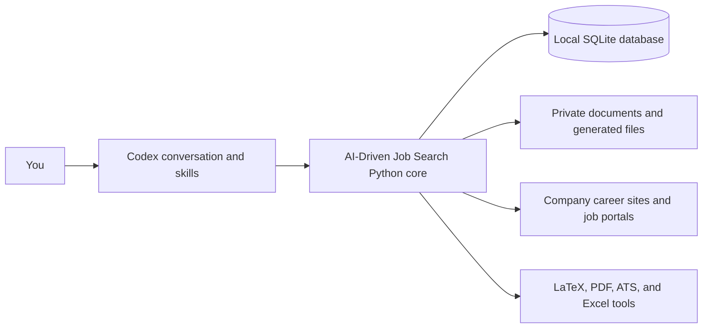
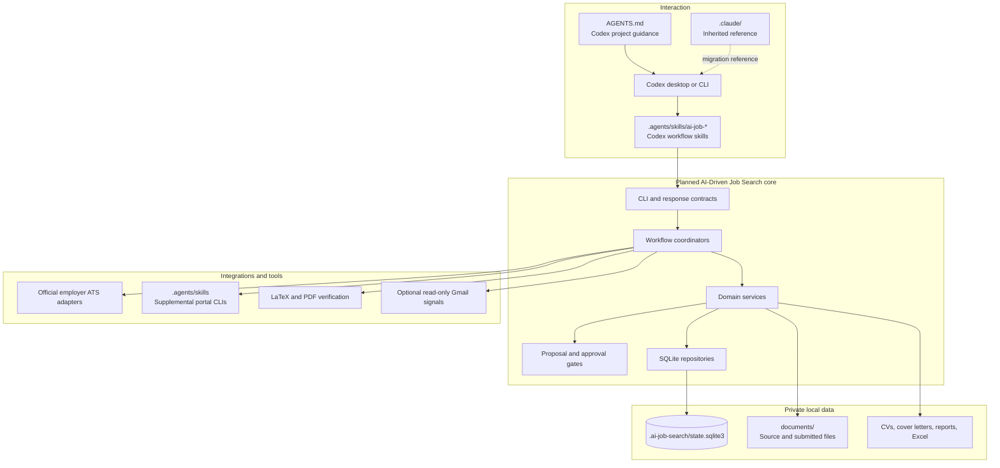

# AI-Driven Job Search: Project Architecture and Data Guide

**Status:** Simplified architecture guide
**Version:** 0.3
**Date:** 2026-07-26
**Detailed design:** [System Design](system-design.md)
**Implementation plan:** [Detailed Implementation Plan](implementation-plan.md)

## 1. The simple mental model

The project has four parts:



1. **Codex conversation and repository skills** provide the user experience.
2. **Python core** will enforce rules and coordinate workflows.
3. **SQLite** will store structured state and history.
4. **Files and adapters** hold source documents, application artifacts, and job-source integrations.

There will not be a web server or cloud database in MVP.

## 2. Current versus planned architecture

The inherited repository currently works mainly through Claude-oriented
Markdown instructions. They remain useful design references, but AI-Driven Job Search uses
Codex as its primary environment.

```text
Current:
you
→ inherited .claude workflow
→ Claude-oriented instructions
→ portal/Python/LaTeX tools
→ CSV, JSON, Markdown, and LaTeX files
```

AI-Driven Job Search adds a code-enforced core:

```text
AI-Driven Job Search:
you
→ Codex natural language or $ai-job-* skill
→ Python workflow service
→ validation and approval
→ SQLite transaction
→ generated file/report
```

The current project still works as inherited. The planned `src/`, `migrations/`, `schemas/`, `config/`, and `.ai-job-search/` structures do not exist yet and will be created during implementation.

## 3. High-level architecture



## 4. Project folder map

Planned final structure:

```text
AI-Job-Search/
├── AGENTS.md                  Codex project guidance and canonical pointers
├── .agents/                   Codex workflows and executable job-portal skills
├── .claude/                   Inherited Claude workflow/profile references
├── src/                       Planned AI-Driven Job Search Python application
├── migrations/                Planned SQLite schema migrations
├── schemas/                   Planned JSON contracts
├── config/                    Planned tracked defaults and role tracks
├── .ai-job-search/            Planned private runtime data
├── documents/                 Your private career and application documents
├── cv/                        CV template and generated CVs
├── cover_letters/             Cover-letter template and generated letters
├── templates/                 User-registered document templates
├── tools/                     Deterministic utilities and safety checks
├── tests/                     Python tests
├── assets/                    README and branding assets
├── job_scraper/               Current legacy discovery state
├── gmail_sync/                Current optional legacy email-sync state
├── reports/                   Current generated reports
├── upskill/                   Generated learning reports
├── docs/                      Product and engineering documentation
├── CLAUDE.md                  Inherited candidate profile compatibility source
├── README.md                  User-facing repository introduction
└── pyproject.toml             Planned Python package definition
```

## 5. What each folder does

### 5.1 Interaction and agent behavior

| Folder/file | Status | Function |
|---|---|---|
| `AGENTS.md` | Current, to update | Codex project guidance and pointers to the deterministic core, product policy, and workflow skills |
| `.agents/skills/ai-job-*/` | Planned | Codex-first setup, daily search, application, tracker, evidence, company, interview, and report workflows |
| `.claude/commands/` | Inherited | Workflow references for `/setup`, `/apply`, `/rank`, `/outcome`, and related journeys |
| `.claude/skills/job-application-assistant/` | Inherited | Candidate profile, writing style, evaluation policy, CV rules, cover-letter rules, and interview guidance to migrate |
| `.claude/skills/job-scraper/` | Inherited | Prior orchestration design for installed job-search adapters |
| `.claude/skills/upskill/` | Inherited | Prior skill-gap and learning-plan workflow |
| `.claude/agents/` | Inherited | Prior specialized-agent definitions |
| `.claude/settings.json` | Claude-only compatibility | Historical Claude Code operation settings; Codex does not depend on them |
| `CLAUDE.md` | Inherited | Candidate profile compatibility source to migrate into structured evidence |

In AI-Driven Job Search, `AGENTS.md` and repository Codex skills are the conversational
layer. Database rules, transitions, scoring formulas, and persistence move
into Python code.

### 5.1.1 How you will invoke it in Codex

Natural-language use:

```text
Run my daily job search and show only jobs first detected today.
Prepare a resume plan for job job_123.
Show applications with an interview or decision deadline this week.
```

Explicit workflow use:

```text
$ai-job-daily
$ai-job-apply
$ai-job-applications
```

Codex reads the skill, calls validated local CLI operations, and returns the
result for review. No Claude Code installation, Anthropic subscription, or
Anthropic SDK is required. The interactive MVP also avoids requiring a
separate model API key.

### 5.2 Job-source integrations

| Folder | Status | Function |
|---|---|---|
| `.agents/skills/linkedin-search/` | Current | Searches public LinkedIn job listings as a supplemental source |
| `.agents/skills/freehire-search/` | Current | Searches a multi-market technical-job aggregator |
| `.agents/skills/jobindex-search/` | Current | Searches Jobindex |
| `.agents/skills/jobnet-search/` | Current | Searches Denmark’s official Jobnet portal |
| `.agents/skills/jobbank-search/` | Current | Searches Akademikernes Jobbank |
| `.agents/skills/jobdanmark-search/` | Current | Searches Jobdanmark |
| `src/ai_job_search/infrastructure/sources/official/` | Planned | Monitors official Greenhouse, Ashby, Lever, SmartRecruiters, and later employer sources |
| `src/ai_job_search/infrastructure/sources/supplemental/` | Planned | Wraps existing portal CLIs behind one validated JSON contract |

Official employer sources will determine whether a target-company role is open and genuinely new. LinkedIn and other portals remain useful for discovery but not authoritative freshness.

### 5.3 Planned Python application

| Folder | Function |
|---|---|
| `src/ai_job_search/cli/` | Parses local commands and returns human or JSON responses |
| `src/ai_job_search/application/` | Coordinates multi-step workflows, proposals, approvals, and resumable runs |
| `src/ai_job_search/domain/evidence/` | Projects, components, claims, metrics, skills, and source grounding |
| `src/ai_job_search/domain/tracks/` | Career-track definitions and versioned strategy |
| `src/ai_job_search/domain/companies/` | Target-company registry and source configuration |
| `src/ai_job_search/domain/jobs/` | Canonical jobs, snapshots, identity, freshness, and lifecycle |
| `src/ai_job_search/domain/ranking/` | Hard filters, dimension scores, confidence, and explanations |
| `src/ai_job_search/domain/selection/` | Requirement mapping and project/component selection |
| `src/ai_job_search/domain/artifacts/` | Resume, cover-letter, report, and archive identity |
| `src/ai_job_search/domain/applications/` | Application events, interviews, actions, offers, and outcomes |
| `src/ai_job_search/infrastructure/sqlite/` | SQLite connection, migrations, transactions, and repositories |
| `src/ai_job_search/infrastructure/agents/` | Validates structured agent extraction/drafting/review responses |
| `src/ai_job_search/infrastructure/files/` | Safe paths, atomic file writing, private data, and backups |
| `src/ai_job_search/infrastructure/documents/` | LaTeX, PDF, and ATS tool integration |
| `src/ai_job_search/infrastructure/excel/` | Excel export and controlled import |
| `src/ai_job_search/infrastructure/connectors/` | Optional Gmail and future external-signal adapters |
| `src/ai_job_search/contracts/` | Versioned request, response, error, and configuration models |

This is a modular monolith: separate code modules, one local process, and one local database.

### 5.4 Database and configuration

| Folder | Status | Function |
|---|---|---|
| `migrations/` | Planned | Ordered, immutable SQLite schema changes |
| `schemas/` | Planned | Versioned JSON contracts for adapters and agent responses |
| `config/defaults.toml` | Planned | Safe tracked defaults |
| `config/role-tracks/` | Planned | Track seed definitions |
| `.ai-job-search/config.toml` | Planned/private | Your locations, priorities, limits, schedules, and feature authority |

### 5.5 Your career documents

| Folder | Function |
|---|---|
| `documents/cv/` | Master and historical resumes |
| `documents/linkedin/` | LinkedIn profile exports |
| `documents/diplomas/` | Diplomas and transcripts |
| `documents/references/` | Reference letters |
| `documents/postings/` | Manually pasted posting text |
| `documents/applications/` | Submitted application archive and outcomes |

These are original or important personal records. They are not disposable cache.

The planned stable application path is:

```text
documents/applications/<application-id>--<company-role-slug>/
├── job_posting.*
├── submitted_cv.*
├── submitted_cover_letter.*
├── provenance.*
├── interview_prep_*.md
└── attachments or notes
```

Submitted versions are immutable.

### 5.6 Generated application files

| Folder | Function |
|---|---|
| `cv/` | Tracked master template plus private generated CV variants |
| `cover_letters/` | Tracked class/template/fonts plus private generated letters |
| `templates/` | Custom templates registered by the user |

Generated drafts may be cleaned. Exact submitted copies under `documents/applications/` must be preserved unless the user explicitly deletes application archives.

### 5.7 Tools and tests

| Folder/file | Function |
|---|---|
| `tools/` | PDF verification, security guards, schema/skill linting, salary conversion, upstream checks |
| `tests/` | Current and future deterministic tests |
| `.github/workflows/ci.yml` | Runs repository validation in GitHub Actions |
| `salary_lookup.py` | Optional local salary-data lookup |

### 5.8 Generated and legacy state

| Folder/file | Status | Function |
|---|---|---|
| `job_search_tracker.csv` | Current/private | Legacy application tracker |
| `job_scraper/` or nested `job_scraper/` | Current/private | Legacy seen-job and report state |
| `gmail_sync/` | Current/private | Processed email IDs and cursor |
| `reports/` | Current/private | Generated HTML reports |
| `upskill/` | Current/private | Generated learning reports |
| `.ai-job-search/` | Planned/private | Unified AI-Driven Job Search database, caches, exports, logs, backups, and configuration |

After cutover, SQLite becomes authoritative and CSV/Markdown tracker files become exports or compatibility views.

## 6. Where the SQLite database will be

The planned relative path is:

```text
.ai-job-search/state.sqlite3
```

In this workspace, the absolute path will be:

```text
/Users/zhenshengxie/Documents/AI-Job-Search/.ai-job-search/state.sqlite3
```

SQLite may also create:

```text
/Users/zhenshengxie/Documents/AI-Job-Search/.ai-job-search/state.sqlite3-wal
/Users/zhenshengxie/Documents/AI-Job-Search/.ai-job-search/state.sqlite3-shm
```

All three are private and Git-ignored.

This database does not exist yet. It will be created in implementation Slice 0.

## 7. What SQLite will contain

SQLite will contain structured records:

- projects and project components;
- claims, metrics, skills, and evidence links;
- career tracks and configuration versions;
- companies and official source definitions;
- jobs, source identities, snapshots, and freshness;
- requirements, ranking factors, and fit assessments;
- resume plans and selected claims;
- artifact paths and hashes;
- applications;
- status history;
- interviews and follow-up actions;
- compensation and offers;
- proposals and approvals;
- run history, health, and audit metadata.

SQLite will not contain the actual PDF, LaTeX, or Excel files as database blobs. It stores their paths, hashes, type, and provenance.

## 8. Where other AI-Driven Job Search data will be

```text
.ai-job-search/
├── state.sqlite3          Structured source of truth
├── config.toml            Private user configuration
├── source-cache/          Reusable source extraction/cache
├── raw-observations/      Optional retained ATS/portal responses
├── exports/               Excel and human-readable exports
├── reports/               Daily and operational reports
├── backups/               Verified SQLite backups
└── logs/                  Redacted local diagnostic logs
```

Important application documents remain under:

```text
documents/applications/
```

Original career sources remain under:

```text
documents/cv/
documents/linkedin/
documents/diplomas/
documents/references/
```

This separation means rebuilding the database does not require deleting original documents or submitted applications.

## 9. Data categories

| Category | Examples | Safe to regenerate? |
|---|---|---|
| Framework code | `src/`, `.claude/`, `.agents/`, `tools/` | Reinstall from Git |
| Tracked templates | `cv/main_example.tex`, cover classes/fonts | Reinstall from Git |
| Original sources | CV, LinkedIn, project docs, diplomas, references | No |
| Submitted records | Submitted CV/letter, posting snapshot, outcomes | Usually no |
| Structured database | Claims, jobs, applications, timelines | Restorable from backup; some content may be reconstructed |
| Derived cache | Parsed source cache, temporary observations | Yes |
| Generated view | Reports and Excel exports | Yes |
| Generated draft | Unsubmitted CV/letter variants | Usually yes |
| Private configuration | Company list, priorities, filters | Back up before deleting |

## 10. Current inherited reset behavior

The existing command supports:

```text
/reset profile
/reset documents
/reset all
```

Current behavior:

| Scope | Clears | Preserves |
|---|---|---|
| `profile` | Candidate-specific sections in profile skill files | Framework rules and documents |
| `documents` | User files under selected `documents/` subfolders | Framework files and `documents/README.md` |
| `all` | Both current profile and documents scopes | Framework code and templates |

Important limitation:

> Current `/reset all` does not mean every private job-search file.

It does not comprehensively clean:

- `job_search_tracker.csv`;
- legacy `seen_jobs.json`;
- generated CVs and cover letters;
- Gmail sync state;
- reports;
- upskill reports;
- future `.ai-job-search/` state.

Do not use current `/reset all` expecting a complete AI-Driven Job Search reset.

## 11. Planned safe AI-Driven Job Search reset

The AI-Driven Job Search reset will be preview-first and scope-specific.

Planned interaction:

```text
/reset
```

or the local CLI:

```text
python -m ai_job_search reset plan --scope <scope>
```

The system will:

1. resolve only allowlisted paths;
2. inventory exact files and database records;
3. calculate size and sensitivity;
4. explain what will remain;
5. create or require a backup when appropriate;
6. produce a reset-plan ID;
7. require exact confirmation;
8. execute only the approved plan;
9. verify the result;
10. write a recovery summary.

There will be no ambiguous unscoped deletion.

## 12. Planned reset scopes

### 12.1 Cache

```text
reset plan --scope cache
```

Clears regenerable:

- source cache;
- temporary raw observations according to retention policy;
- temporary build output;
- redacted logs;
- generated reports;
- generated Excel exports.

Preserves:

- SQLite database;
- configuration;
- backups;
- original sources;
- submitted applications.

This is the safest routine cleanup.

### 12.2 Database

```text
reset plan --scope database
```

Clears active:

- `state.sqlite3`;
- SQLite WAL/SHM files.

Preserves:

- original documents;
- submitted application archives;
- configuration;
- exports;
- verified backups.

Before execution, the system creates and verifies a backup unless the user explicitly opts out through a separate high-risk confirmation.

Afterward, the database can be recreated and legacy/source data re-imported.

### 12.3 Unsubmitted generated drafts

```text
reset plan --scope drafts
```

Clears:

- generated private CV variants not archived as submitted;
- generated cover-letter variants not archived as submitted;
- temporary LaTeX build files.

Preserves:

- master templates;
- custom templates;
- exact submitted artifacts;
- application archive.

### 12.4 Career source documents

```text
reset plan --scope career-sources
```

Clears selected original user sources such as:

- CV imports;
- LinkedIn exports;
- diplomas;
- references;
- manually pasted postings.

This is destructive and not normally needed. It requires exact file preview and confirmation.

It does not automatically delete normalized database history; the system proposes whether related records should be marked unavailable or reset separately.

### 12.5 Application archives

```text
reset plan --scope application-archives
```

Clears selected submitted application files under `documents/applications/`.

This is high risk because submitted versions may not be reproducible. It requires:

- explicit application selection;
- verified backup or explicit backup refusal;
- a second confirmation.

It does not silently delete tracker history.

### 12.6 Everything private

```text
reset plan --scope all-private --backup-to <explicit-safe-path>
```

Clears:

- AI-Driven Job Search runtime data;
- legacy private tracker/scraper/email/report state;
- original career sources;
- generated private drafts;
- submitted application archives;
- candidate-specific compatibility profile data.

Preserves:

- Git-tracked framework code;
- tracked templates;
- tests;
- documentation;
- portal adapters;
- fonts and assets.

Because `.ai-job-search/backups/` is inside the deletion target, an `all-private` recovery bundle must be written to an explicit location outside the target tree.

The command refuses to proceed without:

1. exact inventory;
2. explicit backup destination, or a separate `--no-backup` confirmation;
3. typed high-risk confirmation;
4. revalidation that every path remains under an approved target.

## 13. What not to do

Do not manually use a broad recursive delete against:

```text
/Users/zhenshengxie/Documents/AI-Job-Search
```

Do not delete `.ai-job-search/state.sqlite3` while a process is using it.

Do not delete only `state.sqlite3` while leaving live WAL/SHM files.

Do not delete `documents/applications/` merely to clear generated drafts.

Do not treat Git as a backup for private ignored files; those files are intentionally not committed.

## 14. Practical cleanup recommendations

### Routine cleanup

Use the future `cache` scope.

### Start job discovery over but keep your career evidence and applications

Use a future discovery-state reset, implemented as a database-domain scope rather than deleting the entire database.

### Rebuild structured data from original documents

1. create verified database backup;
2. reset database;
3. initialize new database;
4. re-import sources;
5. review proposed claims/conflicts;
6. re-import legacy application history if needed.

### Start completely fresh

Use `all-private` only after an external recovery bundle is verified.

### Clean current inherited data before AI-Driven Job Search exists

There is no single safe comprehensive current command. Ask for a read-only inventory first. Then approve the exact categories to remove.

## 15. Architecture summary

```text
Tracked framework:
.claude/ + .agents/ + future src/ + migrations/ + schemas/ + tools/

Private structured state:
.ai-job-search/state.sqlite3

Private runtime:
.ai-job-search/cache, reports, exports, logs, backups

Original career data:
documents/cv, linkedin, diplomas, references

Important submitted records:
documents/applications

Generated drafts:
cv/ and cover_letters/ private variants
```

The key safety rule is:

> Clean regenerable data separately from original evidence and submitted application history.
