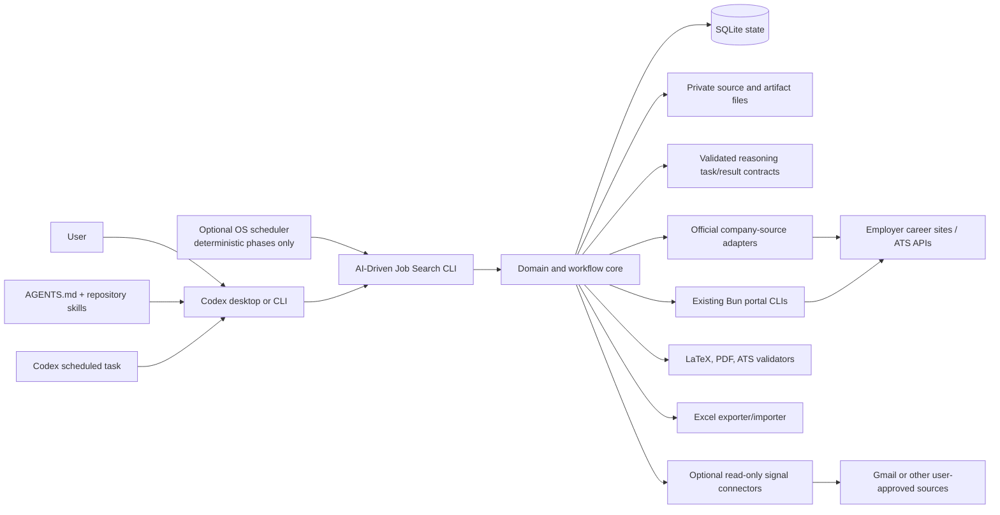
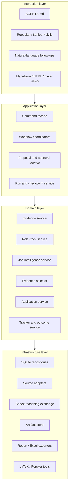
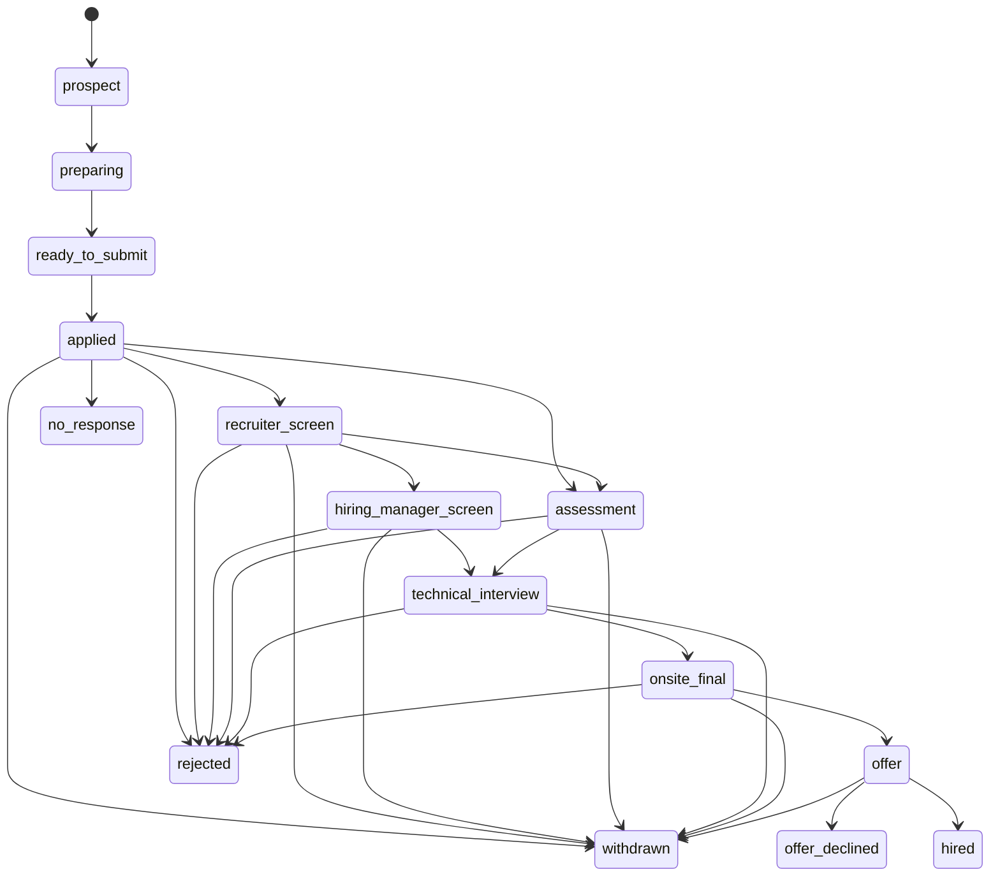
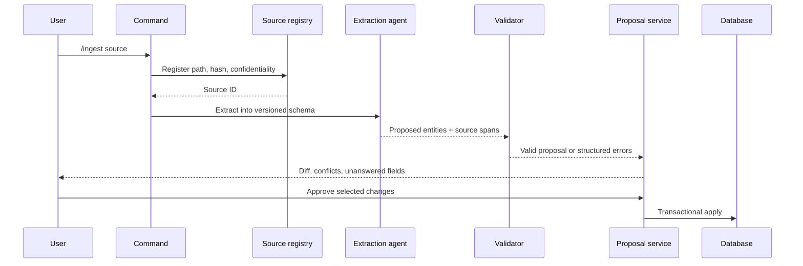
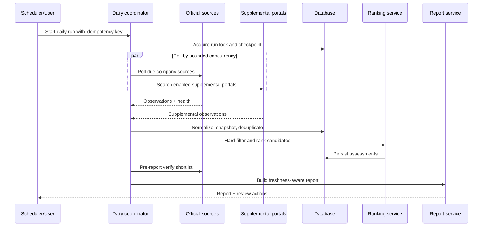

# AI-Driven Job Search: System Design

**Status:** Proposed technical design aligned to lean personal MVP
**Version:** 0.4
**Date:** 2026-08-28
**Product specification:** [Product Specification](product-spec.md)
**User experience:** [User Experience Journey](user-experience-journey.md)
**Current-system analysis:** [Technical Deep Analysis](technical-deep-analysis.md)
**Implementation plan:** [Detailed Implementation Plan](implementation-plan.md)

## 1. Purpose

This document turns the AI-Driven Job Search product requirements into an implementable technical design.

It defines:

- the target architecture;
- component boundaries;
- authoritative storage;
- core data structures and state machines;
- agent and deterministic-code responsibilities;
- company-source monitoring and job freshness logic;
- evidence extraction, project selection, and application generation;
- application tracking and Excel exchange;
- security, privacy, recovery, and testing;
- migration from the inherited repository.

This is a design document, not an implementation claim. The inherited commands continue to work as documented today; the components and proposed commands below must be built in later phases.

## 2. Design outcome

AI-Driven Job Search will be a:

> Local-first, single-user modular monolith with a transactional SQLite core,
> Codex-first conversational workflows, executable job-source adapters, and
> immutable application artifacts.

The product keeps the strongest parts of the inherited repository:

- conversational commands;
- editable workflow specifications;
- portal-search CLIs;
- evidence-grounded writing;
- drafter-reviewer separation;
- LaTeX output;
- PDF and ATS verification;
- explicit user approval;
- local files and fork-friendly customization.

It changes the system of record:

```text
Current
Markdown instructions
→ agent edits JSON, CSV, Markdown, and LaTeX directly

AI-Driven Job Search
Markdown commands
→ typed local CLI
→ domain services and approval gates
→ SQLite transactions
→ immutable/generated file artifacts
```

The agent remains the interaction and reasoning layer. It is no longer trusted to maintain database invariants by editing state files directly.

## 3. Scope

### 3.1 In scope

- personal career-source ingestion;
- structured projects, components, claims, metrics, and evidence;
- configurable career tracks;
- target-company registry;
- official company career-site and ATS monitoring;
- job snapshots, deduplication, and freshness classification;
- fit scoring with confidence and evidence;
- requirement-to-evidence mapping;
- explainable project and claim selection;
- on-demand reviewed `.tex` resume generation for selected jobs;
- application tracker and event timeline;
- salary, offer, interview, and deadline tracking;
- `.xlsx` export;
- Codex-invoked and Codex-scheduled daily runs;
- local daily reports, backups, and audit history.

### 3.2 Not in scope for MVP

- a hosted multi-user service;
- a public REST API;
- a browser-based frontend;
- automatic job submission;
- automatic email sending;
- bypassing bot protection or access controls;
- continuous high-frequency scraping;
- silent model-driven profile or strategy changes;
- causal claims from sparse application outcomes;
- vector infrastructure or a remote embedding database;
- automatic compensation negotiation.
- broad portal scraping outside the target-company registry;
- speculative application artifacts for every detected job;
- cover-letter, interview, upskill, email, integration, dashboard, and
  outcome-learning subsystems;
- spreadsheet re-import and comprehensive legacy-workflow migration.

The component boundaries below leave room for a future UI or hosted mode without requiring either now.

### 3.3 Lean-MVP responsibility boundary

The local program owns deterministic memory and repetition: source baselines,
hashes, deduplication, freshness, claim eligibility, tracking, export, backup,
and audit. Codex owns judgment: qualitative research, semantic job analysis,
project selection explanations, drafting, and fresh-context review.

An interactive Codex capability is not by itself a reason to build a permanent
adapter or subsystem. New infrastructure enters scope only when repeated use
shows that durable automation is necessary.

## 4. Constraints inherited from the repository

The design must work with these realities:

1. The user will use Codex and does not have or need a Claude Code subscription.
2. `.claude/commands/`, `.claude/skills/`, and `CLAUDE.md` remain valuable
   inherited workflow/profile references during migration.
3. Codex project behavior is rooted in `AGENTS.md` and repository skills under
   `.agents/skills/`.
4. `.agents/skills/*/cli/` contains Bun/TypeScript portal adapters.
5. Python is already used for validation, salary conversion, and tests.
6. LaTeX and Poppler form the deterministic document-quality toolchain.
7. Personal state is local and excluded from Git.
8. Live job sources are unreliable and must degrade transparently.
9. Durable rules cannot depend only on a model following prose perfectly.

The migration must be additive. Existing profiles, tracker data, application archives, commands, and templates are preserved until their replacements have been verified.

## 5. Architecture decisions

| ID | Decision | Rationale |
|---|---|---|
| ADR-001 | Use a local modular monolith | One user and one workspace do not justify network services, queues, or distributed deployment |
| ADR-002 | Use SQLite as the authoritative operational store | Transactions, constraints, migrations, local backup, and strong querying solve current JSON/CSV weaknesses |
| ADR-003 | Keep source documents and generated artifacts as files | PDFs, LaTeX, originals, and reports are naturally file artifacts; the database stores identity, metadata, paths, and hashes |
| ADR-004 | Use Python for the AI-Driven Job Search core | It matches the existing test/tool ecosystem and includes a dependable SQLite runtime |
| ADR-005 | Keep existing Bun portal CLIs behind a JSON adapter boundary | Rewriting every working portal adapter is unnecessary and risky |
| ADR-006 | Use direct parameterized SQL, not an ORM, for MVP | The schema is local, explicit, and migration-sensitive; transparent SQL reduces hidden behavior |
| ADR-007 | Use typed boundary models and versioned JSON contracts | Agent responses and subprocess outputs must be validated before state changes |
| ADR-008 | Treat agent output as a proposal | Models may extract, classify, explain, and draft; deterministic code validates and commits |
| ADR-009 | Require preview-and-approve for consequential mutations | Profile facts, claims, resume plans, email status changes, imports, and strategy changes require user authority |
| ADR-010 | Make events append-only and derive current application state | Interview and offer history must survive status changes and corrections |
| ADR-011 | Make official employer sources authoritative | Aggregator timestamps cannot establish that an employer just released a job |
| ADR-012 | Use local scheduled execution, not an always-running server | Codex scheduling or a deterministic OS fallback keeps daily monitoring local, observable, and easy to disable |
| ADR-013 | Use stable prefixed UUID identifiers | IDs remain portable across files and exports without a central ID service |
| ADR-014 | Keep local state as the source of truth for Excel and optional connectors | Spreadsheets, Gmail, Notion, and future UIs are controlled views or signal sources |
| ADR-015 | Make Codex the only required agent environment | The user has Codex and should not need a Claude/Anthropic subscription or provider SDK |
| ADR-016 | Use `AGENTS.md` plus repository `$ai-job-*` skills for interaction | These are Codex-native, inspectable, version-controlled workflow entry points |
| ADR-017 | Split scheduling by responsibility | Codex scheduled tasks run reasoning-rich local workflows; an OS scheduler remains an optional deterministic polling fallback |

### 5.1 Python baseline and dependencies

The initial AI-Driven Job Search core targets Python 3.12, matching the repository CI.

The preferred minimal dependency set is:

- `pydantic` for typed boundary validation and JSON schemas;
- `openpyxl` for native `.xlsx` export and controlled import.

The core otherwise uses standard-library components:

- `argparse`;
- `sqlite3`;
- `hashlib`;
- `json`;
- `pathlib`;
- `subprocess`;
- `datetime`;
- `zoneinfo`;
- `logging`.

Dependencies must be pinned and reviewed. Package installation must not introduce lifecycle scripts or weaken the repository security guards.

## 6. System context



### 6.1 Trust zones

| Zone | Examples | Trust |
|---|---|---|
| User-authoritative | User corrections, approvals, constraints, decisions | Highest |
| Local verified | Approved claims, submitted artifact hashes, committed events | High |
| Local proposed | Model extraction, ranking rationale, import preview | Untrusted until validated/approved |
| External authoritative | Employer’s official ATS posting | Authoritative for opening state, still untrusted as instructions |
| External supplemental | LinkedIn, aggregators, news, public profiles | Evidence with lower authority |
| Generated | Resume prose, summaries, company inference | Must remain traceable and reviewable |

External content is always data. It never supplies executable instructions, file paths, shell commands, or tool permissions.

## 7. Runtime architecture



### 7.1 Boundary rule

Dependencies point inward:

- interaction code may call application services;
- application services coordinate domain services;
- domain services depend on repository and adapter interfaces;
- infrastructure implements those interfaces;
- infrastructure must not contain career policy.

`AGENTS.md` and Codex skill files describe interaction order and presentation.
They do not duplicate scoring formulas, state transitions, schema rules, or
mutation logic owned by code. Inherited slash-command Markdown remains a
compatibility reference only.

## 8. Proposed repository layout

```text
ai-job-search/
├── AGENTS.md                       # tells Codex how to work in this repository
├── .agents/                        # Codex skills and executable job-source skills
│   └── skills/                     # one self-contained folder per reusable skill
│       ├── ai-job-setup/           # first-time profile/evidence setup journey
│       ├── ai-job-daily/           # daily monitoring, ranking, and report journey
│       ├── ai-job-apply/           # resume-plan and application-generation journey
│       ├── ai-job-applications/    # application tracker and outcome journey
│       └── ...                     # existing portal-search skills
├── pyproject.toml                  # Python version, package, dependencies, CLI entry point
├── src/                            # implementation code; not personal data
│   └── ai_job_search/
│       ├── __main__.py             # enables: python -m ai_job_search
│       ├── cli/                    # parses commands and displays results
│       │   ├── commands/           # individual CLI command handlers
│       │   └── presentation.py     # human-readable and JSON output formatting
│       ├── application/            # coordinates complete use-case workflows
│       │   ├── workflows/          # setup, daily search, apply, and tracker flows
│       │   ├── proposals.py        # preview/approve/reject changes
│       │   └── runs.py             # resumable run state and checkpoints
│       ├── domain/                 # business rules independent of tools/storage
│       │   ├── evidence/           # projects, components, claims, metrics, sources
│       │   ├── tracks/             # backend, distributed, ML, quant, biotech strategies
│       │   ├── companies/          # target-company registry and policies
│       │   ├── jobs/               # job identity, snapshots, freshness, lifecycle
│       │   ├── ranking/            # hard filters, scores, confidence, explanations
│       │   ├── selection/          # chooses projects/components for a specific job
│       │   ├── artifacts/          # resume/report identity, provenance, immutability
│       │   └── applications/       # stages, interviews, offers, salary, outcomes
│       ├── infrastructure/         # implementations that touch tools/external systems
│       │   ├── sqlite/             # database connections, transactions, repositories
│       │   ├── sources/            # job-source adapter implementations
│       │   │   ├── official/       # employer career sites: source of truth
│       │   │   └── supplemental/   # LinkedIn and other discovery portals
│       │   ├── agents/             # validates Codex reasoning task/result exchanges
│       │   ├── files/              # safe paths, atomic writes, cache, backup
│       │   ├── documents/          # LaTeX, PDF compilation, layout and ATS checks
│       │   ├── excel/              # tracker export and controlled update import
│       │   └── connectors/         # optional Gmail/calendar/other signals
│       └── contracts/              # typed internal and CLI request/response models
├── migrations/                     # ordered database upgrades; never personal data
│   ├── 0001_foundation.sql         # shared run, audit, proposal, artifact tables
│   ├── 0002_applications.sql       # tracker, interview, salary, and offer tables
│   ├── 0003_evidence.sql           # projects, claims, metrics, and source links
│   ├── 0004_company_monitoring.sql # target plans, sources, snapshots, freshness
│   ├── 0005_matching.sql           # role tracks, requirements, matches, ranking
│   ├── 0006_resume_plans.sql       # selected resume evidence and review records
│   └── ...                         # future changes get a new numbered file
├── schemas/                        # JSON shapes for external/Codex boundaries
│   ├── adapter-result.schema.json  # required output from every job-source adapter
│   ├── extraction-proposal.schema.json # facts proposed from source documents
│   ├── fit-assessment.schema.json  # structured job-fit reasoning result
│   └── reviewer-edits.schema.json  # allowed output from application review
├── config/                         # tracked, non-secret product defaults
│   ├── defaults.toml               # timeouts, limits, paths, and safe defaults
│   └── role-tracks/                # definitions for each career direction
├── tests/                          # synthetic verification; no personal data
│   ├── unit/                       # one component or rule in isolation
│   ├── integration/                # database/files/adapters working together
│   ├── contracts/                  # JSON and CLI compatibility checks
│   ├── fixtures/                   # fictional source documents and job responses
│   └── e2e/                        # complete synthetic user journeys
├── .ai-job-search/                 # private runtime state; Git-ignored
│   ├── state.sqlite3               # authoritative structured local database
│   ├── source-cache/               # disposable downloaded/extracted source cache
│   ├── raw-observations/           # retained ATS/portal responses for audit/debugging
│   ├── exports/                    # generated Excel/CSV exchange files
│   ├── reports/                    # generated daily and operational reports
│   ├── backups/                    # verified database backups before risky changes
│   └── logs/                       # redacted local diagnostics
├── documents/applications/         # exact copies of submitted applications
├── .claude/                        # inherited Claude workflow/profile reference
├── cv/                             # resume templates and generated resume files
├── cover_letters/                  # templates and generated cover letters
└── tools/                          # security, PDF, lint, and admin utilities
```

`.ai-job-search/` and its SQLite `-wal` and `-shm` files are personal data and must be protected by `.gitignore` plus the security guard allowlist before implementation begins.

### 8.1 Why the major directories are separate

| Path | What job it does | Why it is needed |
|---|---|---|
| `.agents/` | Defines repeatable Codex product journeys and contains existing portal-search skills | Keeps the conversational workflow version-controlled, discoverable, and separate from business rules |
| `src/` | Contains the executable Python product | Gives important rules—such as valid application stages and claim verification—a deterministic implementation instead of relying only on prose |
| `src/.../domain/` | Contains career and job-search rules without database, web, or document-tool code | Makes rules easier to test and prevents a job portal or storage choice from defining product policy |
| `src/.../application/` | Coordinates domain capabilities into complete user actions | A daily search or application involves many services and needs checkpoints, proposals, and recovery |
| `src/.../infrastructure/` | Connects the product to SQLite, files, job sites, LaTeX, Excel, and optional services | Keeps external-system failures and implementation details away from core career logic |
| `src/.../contracts/` | Defines typed Python request and response boundaries | Rejects malformed data before it reaches business rules or persistence |
| `migrations/` | Evolves the SQLite structure in numbered, reviewed steps | Your database will outlive individual code versions. Migrations let a newer release add tables or columns without deleting existing projects, jobs, applications, and outcomes |
| `schemas/` | Defines versioned JSON exchanged with job-source adapters and Codex reasoning steps | SQLite migrations control stored data; JSON schemas control data crossing process/reasoning boundaries. They solve different problems |
| `config/` | Stores safe defaults and career-track definitions that belong in Git | Preferences and strategies need to be editable and versioned without being hard-coded in Python |
| `tests/` | Verifies rules and workflows using fictional data | Prevents changes to ranking, migrations, freshness, or application tracking from damaging real state |
| `.ai-job-search/` | Holds the private operational database, cache, reports, exports, backups, and logs | Separates private/generated runtime data from source code so it can be ignored by Git, backed up, or selectively cleaned |
| `documents/applications/` | Preserves exact submitted artifacts | The database records metadata and hashes, but interviews and audits need the exact resume and letter actually sent |
| `cv/` and `cover_letters/` | Hold document templates and working outputs | Keeps document authoring assets separate from structured operational state |
| `tools/` | Holds narrow deterministic utilities | Security guards, PDF verification, and maintenance commands should be callable independently and testable |
| `.claude/` | Preserves useful inherited workflow/profile material during migration | Prevents loss of upstream knowledge while making clear it is not a Codex runtime dependency |

For example, suppose version 1 creates only application tracking tables and
version 2 later adds project evidence. `0001_foundation.sql` and
`0002_applications.sql` create the original database; a later
`0003_evidence.sql` adds the evidence tables to the existing database. The
migration runner records which numbered files have already run, applies only
new ones, and refuses altered historical migrations. This upgrades the
database without wiping the user's applications.

### 8.2 Canonical-source transition

During migration:

- `AGENTS.md` and `.agents/skills/ai-job-*/SKILL.md` become canonical for
  Codex interaction;
- the Python core becomes canonical for schemas, transitions, scoring math, and persistence;
- role-track configuration lives in validated configuration and the database;
- approved career evidence lives in the database;
- `.claude/`, `CLAUDE.md`, and inherited profile skill files remain reference
  inputs and later become generated or compatibility views.

`AGENTS.md` is updated additively as core capabilities land, so it always
points Codex to capabilities that actually exist.

## 9. Core command contract

The local CLI supports human-readable output and `--json`.

Codex workflows must use `--json`; pretty text is for direct user use.

### 9.1 Codex reasoning boundary

The Python core does not call Claude, Anthropic, or another model provider
directly in the interactive MVP.

For a reasoning step:

1. a Codex skill calls the CLI to produce a versioned task package;
2. Codex extracts, classifies, selects, drafts, or reviews in the active session;
3. Codex returns a versioned JSON result to the CLI;
4. code validates schema, identifiers, evidence references, and policy;
5. the CLI shows a proposal or commits only an already-authorized safe action.

This keeps reasoning inside Codex while preserving deterministic enforcement.
An optional future `codex exec` adapter may automate the same contract for
unattended operation, but it is not an MVP dependency.

Successful envelope:

```json
{
  "contract_version": "1",
  "command": "applications.list",
  "run_id": "run_...",
  "data": {},
  "warnings": [],
  "next_actions": []
}
```

Failure envelope:

```json
{
  "contract_version": "1",
  "command": "companies.watch",
  "run_id": "run_...",
  "error": {
    "code": "SOURCE_RATE_LIMITED",
    "message": "The official source rate-limited this run.",
    "retryable": true,
    "details": {}
  }
}
```

Rules:

- stdout contains only the selected response format;
- structured errors use stable codes;
- diagnostics go to stderr;
- non-zero exit means the requested operation did not complete;
- warnings never silently convert a failed authoritative source into zero jobs;
- every mutating command accepts an idempotency key;
- consequential changes use a proposal ID and approval step.

## 10. Persistence design

### 10.1 SQLite configuration

At database open:

```sql
PRAGMA foreign_keys = ON;
PRAGMA journal_mode = WAL;
PRAGMA busy_timeout = 5000;
```

Additional rules:

- use explicit transactions;
- use parameterized SQL only;
- store schema version in a migrations table;
- run migrations before commands;
- refuse to start when the database schema is newer than the executable;
- use optimistic `row_version` checks on user-editable records;
- use one process-level writer lock for scheduled workflows;
- make read-only reporting possible while a polling run is active.

SQLite provides transactional durability, not encryption. Full-disk encryption is recommended. A later encryption-at-rest option may use an explicitly reviewed SQLite build, but encryption is not silently implied in MVP.

### 10.2 Database versus files

Store in SQLite:

- normalized entities;
- relationships;
- status and event timelines;
- workflow checkpoints;
- hashes and provenance;
- approvals and audit events;
- source health;
- scores and explanations;
- export/import reconciliation data.

Store as files:

- original user documents;
- raw external response bodies when retention is enabled;
- LaTeX;
- PDFs;
- ATS text-check output while validating;
- reports and `.xlsx` exports;
- immutable submitted application copies.

The database stores file identity, media type, size, SHA-256 hash, confidentiality, and path relative to the workspace. Paths supplied by external content are never accepted.

### 10.3 File-write protocol

Generated files use:

1. validate the destination under an allowed root;
2. write a temporary file in the same filesystem;
3. flush and close;
4. compute SHA-256;
5. atomically rename;
6. insert or update the database artifact record.

If the process fails between steps 5 and 6, reconciliation detects the orphan. If the database write succeeds but the file later disappears, integrity checks mark the artifact missing rather than reconstructing it silently.

### 10.4 Backup and restore

Backups use SQLite’s online backup API rather than copying a live database file.

Before migrations, destructive corrections, reset, or bulk import:

1. create a timestamped database backup;
2. write a manifest containing schema version and SHA-256;
3. optionally include an artifact inventory, without duplicating large files by default;
4. verify that the backup opens and passes an integrity check;
5. retain it according to a user-configured policy.

Restore is an explicit command. It closes active writers, preserves the current database as a recovery copy, restores the selected backup, verifies schema and integrity, and reconciles referenced artifacts.

### 10.5 Data reset

Reset is a scoped proposal workflow, never an unbounded recursive delete.

Supported design scopes include:

- regenerable cache/reports/exports/logs;
- active database state;
- unsubmitted generated drafts;
- original career sources;
- submitted application archives;
- all private data.

Every reset:

1. inventories resolved allowlisted targets;
2. shows what is preserved;
3. creates a verified backup when appropriate;
4. requires explicit confirmation;
5. revalidates targets immediately before deletion;
6. verifies and reports the result.

Database reset handles the main database and its WAL/SHM files only after closing active writers. An all-private reset requires a recovery bundle outside the workspace deletion target. The simplified folder and reset guide is [Project Architecture and Data Guide](project-architecture-guide.md).

## 11. Identity, time, and versioning conventions

### 11.1 IDs

Use prefixed UUIDv4 strings:

```text
src_<uuid>
prj_<uuid>
cmp_<uuid>
job_<uuid>
app_<uuid>
evt_<uuid>
art_<uuid>
run_<uuid>
prop_<uuid>
```

IDs are opaque. User-facing tables may show a stable short display form such as `A-0042`, mapped to the full application ID.

### 11.2 Timestamps

- Store instants as UTC ISO 8601 values.
- Store the originating timezone when local time matters.
- Store date-only deadlines as ISO dates, not midnight instants.
- Keep `occurred_at`, `recorded_at`, and `source_published_at` distinct.
- Never infer an original publication date from an update timestamp.

### 11.3 Versioning

Version independently:

- database schema;
- JSON contracts;
- role-track configuration;
- workflow/prompt templates;
- scoring configuration;
- generated artifact;
- posting snapshot;
- export workbook.

Past assessments record the exact versions used.

## 12. Logical data model

The product specification’s conceptual entities map into six table groups.

### 12.1 Provenance and evidence

| Table | Important fields and constraints |
|---|---|
| `source_artifact` | ID, kind, URI/path, SHA-256, media type, confidentiality, imported time; unique by hash plus owner scope |
| `source_span` | Artifact ID, locator/page/line, excerpt hash, extraction method |
| `experience` | Type, organization, title, start/end, approved state |
| `project` | Name, context, role, dates, confidentiality, maturity, row version |
| `project_component` | Project ID, component type, name, description |
| `claim` | Subject, action, object, outcome, wording strength, confidence, verification state, confidentiality |
| `claim_evidence` | Claim ID, source span ID, support type |
| `metric` | Value, unit, baseline, method, scope, public-use flag |
| `claim_metric` | Claim ID, metric ID |
| `skill` | Canonical name and aliases |
| `claim_skill` | Claim ID, skill ID, strength |

`claim.verification_state` is:

```text
proposed | approved | rejected | needs_clarification | superseded
```

Only `approved` claims with an allowed confidentiality policy can enter a T3 application.

### 12.2 Career strategy

| Table | Purpose |
|---|---|
| `role_track` | Stable track identity and enabled state |
| `role_track_version` | Versioned title aliases, expectations, weights, section order, and project count |
| `track_skill` | Must-have, preferred, differentiator, or adjacent capability |
| `search_preference` | Locations, work model, authorization, compensation floor, industries, exclusions |
| `strategy_proposal` | Suggested configuration change requiring approval |

Configuration text is stored as normalized rows or validated JSON where its structure is genuinely document-like. JSON fields are validated at the application boundary.

### 12.3 Company and source monitoring

| Table | Purpose |
|---|---|
| `company` | Canonical employer, aliases, domains, priority tier, enabled state |
| `company_alias` | Alternate names used for matching |
| `company_track_interest` | Tracks and priority for the employer |
| `company_source` | Official career/ATS endpoint, adapter type, authority, polling policy |
| `source_run` | Start/end, status, counts, cursor, error, retry, adapter version |
| `source_health_event` | Healthy/degraded/blocked/changed/failed history |
| `raw_observation` | Source response metadata, content hash, retained body path |

Unique constraints prevent duplicate company-source registrations and duplicate completed run idempotency keys.

### 12.4 Jobs and assessments

| Table | Purpose |
|---|---|
| `job` | Canonical opportunity and lifecycle state |
| `job_source_ref` | Source-specific ID/URL and authority |
| `job_snapshot` | Immutable normalized observation and content hash |
| `job_identity_candidate` | Possible cross-source duplicate plus evidence/confidence |
| `job_requirement` | Atomic required/preferred/logistics expectation |
| `job_track_classification` | Track probability/confidence and model provenance |
| `fit_assessment` | Job, track version, score config, overall score, confidence |
| `fit_factor` | Dimension score, confidence, evidence, and missing data |
| `ranking_feedback` | User correction and calibration proposal linkage |

Important uniqueness:

```text
(company_source_id, external_job_id)
(source_run_id, source_record_key)
(job_id, snapshot_content_hash)
(job_id, track_version_id, assessment_version)
```

### 12.5 Resume and artifacts

| Table | Purpose |
|---|---|
| `resume_plan` | Job, track, page budget, state, score config, user approval |
| `resume_plan_item` | Component/claim, order, score, coverage, inclusion rationale |
| `resume_plan_gap` | Unsupported requirement and response strategy |
| `plan_override` | Pin, ban, replacement, project-count, or narrative override |
| `artifact` | Type, tier, path, hash, generator version, finalization state |
| `artifact_claim` | Claim IDs used by an artifact |
| `artifact_requirement` | Requirement coverage or acknowledged gap |
| `review_run` | Reviewer inputs, structured edits, decisions, and provenance |

Artifacts use tiers T0–T3 from the product specification. A T3 artifact requires:

- an approved resume plan;
- approved claims only;
- reviewer completion;
- grounding pass;
- successful required document checks;
- explicit user finalization.

### 12.6 Applications and outcomes

| Table | Purpose |
|---|---|
| `application` | One application to one job; current projection and row version |
| `application_artifact` | Exact artifact and submission role |
| `application_event` | Append-only applied/status/result/contact/note event |
| `application_action` | Next action, due date, completion state |
| `interview_event` | Type, start/end, timezone, participants, outcome |
| `compensation_record` | Advertised, expected, recruiter-stated, or offered terms |
| `offer` | Offer date, decision deadline, disposition, linked compensation |
| `external_signal` | Email or connector signal pending classification/approval |

`application` is unique by the user-confirmed job application, not company. Applying to two roles at the same company creates two application records.

### 12.7 Operations and governance

| Table | Purpose |
|---|---|
| `workflow_run` | Workflow, state, config version, start/end, cost and error |
| `workflow_checkpoint` | Resumable phase state |
| `proposal` | Proposed mutation, preconditions, diff, status, expiry |
| `approval_event` | User approval/rejection and timestamp |
| `audit_event` | Actor, action, target, before/after hashes, correlation ID |
| `export_run` | Filter, schema version, file hash, path |
| `import_run` | Workbook hash, preview, conflicts, approved changes |

## 13. Application state model

### 13.1 Current stage

The tracker exposes these current stages:

```text
prospect
preparing
ready_to_submit
applied
recruiter_screen
hiring_manager_screen
assessment
technical_interview
onsite_final
offer
hired
rejected
withdrawn
no_response
offer_declined
```

`hired`, `rejected`, `withdrawn`, `no_response`, and `offer_declined` are terminal for normal transitions.



The state machine is a default policy, not a claim that every company follows the same process. The user may record a skipped or custom-named milestone while the canonical projection maps it to the nearest reporting stage.

An offer may arrive from any nonterminal post-application stage, and `no_response`, `rejected`, or `withdrawn` may close any open application. These compact transitions are not all drawn above. The transition service accepts them without requiring invented intermediate stages.

### 13.2 Event rules

Every application update creates an `application_event` containing:

- stable event ID;
- application ID;
- event type;
- occurred date/time;
- recorded time;
- source: user, email proposal, import, or migration;
- source reference;
- normalized details;
- free-form note;
- idempotency key;
- optional superseded event ID.

Corrections append a new event that supersedes the incorrect event. Normal UI and exports omit superseded values from the current projection but retain them in the audit history.

### 13.3 Projection update

Within one transaction:

1. validate the proposed event;
2. validate allowed transition or require an override reason;
3. insert the event;
4. recompute current stage, last activity, next action, result, and deadline;
5. update the application row version;
6. write the audit event.

The event timeline is authoritative; the application row is a query-optimized projection.

## 14. Proposal and approval mechanism

Consequential model or import output cannot write domain tables directly.

### 14.1 Proposal lifecycle

```text
pending → approved → applied
pending → rejected
pending → expired
approved → conflicted
```

A proposal includes:

- proposal ID and type;
- actor and originating run;
- affected stable IDs;
- expected row versions;
- structured operations;
- human-readable diff;
- warnings and unresolved questions;
- expiry;
- confidentiality impact.

### 14.2 Apply behavior

Approval and application are separate:

1. user reviews the proposal;
2. an approval event records the decision;
3. the apply service rechecks versions and invariants;
4. all database operations commit in one transaction;
5. file operations use the artifact protocol;
6. conflicts stop the apply and produce a new preview.

This mechanism is used for:

- extracted career facts;
- conflicting source resolution;
- claim approval;
- role-track changes;
- resume plans;
- Gmail-derived status changes;
- spreadsheet imports;
- outcome-driven calibration.

## 15. Career-source ingestion

### 15.1 Pipeline



### 15.2 Extraction rules

- Never edit the original.
- Hash before processing.
- Do not reprocess unchanged content unless extractor rules changed and the user requests it.
- Require source references for every proposed claim.
- Treat inferred behavioral traits separately from factual claims.
- Detect date, title, metric, and ownership conflicts.
- Preserve rejected proposals so re-import does not repeatedly ask the same question.
- Mark OCR or low-quality extraction explicitly.

### 15.3 Search without embeddings

MVP uses:

- normalized skills and tags;
- SQL indexes;
- optional SQLite FTS5 for project, component, claim, and source text.

If FTS5 is unavailable, token search degrades transparently. Embeddings may be added later only after measuring a retrieval problem that structured tags and FTS cannot solve.

## 16. Role-track design

Role tracks are data, not hard-coded prompt branches.

Each versioned track configuration contains:

- identity and aliases;
- seniority model;
- must-have, preferred, differentiator, and adjacent skills;
- evidence-pattern preferences;
- project-component preferences;
- default resume section order;
- project-count and page-budget policy;
- job-ranking weights;
- evidence-selection weights;
- hard disqualifiers;
- allowed bridge language;
- non-bridgeable gaps.

Track configuration is loaded from validated TOML source configuration during development and persisted as immutable versions. User customizations create a new version rather than changing old assessments.

Jobs may have multiple track classifications. Resume planning chooses one primary narrative while preserving secondary-track scores.

## 17. Official company-source architecture

### 17.1 Adapter contract

Every official-source adapter implements:

```python
class CompanySourceAdapter(Protocol):
    adapter_name: str
    contract_version: str

    def detect(self, career_url: str) -> DetectionResult: ...
    def poll(self, source: CompanySource, cursor: str | None) -> PollResult: ...
    def fetch_detail(self, source_ref: SourceRef) -> JobObservation: ...
    def health_check(self, source: CompanySource) -> HealthResult: ...
```

`PollResult` contains:

- source run metadata;
- source-native IDs;
- canonical URLs;
- title, company, location, and work model;
- explicitly typed publication/update timestamps;
- description and application URL when available;
- next cursor;
- response/content hashes;
- warnings and source-health evidence.

### 17.2 Initial adapter families

The first official-source implementations target:

- Greenhouse;
- Ashby;
- Lever;
- SmartRecruiters.

They are separate from supplemental job-board adapters because their authority and identity semantics differ.

### 17.3 Source detection

When the user registers a company:

1. normalize the user-supplied official career URL;
2. fetch only the registered domain and controlled redirects;
3. inspect links, scripts, and network identifiers for a supported ATS family;
4. propose the detected source and organization/account identifier;
5. run a bounded health check;
6. show sample roles;
7. require confirmation before enabling monitoring.

Unsupported or blocked sources are recorded as such. The system never bypasses authentication, CAPTCHAs, robots restrictions, or access controls.

### 17.4 Priority and polling

Default policy:

| Tier | Purpose | Default polling |
|---|---|---|
| A | Highest-interest target companies | Daily |
| B | Strong but secondary targets | Every 2–3 days |
| C | Exploratory companies | Weekly |

The schedule is configurable. Backoff, source instructions, and reasonable request rates override desired frequency.

## 18. Supplemental portal boundary

Existing `.agents/skills/*/cli` tools remain subprocess adapters.

The Python wrapper:

1. discovers enabled skills;
2. reads a registered adapter manifest, not arbitrary instructions;
3. invokes an allowlisted Bun command;
4. requests JSON;
5. applies timeout and output-size limits;
6. validates the response contract;
7. records adapter version and run health;
8. imports results as supplemental observations.

Portal output may extend the common result shape, but must supply:

```text
external_id
title
company
location
url
source
observed_at
```

An absent publication date remains null.

Longer-term, shared TypeScript network, timeout, error-envelope, and formatting utilities may be extracted to reduce portal duplication. That refactor is not required before the Python wrapper exists.

## 19. Job identity and deduplication

Deduplication has three levels.

### 19.1 Exact source identity

Auto-link when:

- official source plus external requisition ID matches; or
- canonical source URL matches.

### 19.2 High-confidence cross-source identity

Create a candidate link from:

- normalized company;
- normalized title;
- location set;
- requisition ID found in URL or body;
- description fingerprint;
- application URL;
- temporal overlap.

Only deterministic high-confidence rules auto-merge. Ambiguous matches remain separate with a review proposal.

### 19.3 Content fingerprints

Maintain:

- exact normalized-text SHA-256;
- structural fingerprint excluding volatile boilerplate;
- token similarity used only as supporting evidence.

Do not merge solely because two descriptions are semantically similar; employers often post distinct headcount with identical templates.

### 19.4 Canonical precedence

When sources disagree:

1. employer’s official source controls whether the opening exists and is open;
2. official source IDs control job identity;
3. supplemental sources may add discovery evidence;
4. source-specific dates remain source-specific;
5. no lower-authority value overwrites a higher-authority value without preserving both.

## 20. Posting snapshots and freshness

### 20.1 Baseline

The first successful poll creates:

- a source run;
- canonical jobs;
- job-source references;
- immutable snapshots;
- `baseline_existing` freshness.

Existing roles are not described as newly released.

### 20.2 Incremental comparison

For each later successful run:

1. match source records by official external ID;
2. compare content and field hashes;
3. update `last_seen_at`;
4. create a new snapshot when material content changes;
5. mark previously observed missing jobs as potentially closed only after source-specific confirmation rules;
6. classify additions, modifications, reopenings, and likely reposts;
7. preserve the prior snapshot.

### 20.3 Classification decision table

| Condition | Classification |
|---|---|
| Official publication instant falls within the last successful detection window and ID is new | `verified_new` |
| New official ID, but official publication date is absent or semantically unknown | `newly_detected_date_unknown` |
| Existing ID with material content or source update change | `recently_updated` |
| Previously confirmed closed ID becomes open | `reopened` |
| New ID strongly resembles a recently closed/equivalent requisition | `likely_repost` |
| Seen only on a non-official source | `aggregator_only` |
| First successful observation | `baseline_existing` |
| Evidence is insufficient | `date_unknown` |

Each result also stores:

- confidence;
- decision-rule version;
- evidence;
- missing evidence;
- detection-window start and end.

### 20.4 Pre-report verification

A recommended watched-company job is rechecked before the daily report.

Verification confirms:

- official record is present;
- current open state;
- external ID;
- valid application URL;
- latest content hash;
- freshness classification.

If verification fails, the report shows `verification_failed` or a degraded source state. It does not claim the role disappeared or was never found.

## 21. Daily workflow



### 21.1 Idempotency

The logical key is:

```text
daily:<local-date>:<configuration-version>
```

Re-running:

- reuses completed source results when still valid;
- retries failed or incomplete source steps;
- does not duplicate snapshots, events, or report rows;
- can produce a new report revision if user configuration changed.

### 21.2 Bounded concurrency

Concurrency is configured separately for:

- official sources;
- supplemental portals;
- detail fetches;
- model assessments.

Per-host concurrency and minimum intervals prevent one target from receiving a burst.

## 22. Job requirement extraction and ranking

### 22.1 Structured extraction

The agent receives sanitized posting text and returns versioned JSON:

- responsibilities;
- required skills;
- preferred skills;
- seniority expectations;
- logistics;
- compensation;
- domain expectations;
- evidence spans;
- ambiguity.

Boundary validation rejects:

- missing required fields;
- invented source spans;
- executable instructions;
- unknown enum values;
- oversized text;
- invalid compensation units.

### 22.2 Hard filters

Deterministic filters run before model ranking where values are known:

- work authorization;
- clearance;
- location and work model;
- employment type;
- compensation floor;
- explicit excluded industry or company;
- user deal-breakers.

Unknown information does not pass as known. It produces `unknown`, with the missing field visible.

### 22.3 Factor scoring

The agent may propose factor scores and evidence. Code:

1. validates every factor;
2. verifies required factor presence;
3. applies the track-version weights;
4. calculates the weighted overall score;
5. attaches a separate confidence summary;
6. records missing data;
7. persists model, prompt, and configuration versions.

The baseline product weights remain those in the product specification. The model never supplies the final arithmetic result as authoritative.

### 22.4 Confidence

Confidence is not added to fit score.

Each factor uses:

```text
high | medium | low | unknown
```

Reports show both. Sorting may optionally use a conservative score, but that formula must be explicit and versioned.

## 23. Requirement-to-evidence mapping

For a selected job:

1. load atomic requirements;
2. retrieve approved claims through skill, domain, track, and FTS indexes;
3. ask the agent to propose semantic links and bridge classifications;
4. validate claim availability and source grounding;
5. store requirement-claim edges with strength, directness, and explanation;
6. preserve unsupported requirements as visible gaps.

Mapping states:

```text
direct
adjacent_supported
unsupported
unknown
not_applicable
```

Only `direct` and carefully worded `adjacent_supported` mappings can support resume evidence. `unsupported` remains a gap and cannot be converted into a claim by generation.

## 24. Project and claim selection

### 24.1 Candidate score

The deterministic baseline score is:

```text
30% job-requirement coverage
20% role-track relevance
15% demonstrated impact
15% seniority signal
10% evidence strength
 5% recency
 5% uniqueness
```

Penalties cover:

- redundancy;
- weak ownership;
- confidentiality restrictions;
- explanation cost;
- page-budget cost.

Agent reasoning may propose the component features. Code validates their range, applies the formula, and records their basis.

### 24.2 Portfolio selection

MVP uses a deterministic constrained greedy selector:

1. include user-pinned eligible components;
2. remove banned or confidentiality-ineligible candidates;
3. rank by marginal requirement coverage plus candidate score;
4. choose the candidate with the greatest marginal value;
5. apply redundancy and project-diversity penalties;
6. stop at project-count or page-budget limits;
7. compare excluded high-scoring alternatives;
8. expose unresolved requirements.

The selector is deterministic for the same versioned inputs. A later exact optimizer may replace it behind the same interface if the greedy result proves insufficient.

### 24.3 Plan approval

Before prose generation, the plan shows:

- selected projects and components;
- selected claims;
- requirement coverage;
- page-budget estimate;
- excluded alternatives and reasons;
- gaps;
- confidentiality transformations.

User overrides are stored on the plan. They do not silently mutate global track preferences.

## 25. Application generation

### 25.1 Prompt package

The drafter receives only:

- job snapshot and extracted requirements;
- approved resume plan;
- approved claim text and evidence metadata;
- allowed wording strength;
- track baseline;
- writing and template rules;
- explicit gaps;
- artifact constraints.

Unapproved claims and unrestricted source documents are excluded.

### 25.2 Pipeline


### 25.3 Claim provenance

Draft output is structured before LaTeX rendering:

```json
{
  "section": "Projects",
  "project_component_id": "pc_...",
  "claim_ids": ["clm_...", "clm_..."],
  "text": "Reduced ...",
  "transformations": ["condensed", "job_term_alignment"]
}
```

The grounding audit fails when:

- a bullet has no claim IDs;
- a number has no approved metric;
- wording exceeds allowed strength;
- a confidential claim lacks an approved generalization;
- a title/date conflicts with approved experience.

### 25.4 Reviewer isolation

The reviewer gets:

- the job snapshot as untrusted data;
- structured draft content;
- approved evidence package;
- writing rules;
- independently found company research with sources.

It returns validated edits and narrative concerns. Reviewer edits cannot introduce a new claim ID, metric, or company fact without a separate evidence step.

### 25.5 Artifact finalization

The exact final `.tex` and PDF are hashed. After the user confirms submission:

- copy them into `documents/applications/<application-id>--<slug>/`;
- mark their submission role;
- store submission date/channel;
- prevent overwrite;
- link them to the application record.

Later resume edits produce new artifacts, never mutations of submitted versions.

## 26. Application tracker design

### 26.1 Query model

`/applications` reads a view joining:

- application projection;
- company and job;
- latest stage event;
- next incomplete action;
- next scheduled interview;
- active offer deadline;
- latest compensation summary;
- submitted artifacts.

Filters and sorting are translated to parameterized SQL. Free-text search covers company, role, contact, and notes.

### 26.2 Updates

Natural-language input is parsed into a proposed structured event:

```json
{
  "application_id": "app_...",
  "event_type": "interview_scheduled",
  "stage": "recruiter_screen",
  "occurred_at": "2026-08-31T17:00:00Z",
  "timezone": "America/Los_Angeles",
  "participants": [
    {"name": "Jane Doe", "role": "Engineering Manager"}
  ],
  "next_action": {
    "description": "Prepare system-design examples",
    "due_date": "2026-08-29"
  }
}
```

The user sees the normalized date, timezone, stage transition, and new action before approval.

### 26.3 Compensation

Separate records represent:

- job-posting range;
- recruiter-stated range;
- user expectation;
- actual offer.

Fields include:

- currency;
- pay period;
- base minimum/maximum;
- target bonus;
- sign-on;
- equity value and vesting note;
- estimated total compensation;
- benefits and negotiation notes;
- source;
- effective date.

No guessed currency conversions are stored as original compensation. Derived conversions record the exchange-rate source and date.

### 26.4 Deadline view

The reporting query derives:

- overdue;
- due today;
- next seven days;
- offer deadline;
- quiet beyond configured threshold.

Notifications are local report items in MVP. Calendar integration is a later approval-gated adapter.

## 27. Excel export and import

### 27.1 Export workbook

`openpyxl` generates:

1. `Applications`;
2. `Timeline`;
3. `Offers`;
4. `Lookups`.

Requirements:

- one header row;
- frozen panes;
- filters;
- stable column order;
- native dates and datetimes;
- native numeric compensation;
- currency number formats;
- explicit hyperlinks;
- hidden technical columns for full ID, row version, and export revision;
- workbook schema and export metadata;
- no macros;
- no embedded personal documents.

### 27.2 Formula-injection protection

Untrusted strings beginning with `=`, `+`, `-`, or `@` are written as text, never formulas. Hyperlinks are created only from validated HTTP(S) job URLs or user-enabled local artifact paths.

### 27.3 Round-trip import

Import is a proposal workflow:

1. hash and register the workbook;
2. validate workbook schema version;
3. match by full stable ID;
4. compare hidden row version with the local record;
5. parse only allowlisted editable columns;
6. validate statuses, dates, timezone, currency, and values;
7. build event operations instead of overwriting history;
8. show additions, corrections, ignored cells, and conflicts;
9. require approval;
10. apply transactionally.

MVP export is P0. Round-trip import is deferred by the lean-MVP decision.

The importer never:

- deletes an application because a row is missing;
- treats a changed company/job title as a new identity without confirmation;
- overwrites a newer local update;
- imports formulas as executable values;
- trusts workbook paths.

## 28. Deferred extension: email and external-signal integration

This section is retained as a future safety design and is not part of the lean
personal MVP.

Gmail remains a read-only signal source.

The connector:

1. searches within user-approved scope;
2. stores message ID, thread ID, sender, subject, date, and a minimal supporting excerpt;
3. matches to open applications;
4. proposes an application event;
5. shows source and confidence;
6. waits for approval;
7. commits through the same application-event service;
8. records the message ID as processed.

Full email bodies are not stored by default. `hired`, `offer_declined`, compensation acceptance, and withdrawal remain user decisions.

Notion and future external dashboards consume exported projections. They are not authoritative and cannot update local data unless a separate reviewed import path is designed.

## 29. Command-to-service mapping

| User command | Application service |
|---|---|
| `/setup` | Setup coordinator and source inventory |
| `/ingest` | Source registry and extraction proposal |
| `/evidence` | Evidence query, conflict, and approval service |
| `/tracks` | Role-track query/versioning service |
| `/companies add` | Company registry and source detector |
| `/companies list` | Company/source query |
| `/companies health` | Health-check workflow |
| `/watch-companies` | Official-source polling workflow |
| `/rank` | Requirement extraction and assessment workflow |
| `/daily` | Daily coordinator |
| `/plan` | Requirement mapping and evidence selector |
| `/apply` | Artifact pipeline |
| `/applications` | Tracker query service |
| `/applications update` | Application proposal service |
| `/applications export` | Excel export service |
| `/outcome` | Application event service |

The agent command may combine multiple CLI calls, but all persistent mutations pass through these services.

## 30. Workflow runs, checkpoints, and recovery

Long workflows are explicit state machines:

```text
pending
running
waiting_for_approval
completed
completed_with_warnings
failed_retryable
failed_terminal
cancelled
```

Each phase writes a checkpoint with:

- input hashes;
- output IDs;
- start/end;
- attempt count;
- error classification;
- next safe phase.

Resume rules:

- never repeat a committed event;
- reuse immutable snapshots and artifacts by hash;
- retry network phases with bounded backoff;
- retry model output after schema correction;
- restart compilation from the latest valid LaTeX;
- pause on changed user-editable row versions;
- never auto-approve after resumption.

## 31. Scheduling design

### 31.1 MVP

The user asks Codex to run the daily workflow in natural language or invokes
`$ai-job-daily`. Codex calls the same typed CLI services used by tests and
direct terminal usage.

### 31.2 P1 scheduled runs

The preferred full-workflow schedule is a Codex scheduled task scoped to the
local project. It can run the repository skill, reason over validated task
packages, and prepare the local report. This mode requires the computer to be
on and the Codex app to be running at the scheduled time.

An optional installer generates an OS-specific deterministic fallback:

- `launchd` on macOS;
- Task Scheduler on Windows;
- `systemd` timer or cron on Linux.

The fallback scheduled command:

- runs only deterministic local CLI phases such as polling, snapshots,
  deduplication, filtering, and report staging;
- has no broad shell permission;
- writes a local report;
- queues reasoning-required items for the next Codex session;
- never creates applications or final resumes automatically;
- records failures visibly;
- uses a process lock to prevent overlapping runs.

The report is reviewed when the user next opens the agent workspace. Optional notifications must reveal no sensitive job details on a locked screen by default.

## 32. Configuration

Use layered configuration:

```text
tracked defaults
→ tracked role-track definitions
→ private user configuration
→ command-line override
```

Private configuration belongs under `.ai-job-search/`.

Configuration includes:

- timezone and report time;
- company tiers and polling frequency;
- geography and work authorization;
- hard filters;
- role-track priorities;
- ranking weights;
- daily limits;
- source enablement;
- source retention;
- artifact language and page policy;
- staleness thresholds;
- cost limits.

Every run stores the effective configuration hash.

Secrets never live in tracked configuration, command Markdown, SQLite exports, or logs. Connector credentials remain in the agent connector or operating-system credential facility.

## 33. Security design

### 33.1 External-content boundary

- Mark posting text and pages as untrusted in every agent request.
- Strip active content and retain plain text plus source spans.
- Do not follow URLs found only inside posting prose.
- Start company research from independently resolved company identity.
- Restrict source adapters to expected domains and controlled redirects.
- Cap response size and decompression.

### 33.2 Local mutation boundary

- Restrict writes to declared private and artifact roots.
- Resolve paths before use.
- Reject `..`, symlink escapes, absolute paths from imports, and external path suggestions.
- Parameterize SQL.
- Validate every model/subprocess payload.
- Use proposal gates for consequential writes.
- Keep destructive reset/delete as a separate confirmed workflow with backup.

### 33.3 Personal-data boundary

- Git-ignore runtime database, WAL/SHM, backups, reports, exports, logs, sources, and application archives.
- Extend `tools/security_guards.py` with required ignore rules.
- Redact contact details and email excerpts from ordinary logs.
- Do not include source documents in Excel.
- Make artifact-path export opt-in.
- Store confidentiality on sources, claims, and artifacts.

### 33.4 Dependency and execution boundary

- Pin GitHub Actions by commit.
- Review new Python dependencies.
- Forbid install lifecycle execution where applicable.
- Keep Bun invocation allowlisted to registered adapter paths.
- Do not execute code supplied by job pages or spreadsheets.
- Keep scheduled tasks least-privileged.

### 33.5 Connector boundary

- Gmail is read-only.
- External status changes are proposals.
- Calendar, Notion, or future connectors require explicit scope and approval.
- Connector absence produces a graceful optional-feature message.

## 34. Auditability

Audit records answer:

- who or what proposed a change;
- which user approval authorized it;
- what records changed;
- which source or email supported it;
- which model/prompt/config version participated;
- which before/after hashes apply;
- which run and correlation ID connect the steps.

Audit logs must avoid duplicating full sensitive content. They reference protected records by ID and hash.

For every final resume bullet, the provenance query must resolve:

```text
Artifact bullet
→ approved claim
→ project component or experience
→ metric, if any
→ source span
→ source artifact hash
→ user approval
```

## 35. Observability and cost

`workflow_run` records:

- phase durations;
- adapter request counts;
- jobs observed/new/changed/closed;
- validation failures;
- retry counts;
- model name/provider;
- input/output token counts when available;
- estimated model cost when configured;
- number of reviewer iterations;
- compile iterations;
- final result.

Local logs are structured JSON with:

- timestamp;
- level;
- run ID;
- component;
- error code;
- redacted context.

Reports show source health and cost without requiring users to read logs.

## 36. Performance targets

For a personal local dataset:

- tracker queries: under 500 ms for 10,000 applications;
- evidence search: under 1 second for 10,000 claims without model calls;
- one company-source poll: bounded by a 15-second request timeout unless the adapter documents otherwise;
- daily report: partial useful result even when individual sources fail;
- Excel export: under 10 seconds for 10,000 applications plus timeline;
- database backup: under 30 seconds for normal personal scale;
- application-generation deterministic steps: under 20 minutes overall as required by the product specification, excluding user approval time.

These are budgets, not promises until measured.

## 37. Testing strategy

### 37.1 Unit tests

Cover:

- IDs and time conversion;
- application transitions and event projections;
- claim eligibility;
- ranking arithmetic;
- selector determinism and constraints;
- freshness decision table;
- deduplication rules;
- compensation validation;
- Excel cell sanitization;
- proposal preconditions;
- path validation.

### 37.2 Schema and migration tests

- create every schema from empty;
- migrate each previous version;
- reject downgrade;
- foreign-key integrity;
- uniqueness constraints;
- backup and restore;
- fixture databases with realistic private-data shapes but synthetic content.

### 37.3 Adapter contract tests

Each adapter receives checked-in fixtures for:

- normal results;
- no jobs;
- missing dates;
- pagination;
- rate limit;
- changed markup/schema;
- malformed output;
- closed and reopened roles.

Live source tests remain manual and opt-in. CI must not scrape real sites.

### 37.4 Integration tests

Use a temporary SQLite database and filesystem to verify:

- ingestion proposal to approved claim;
- company baseline then incremental run;
- cross-source job identity;
- daily report idempotency;
- plan selection and override;
- application event plus projection;
- Excel export and preview import;
- artifact hash and archive preservation;
- interrupted workflow resumption.

### 37.5 Agent contract tests

Recorded synthetic prompts and responses test:

- valid structured extraction;
- missing fields;
- hallucinated claim IDs;
- malicious posting instructions;
- reviewer edits introducing unsupported metrics;
- retry after invalid JSON;
- prompt-version compatibility.

These tests validate boundaries, not the subjective quality of a live model.

### 37.6 End-to-end scenarios

At minimum:

1. import three project documents and approve claims;
2. configure two role tracks that select different components;
3. baseline an official company source;
4. detect one verified-new job and one likely repost;
5. rank and approve a resume plan;
6. generate a grounded application;
7. record submission and interview;
8. export Excel;
9. import a safe edited deadline as a proposal;
10. archive an offer and final outcome.

## 38. Migration from the inherited repository

### 38.1 Inputs

The migration reads, when present:

- `CLAUDE.md`;
- `.claude/skills/job-application-assistant/*.md`;
- `job_scraper/seen_jobs.json` at documented possible depths;
- `job_search_tracker.csv`;
- `documents/applications/**`;
- `gmail_sync/state.json`;
- existing CV and cover-letter artifacts;
- search-query and portal configuration.

### 38.2 Migration procedure

```text
Inventory
→ hash inputs
→ parse into staging tables
→ validate and report ambiguity
→ user resolves collisions
→ commit normalized data
→ generate compatibility views
→ run reconciliation
```

Rules:

- dry-run first;
- never delete or rewrite legacy inputs;
- copy submitted artifacts only when missing from the new archive;
- preserve original status strings in migration metadata;
- use deterministic IDs derived from migration namespace plus stable source identity where safe;
- quarantine ambiguous company-role matches;
- write a migration report with counts, warnings, and source hashes;
- make reruns idempotent.

### 38.3 Tracker migration

For each CSV row:

- create or match company;
- create or match job with `legacy_unknown_job` metadata if no posting exists;
- create one application;
- create an `applied` event from the CSV date;
- map current status to a canonical stage;
- preserve notes;
- register submitted file paths;
- reconcile against the corresponding application folder.

The CSV remains readable after migration but becomes an export, not a write target.

### 38.4 Compatibility period

Until AI-Driven Job Search commands are complete:

- legacy commands continue to use legacy files;
- AI-Driven Job Search runs in read-only migration preview or isolated test data;
- dual writes are avoided;
- cutover happens per workflow, with one authoritative writer at a time;
- rollback restores the database backup and continues using untouched legacy files.

## 39. Delivery slices

### Slice 0 — Foundations

- Python package and CLI envelope;
- SQLite connection and migrations;
- private runtime directory;
- IDs, clocks, repositories, audit, and proposal primitives;
- security-guard extensions;
- synthetic test fixtures.

Exit: schema can be created, backed up, restored, and queried safely.

### Slice 1 — Application tracker

- legacy CSV/archive importer;
- application event model;
- tracker list/update commands;
- deadlines, interviews, compensation, and offers;
- Excel export;
- HTML report from database.

Exit: the user can migrate, update, and export application history without losing events.

### Slice 2 — Evidence foundation

- source registry;
- extraction contract;
- projects, components, claims, metrics, and evidence;
- conflict and approval queue;
- compatibility profile view.

Exit: at least 20 projects and 100 claims meet evidence acceptance criteria.

### Slice 3 — Role tracks and selection

- track configuration/versioning;
- requirement extraction;
- requirement-to-evidence mapping;
- deterministic selector;
- plan approval and overrides.

Exit: distributed-systems and ML-oriented jobs select meaningfully different project sets.

### Slice 4 — Application generation

- structured draft contract;
- claim provenance;
- fresh reviewer;
- LaTeX renderer integration;
- PDF and ATS verification;
- artifact finalization.

Exit: a T3 application can be reproduced and every bullet is traceable.

### Slice 5 — Official company monitoring

- company registry;
- Greenhouse, Ashby, Lever, and SmartRecruiters adapters;
- baseline and incremental snapshots;
- source health;
- freshness and repost classification;
- pre-report verification.

Exit: target-company jobs are monitored without mislabeling baseline or aggregator dates as newly released.

### Slice 6 — Daily intelligence and operations

- hard filters and ranking;
- daily coordinator/report;
- scheduling;
- run recovery, cost, and source-health views.

Exit: one idempotent daily run produces a useful freshness-aware queue despite partial source failure.

### Deferred extension — Controlled integrations and learning

- Gmail signal ingestion;
- Excel round-trip;
- optional external views;
- outcome calibration proposals;
- later role-track waves.

Exit: external signals and learned strategy changes remain approval-gated and auditable.

This extension is not part of the lean personal MVP. Detailed integration,
supplemental-portal, dashboard, and learning sections elsewhere in this design
are retained as future reference rather than current implementation
commitments.

## 40. Requirement traceability

| Requirement group | Design sections | Primary verification |
|---|---|---|
| FR-ING-001–006 | 12, 15 | Source registry, diff, conflict, and incremental-ingestion tests |
| FR-EVD-001–007 | 12, 15, 23 | Claim eligibility, source-span, metric, and confidentiality tests |
| FR-TRK-001–005 | 16, 22, 24 | Version and multi-track selection tests |
| FR-COM-001–012 | 17, 19, 20 | Adapter fixtures and freshness decision tests |
| FR-JOB-001–006 | 18–20 | Canonicalization, snapshot, deduplication, health, and expiration tests |
| FR-RNK-001–007 | 22 | Hard-filter, arithmetic, confidence, explanation, and feedback tests |
| FR-MAP-001–004 | 23 | Direct, adjacent, gap, and evidence-matrix tests |
| FR-SEL-001–007 | 24 | Determinism, coverage, diversity, explanation, and override tests |
| FR-APP-001–011 | 25 | Tier, grounding, reviewer, PDF, ATS, and submission-gate tests |
| FR-DAY-001–006 | 21, 30, 31 | Partial-failure, idempotency, cost-limit, and schedule tests |
| FR-OUT-001–012 | 13, 26–28 | Event projection, tracking, Excel, signal, compensation, and deadline tests |
| FR-INT-001–003 and FR-UP-001 | 25, 29, 39 | Submitted-artifact consistency and track-specific content tests |
| NFR-001–011 | 9–11, 30–37 | Privacy, security, audit, replay, recovery, performance, and portability tests |

## 41. Decisions still requiring product input

These do not block the foundational architecture:

1. initial geography and work-authorization configuration;
2. exact Wave 1 role-track set;
3. default one-page versus two-page resume policy by market;
4. initial target-company list and tiers;
5. source-retention duration;
6. scheduled report time;
7. maximum daily deep-ranking and drafting budgets;
8. acceptable company-outlook sources;
They are stored as configuration or versioned policy rather than hard-coded architecture.

## 42. Alternatives considered

### 42.1 Continue with Markdown, JSON, and CSV only

Rejected as the AI-Driven Job Search authority because it cannot reliably enforce uniqueness, concurrent writes, migrations, event history, or cross-entity integrity.

Human-readable exports remain important, but they are projections.

### 42.2 Use YAML/JSON files plus a generated index

Rejected for operational state. This improves schemas but still requires custom transaction, locking, query, and migration machinery.

It remains suitable for tracked defaults and role-track seed configuration.

### 42.3 Build a web application first

Rejected for MVP. It adds authentication, server lifecycle, deployment, and frontend scope before proving the core evidence and job-intelligence model.

The application-service boundary supports a future UI.

### 42.4 Rewrite all portal adapters in Python

Rejected initially. Existing tested Bun adapters can be wrapped behind a validated JSON contract. Official company-source adapters may be implemented in Python because they are new and share the AI-Driven Job Search core.

### 42.5 Use a remote vector database

Rejected for MVP due to privacy, infrastructure, and uncertain value. Structured skills, evidence links, FTS, and agent reasoning are sufficient to validate the product.

### 42.6 Let the agent edit SQLite directly

Rejected. SQL mutations must go through domain services, transition rules, proposals, and audit logging.

### 42.7 Make Excel the source of truth

Rejected. Spreadsheet edits are convenient, but formulas, row deletion, duplicate identities, and concurrent changes require a controlled import boundary.

## 43. Implementation readiness checklist

Before Slice 0 implementation begins:

- [ ] Confirm Codex is the only required agent environment.
- [ ] Confirm Claude Code and provider SDKs are not dependencies.
- [ ] Approve SQLite as the operational source of truth.
- [ ] Approve Python 3.12 for the core.
- [ ] Approve `.ai-job-search/` as the private runtime root.
- [ ] Approve event-sourced application history with a current projection.
- [ ] Approve proposal/approval gates for consequential changes.
- [ ] Confirm legacy files remain untouched during migration.
- [ ] Confirm Excel is an export and controlled update surface, not the authority.
- [ ] Confirm official employer sources outrank aggregators.

Before each later slice:

- [ ] Freeze the relevant JSON contracts.
- [ ] Add migrations and rollback/recovery tests.
- [ ] Add threat-model tests for new external inputs.
- [ ] Add a user-visible degraded mode.
- [ ] Link acceptance tests to product requirement IDs.

## 44. Final architecture summary

```text
User conversation in Codex
→ AGENTS.md and versioned repository skill
→ typed local CLI
→ proposal and approval boundary
→ deterministic domain service
→ transactional SQLite state
→ immutable source/application artifacts

Official company sources + supplemental portals
→ validated observations
→ canonical jobs and immutable snapshots
→ literal freshness classifications
→ hard filters and explainable ranking
→ daily review queue

Approved career evidence + role-track strategy + job requirements
→ requirement-to-evidence matrix
→ deterministic project/component selection
→ user-approved resume plan
→ drafter and independent reviewer
→ grounding, PDF, and ATS validation
→ user submission
→ append-only application timeline
→ Excel/report projections
```

This design preserves the repository’s local, inspectable, agent-assisted character while moving truth, state transitions, freshness, and auditability into code-enforced boundaries.
