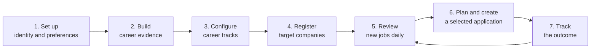

# AI-Driven Job Search: User Experience Journey

**Status:** Draft experience specification aligned to lean personal MVP
**Version:** 0.5
**Date:** 2026-08-28
**Related specification:** [Product Specification](product-spec.md)
**Technical design:** [System Design](system-design.md)
**Architecture guide:** [Project Architecture and Data Guide](project-architecture-guide.md)

## 1. Purpose

This document describes how using AI-Driven Job Search should feel from the user’s perspective.

It explains:

- what you do;
- what the system does;
- what you see;
- what decisions you make;
- what artifacts are created;
- what happens when information is uncertain or a source fails.

This describes the intended Codex-first AI-Driven Job Search experience. Some
Claude-oriented commands exist in the inherited repository as useful workflow
references; the new product does not require Claude Code or an Anthropic
subscription.

### 1.1 Lean-MVP reading rule

The controlling MVP journey is setup, evidence, target-company monitoring,
daily review, selected-job resume preparation, and application tracking. Later
sections describing Gmail synchronization, dedicated interview/upskill
systems, supplemental portal orchestration, dashboards, or automatic strategy
calibration are retained as deferred reference designs and are not MVP
commitments. Codex may still help with those activities interactively.

## 2. Experience summary

The complete experience has seven stages:



You should not need to rebuild your profile for every job. Most daily use should be:

```text
Open daily report
→ review a small number of new jobs
→ choose Apply, Investigate, Save, or Skip
→ approve a resume evidence plan
→ generate and review a tailored resume for the selected job
→ submit it externally
→ record the outcome
```

The daily run does not pre-generate a complete resume for every match. It
creates lightweight fit/evidence plans for qualifying jobs, then spends full
application effort only after the user selects a role. Cover letters and
interview preparation remain available as direct Codex requests rather than
dedicated MVP subsystems.

## 3. Interaction model

The first interface is a conversation in Codex desktop or Codex CLI.

Example:

```text
Run my daily job search.
```

For a predictable explicit workflow, you may invoke a repository skill:

```text
$ai-job-daily
```

Codex calls the typed local CLI where deterministic state changes are needed,
then responds with a structured report and numbered actions.

You can respond naturally:

```text
Investigate 2 and 4. Skip 1 because I do not want advertising companies.
Prepare a resume plan for 3.
```

The product should support both:

- Codex skills for predictable workflows;
- natural-language follow-ups for judgment and adjustments.

## 4. Existing and proposed commands

### Available in the inherited repository as workflow references

```text
/setup
/expand
/scrape
/rank
/apply
/outcome
/gmail-sync
/interview
/upskill
/html-report
/notion-sync
/add-portal
/add-template
/reset
```

These slash commands are Claude-oriented labels. In Codex, they are referenced
through natural language or replaced by the skills below.

### Proposed Codex skills for AI-Driven Job Search

```text
$ai-job-setup
$ai-job-evidence
$ai-job-companies
$ai-job-daily
$ai-job-plan
$ai-job-apply
$ai-job-applications
```

The final implementation may combine some skills, but the user journeys and
approval boundaries should remain. Later examples such as `/daily` and
`/apply` are concise conceptual labels inherited from the source project; in
Codex, use the equivalent natural-language request or `$ai-job-*` skill.

Inherited `/gmail-sync`, `/interview`, `/upskill`, `/html-report`,
`/notion-sync`, and `/add-portal` workflows are not reimplemented as dedicated
lean-MVP services.

## 5. Journey 1: first-time setup

### Your goal

Tell the system who you are, what work you have done, what jobs you want, and what constraints matter.

### What you prepare

Place available material under `documents/`:

```text
documents/
├── cv/
├── linkedin/
├── diplomas/
├── references/
├── projects/
├── publications/
└── applications/
```

Possible sources:

- current and older resumes;
- LinkedIn export;
- project documents;
- architecture notes;
- performance reports;
- portfolio pages;
- GitHub repositories;
- papers and presentations;
- transcripts;
- reference letters;
- prior applications;
- prior interview feedback.

You do not need every source before starting. You can import more later.

### Your action

```text
/setup
```

### What the system does

1. scans available document categories;
2. explains what it found;
3. offers document import, CV import, or interview mode;
4. extracts identity, experience, skills, goals, and constraints;
5. identifies conflicts and missing fields;
6. asks focused follow-up questions;
7. proposes profile changes;
8. waits for approval before writing.

### What you see

```text
Setup source inventory

CVs: 3
LinkedIn exports: 1
Project documents: 14
Publications: 2
References: 1
Past applications: 8

Recommended path: Document import

Potential conflicts:
1. Company A title: "Software Engineer II" vs "Senior Software Engineer"
2. Project X latency result: 31% vs 37%

Nothing has been written yet.
```

### What you decide

- choose the import path;
- resolve factual conflicts;
- confirm your preferred wording;
- provide missing constraints;
- approve the profile update.

### Questions you should expect

- Where are you legally authorized to work?
- Do you require sponsorship?
- Which locations are acceptable?
- Are remote, hybrid, and on-site roles equally acceptable?
- What is your minimum compensation?
- Which role tracks are highest priority?
- Which industries are excluded?
- What work energizes you?
- What work do you want to avoid?
- What would help your future career or business?

### Success state

The system confirms:

```text
Profile setup complete

Identity and constraints: complete
Experience history: complete
Career tracks: needs review
Career evidence: 64 proposed claims need verification
Search configuration: draft

Recommended next action:
/evidence review
```

## 6. Journey 2: building the career evidence library

### Your goal

Turn project A–Z into structured, reusable evidence rather than one long resume.

### Your action

```text
/ingest documents/projects
```

or:

```text
/evidence review
```

### What the system does

For every project, it proposes:

- project identity and dates;
- problem and context;
- your role;
- project components;
- technologies;
- architecture and methods;
- claims;
- metrics;
- source evidence;
- confidentiality;
- role-track relevance.

### Example project view

```text
Project: Distributed Feature Store
Status: Needs review

Components
1. Online serving API
2. Streaming ingestion
3. Consistency and backfill logic
4. ML feature definitions
5. Monitoring and operational tooling

Proposed claims
C-104  Designed the online serving path...
       Evidence: architecture.md, section 3
       Confidence: High

C-105  Reduced p99 feature retrieval latency by 37%...
       Evidence: benchmark-results.xlsx, row 42
       Confidence: Medium
       Issue: baseline workload needs confirmation

C-106  Led the full project...
       Evidence: not found
       Confidence: Low
       Recommendation: reject or rewrite ownership
```

### What you can do

```text
Approve C-104.
For C-105, the result was 34%, not 37%.
Reject C-106. I owned serving and backfill, not the entire project.
Mark the customer name confidential.
```

### What the system changes

- approved claims become eligible for applications;
- corrected claims retain source and change history;
- rejected claims cannot appear in final resumes;
- confidential facts receive wording restrictions;
- unverified claims remain in the review queue.

### Evidence review modes

```text
/evidence review projects
/evidence review metrics
/evidence review conflicts
/evidence review confidential
/evidence show C-105
```

### Success state

```text
Career evidence status

Projects: 24
Project components: 117
Approved claims: 186
Needs review: 12
Rejected claims: 9
Confidential claims: 18

All claims currently eligible for resume generation have evidence.
```

## 7. Journey 3: configuring career tracks

### Your goal

Teach the system that different roles require different versions of your professional story.

### Your action

```text
/tracks
```

### What the system shows

```text
Career tracks

1. Senior Backend Software Engineer       Priority: High
2. Senior Distributed Systems Engineer    Priority: High
3. Senior Full-Stack Software Engineer    Priority: Medium
4. Senior AI Software Engineer            Priority: High
5. Machine Learning Engineer              Priority: High
6. Applied Scientist                      Priority: Medium
7. Machine Learning Researcher            Priority: Medium
8. Quantitative Researcher                Priority: Explore
9. Quantitative Developer                 Priority: Explore
10. Biotech Researcher                    Priority: Explore
11. Biotech Software/ML Engineer          Priority: Explore
```

### Track detail

```text
/tracks inspect distributed-systems
```

The system shows:

- title synonyms;
- required capabilities;
- seniority expectations;
- strongest existing evidence;
- current evidence gaps;
- preferred resume structure;
- default project pool;
- ranking weights;
- excluded roles.

### Example

```text
Senior Distributed Systems Engineer

Strong evidence:
- replication and recovery
- high-throughput data processing
- latency and capacity work
- production reliability

Weak evidence:
- formal consensus implementation
- storage-engine internals

Default project strategy:
- 2 production systems
- 1 infrastructure/platform project
- 1 differentiating research or ML-systems project
```

### What you decide

- enable or disable tracks;
- assign priority;
- change track definitions;
- pin preferred projects;
- mark gaps as acceptable or blocking;
- choose target industries.

### Success state

Every enabled track has:

- a strategy;
- a candidate project pool;
- evaluation weights;
- at least one baseline resume plan.

## 8. Journey 4: registering target companies

### Your goal

Monitor official company career sites instead of depending on delayed aggregator listings.

### Your action

```text
/companies add https://company.example/careers
```

### What the system does

1. identifies the company;
2. detects its ATS or career platform;
3. locates the official job source;
4. checks access restrictions;
5. asks for company priority;
6. asks which role tracks and locations matter;
7. runs a test fetch;
8. creates an initial baseline.

### What you see

```text
Company source detected

Company: Example AI
Careers page: https://company.example/careers
Official source: Ashby
Board: example-ai
Access: Public structured API
Open jobs: 42
Relevant jobs in baseline: 6

Choose priority:
A — check every 2 hours
B — check every 4–6 hours
C — check daily
```

### Your response

```text
Priority A.
Watch backend, distributed systems, AI SDE, and MLE.
Locations: US remote, San Francisco, Seattle, New York.
```

### Baseline behavior

The first 42 jobs are stored as existing baseline jobs. The system does not call them newly released.

```text
Baseline complete

42 active jobs recorded
6 match enabled tracks
0 labeled new

New jobs will be detected relative to this snapshot.
```

### Company-list view

```text
/companies list
```

```text
Target companies

Company       Priority  Source       Health     Last checked
Example AI    A         Ashby        Healthy    12 minutes ago
Company B     A         Greenhouse   Healthy    1 hour ago
Company C     B         Workday      Degraded   5 hours ago
Company D     C         Custom       Blocked    Yesterday
```

### Failure behavior

If a source cannot be monitored:

```text
Company D source could not be monitored automatically.

Reason: Careers site requires authenticated browser access.
No bypass was attempted.

Fallback options:
1. Company email alert
2. Manual check link
3. LinkedIn supplemental discovery

Freshness confidence will remain low for fallback results.
```

## 9. Journey 5: initial company baseline

### Why this is a separate experience

When monitoring starts, the system does not know when existing jobs were originally released.

### What you see

```text
Initial watch baseline — 2026-07-24

Companies checked: 34
Healthy sources: 29
Degraded sources: 3
Blocked sources: 2

Active jobs recorded: 1,842
Relevant baseline jobs: 73
Verified new jobs: 0

The 73 relevant jobs are available for exploration, but none are being
described as newly published today.
```

You can still inspect and apply to baseline jobs. They are simply labeled honestly.

## 10. Journey 6: daily review

### Your goal

Review the newest relevant opportunities without visiting every company site.

### Your action

```text
/daily
```

### What the system does before showing the report

1. checks scheduled company sources;
2. compares each result with its previous snapshot;
3. detects new, changed, closed, reopened, and reposted jobs;
4. verifies relevant jobs on the official source;
5. searches supplemental portals;
6. deduplicates cross-source results;
7. applies hard filters;
8. classifies each job by career track;
9. ranks promising jobs;
10. builds the report.

### Report overview

```text
Daily Job Intelligence — 2026-07-25

Source health
Healthy: 31
Degraded: 2
Blocked: 1
Failed: 0

Today
Verified new: 7
Newly detected, date unknown: 3
Recently updated: 4
Likely reposts: 2
Closed since prior run: 9

After filters
Recommended: 5
Investigate: 3
Excluded: 4
```

### Verified-new section

```text
1. Senior Distributed Systems Engineer — Company A

Source: Official Ashby career board
Published: 10:42 AM
First detected: 12:01 PM
Freshness: Verified new
Freshness confidence: High

Track:
- Distributed Systems 82%
- Backend 18%

Overall opportunity score: 88
Score confidence: High

Why it ranks highly:
- replication and recovery experience
- strong latency and operational evidence
- role owns a new storage platform
- compensation and location pass

Important gaps:
- no direct Raft implementation

Artifact ready: T1 resume evidence plan
```

### Newly detected section

```text
2. Senior Backend Engineer — Company B

Source: Official Lever board
First detected: 8:04 AM
Detection window: 12:00 AM–8:04 AM
Original publication time: Not exposed
Freshness: Newly detected, date unknown
Freshness confidence: Medium
```

### Repost section

```text
3. Machine Learning Engineer — Company C

LinkedIn date: 3 hours ago
Official source first seen: 2026-06-18
Description similarity: 98%
Requisition ID: unchanged
Freshness: Likely repost

The role remains open and can still be considered.
```

### Your possible responses

```text
Apply to 1.
Investigate 2.
Save 4.
Skip 3 because it looks stale.
Skip 5 and remember that I do not want ad-ranking roles.
```

### What those actions mean

| Action | Result |
|---|---|
| Apply | Starts evidence mapping and resume planning |
| Investigate | Runs deeper company/team research |
| Save | Keeps the job in a watch list |
| Skip | Removes it from the active queue |
| Wrong track | Requests reclassification |
| Duplicate | Merges it with another job |
| Not interested | Records a personal preference for later calibration |

## 11. Journey 7: investigating a job

### Your goal

Understand the opportunity before spending time on an application.

### Your action

```text
Investigate job 2.
```

### What the system researches

- exact responsibilities;
- team and reporting context;
- company products and market;
- company durability signals;
- compensation;
- culture evidence;
- engineering or research maturity;
- work-content quality;
- career leverage;
- future-business leverage;
- work authorization;
- open questions.

### What you see

```text
Opportunity investigation

Fit: 81/100 — High confidence
Company outlook: 78/100 — Medium confidence
Culture/team: 70/100 — Low confidence
Career leverage: 91/100 — High confidence
Future-business leverage: 85/100 — Medium confidence

What is known:
- team owns the real-time data platform
- role includes architecture ownership
- compensation range meets threshold

What is inferred:
- likely high operational responsibility

What remains unknown:
- manager quality
- on-call frequency
- new development versus maintenance ratio

Recommended questions:
1. How much of the roadmap is new platform development?
2. What are the current scale and reliability bottlenecks?
3. How is on-call ownership divided?
```

### Your decision

- proceed;
- save pending answers;
- call or contact the employer;
- skip.

## 12. Journey 8: resume evidence planning

### Your goal

Approve what will appear in the resume before the system writes it.

### Your action

```text
/plan 1
```

### What the system does

1. extracts each job requirement;
2. retrieves matching approved claims;
3. scores project components;
4. optimizes requirement coverage and page budget;
5. identifies gaps;
6. proposes a resume structure.

### Requirement-to-evidence view

```text
Requirement: Design highly available distributed services
Priority: Required

Evidence:
- Project A / Replication and recovery component — Exact, strong
- Project B / Multi-region service component — Exact, strong
- Project K / Distributed training component — Adjacent, medium

Selected:
- Project A, Claim C-104

Reason:
Strongest production evidence with measurable reliability impact.
```

### Proposed project set

```text
Resume plan — Distributed Systems

1. Project A
   Components: replication, recovery, failure testing
   Requirements covered: 4

2. Project B
   Components: high-throughput API, observability, capacity planning
   Requirements covered: 3

3. Project Z
   Components: streaming architecture, backpressure
   Requirements covered: 2

4. Project K
   Components: distributed ML training
   Purpose: differentiating evidence

Not selected:
- Project C: strong ML relevance, weak systems relevance
- Project M: redundant with Project B
- Project N: high explanation cost for one-page budget

Remaining gap:
- no direct consensus-protocol implementation
```

### Your possible responses

```text
Approve.
Replace Project K with Project C.
Keep Project K but remove the distributed-training metric.
Use three projects, not four.
Pin Project Z for all distributed-systems resumes.
```

### Important boundary

No final resume is generated until you approve the evidence plan, unless you explicitly enable automatic T2 drafts for a defined class of jobs.

## 13. Journey 9: generating and reviewing an application

### Your action

```text
/apply 1
```

### What the system does

1. starts from the approved evidence plan;
2. composes resume bullets from approved claims;
3. applies the correct role-track baseline;
4. addresses job requirements;
5. drafts a cover letter when requested;
6. sends the drafts to a fresh reviewer;
7. applies only grounded reviewer suggestions;
8. compiles PDFs;
9. visually inspects layout;
10. checks ATS-readable text;
11. produces a provenance report.

### Progress updates you should expect

```text
Application preparation

[complete] Evidence plan approved
[complete] Resume draft
[complete] Reviewer pass
[in progress] PDF layout verification
[pending] ATS text-layer verification
[pending] Final user review
```

### Reviewer result

```text
Reviewer summary

Pass with changes

Applied:
- strengthened ownership language using approved claim C-104
- moved reliability evidence before ML infrastructure
- removed redundant Python keyword

Rejected:
- suggestion to claim direct Raft implementation
  Reason: no supporting evidence

Selection objection:
- Project K contributes differentiation but uses 18% of project-section space
  Decision needed: keep or replace?
```

### Your decision

If a reviewer raises a meaningful selection objection, the system pauses.

```text
Keep Project K.
```

### Final result

```text
Application ready for review

CV: 2 pages — PASS
Cover letter: 1 page — PASS
ATS text extraction — PASS
Contact details — PASS
Required keyword coverage — 12/14
Genuine unsupported gaps — 2
Unsupported claims — 0

Files:
cv/main_company_role.pdf
cover_letters/cover_company_role.pdf
applications/company_role/provenance.md
```

### Provenance view

You can inspect:

```text
/evidence trace "Reduced p99 latency by 34%"
```

The system shows:

```text
Resume bullet
→ Claim C-105
→ Project A / Online serving component
→ benchmark-results.xlsx, row 42
→ User approved 2026-07-24
```

## 14. Journey 10: submitting the application

### Your action

You open the employer’s official application link, inspect the final documents, and submit outside the system.

The product does not click Submit.

### After submission

```text
/outcome Company A
```

The system asks:

```text
Did you submit this application?

Submission date:
Channel:
Referral/contact:
Which CV version was submitted?
Was a cover letter submitted?
```

### Result

The exact submitted artifacts are copied into the application archive and cannot be overwritten by later edits.

## 15. Journey 11: application tracking and Excel export

### Open the application tracker

```text
/applications
```

You see one row per job application:

```text
Application tracker                                         2026-08-25

ID       Company     Job                         Applied      Current stage       Next event / action       Result
A-0042   Company A   Senior Distributed SDE      2026-08-12   First interview     Aug 31, 10:00 PT          —
A-0038   Company B   ML Research Engineer        2026-08-04   Recruiter screen    Follow up Aug 28          —
A-0031   Company C   Senior Backend Engineer      2026-07-29   Closed              —                         Rejected
A-0027   Company D   Applied Scientist            2026-07-21   Offer               Decide by Sep 5           Offer
```

The tracker represents applications, not just companies. If you apply to two jobs at Company A, they appear as two separate records.

You can:

- search by company or title;
- filter by career track, status, result, location, or date;
- sort by the next deadline, latest activity, compensation, or fit score;
- open an application’s complete timeline;
- see the exact resume and cover letter submitted;
- add a status, event, deadline, contact, result, salary, or note;
- export the current view or the full history.

### Update a status or milestone

```text
/applications update A-0042
```

You can type a compact update:

```text
First interview on 2026-08-31 at 10:00 AM PT.
Interviewer: Jane Doe, Engineering Manager.
Prepare system-design examples by 2026-08-29.
```

The system shows the proposed change:

```text
Application A-0042 — Company A — Senior Distributed SDE

Add milestone:
  Type: First interview
  Starts: 2026-08-31 10:00 America/Los_Angeles
  Contact: Jane Doe — Engineering Manager

Set next action:
  Prepare system-design examples
  Due: 2026-08-29

Current stage will change:
  Applied → First interview

Approve?
```

Once approved, the tracker updates the current stage and appends the milestone to the timeline. It does not erase the original application date or any recruiter-screen history.

Supported events and results include:

- recruiter screen;
- hiring-manager screen;
- assessment;
- technical interview;
- onsite or final round;
- rejection;
- offer;
- hired;
- offer declined;
- withdrawal;
- no response.

You can still use the shorter command:

```text
/outcome A-0042
```

### Record an offer

```text
/applications update A-0027
```

Example:

```text
Offer received August 24.
Base salary: USD 210,000/year.
Target bonus: 15%.
Equity: USD 240,000 over four years.
Sign-on: USD 30,000.
Decision deadline: 2026-09-05.
```

The tracker stores advertised compensation, recruiter-stated compensation, expectations, and the actual offer separately so one never overwrites another.

The application row shows the concise current result, while the offer detail retains base salary, bonus, equity, sign-on, benefits notes, currency, and the decision deadline.

### Export to Excel

```text
/applications export xlsx
```

The system asks whether to export:

```text
1. Current filtered view
2. All applications and full history
```

The generated workbook contains:

| Sheet | Contents |
|---|---|
| `Applications` | One row per application and its current status |
| `Timeline` | Every application, interview, follow-up, and result event |
| `Offers` | Salary, bonus, equity, sign-on, and decision deadlines |
| `Lookups` | Status definitions and export metadata |

Dates and monetary values are exported as usable Excel values, not decorative text, so you can sort, filter, calculate, and make your own charts.

Spreadsheet round-trip is deferred. A future extension may allow permitted
cells to be edited and previewed before import, but the lean MVP treats SQLite
as authoritative and Excel as an export.

### Deferred: Gmail-assisted status

The inherited design proposed:

```text
/gmail-sync
```

If this integration is reactivated later, it would present proposals:

```text
Proposed application updates

1. Company A — Interview invitation
   Source: "Next steps for Senior Distributed Systems Engineer"
   Email date: 2026-08-02
   Confidence: High

2. Company B — Possible rejection
   Source: "Update on your application"
   Confidence: Medium
   Reason: message language is ambiguous

Nothing has been written.
```

You respond:

```text
Approve 1. Skip 2.
```

Only approved changes are written.

## 16. Deferred journey: dedicated interview-preparation subsystem

### Your action

```text
/interview Company A
```

### What the system uses

- exact submitted resume;
- exact submitted cover letter;
- job snapshot;
- selected claims;
- prior interview notes;
- company research;
- STAR story library.

### What you receive

```text
Interview prep — Technical screen

Likely topics
1. Replication and failure recovery
2. Capacity and latency tradeoffs
3. Production incident ownership
4. Cross-team architecture decisions

Project deep dives
- Project A: architecture, decisions, failure modes, metrics
- Project B: scaling path, bottleneck, observability

Known gap
- No direct Raft implementation

Bridge answer
"I have not implemented Raft itself. My closest production experience is..."

Questions to ask
...
```

You can start a mock interview or request a focused project deep dive.

## 17. Deferred journey: automatic outcome-driven improvement

### When it happens

After enough applications have meaningful outcomes, the system proposes calibration.

### What you see

```text
Strategy calibration proposal

Evidence window:
18 applications
7 recruiter screens
4 technical interviews
1 offer

Observed patterns:
- Distributed-systems applications using Projects A + Z:
  5 applications, 3 screens
- Full-stack applications:
  4 applications, 0 screens
- Referral channel:
  4 applications, 3 screens

Confidence: Low to medium
Reason: sample size remains small and company quality varies.

Proposed changes:
1. Raise distributed-systems track priority.
2. Do not change full-stack weighting yet.
3. Surface referral opportunities more prominently.

No changes have been applied.
```

### Your decision

```text
Approve 1 and 3. Reject 2.
```

The system versions the strategy change so earlier application decisions remain reproducible.

## 18. Journey 14: periodic routine

### Daily

```text
/daily
```

Expected time:

- 5–15 minutes to review the report;
- more only for jobs you investigate or apply to.

### Weekly

```text
/companies health
/report weekly
/applications
/outcome followup
```

Review:

- broken company sources;
- saved jobs;
- open applications;
- upcoming deadlines;
- scheduled interviews and assessments;
- offer decision deadlines;
- quiet applications.

### Monthly

```text
/report monthly
/upskill
/evidence review pending
/tracks
```

Review:

- application funnel;
- role-track performance;
- recurring gaps;
- stale evidence;
- company-watch priorities;
- changes in career goals.

## 19. Fast paths

### You already have a job URL

```text
/plan https://company.example/job/123
```

The system imports, verifies, evaluates, and builds the evidence plan without waiting for the next daily run.

### You want only a fit evaluation

```text
Evaluate this job but do not generate documents.
```

### You want to use an existing track resume

```text
Create a T2 draft from my MLE baseline. Do not generate a cover letter.
```

### You want to add one project

```text
/ingest documents/projects/new-project.md
```

### You want to monitor one new company

```text
/companies add <career-url>
```

## 20. Approval gates

The product must pause at these points:

| Stage | Why approval is required |
|---|---|
| Profile conflict | User is the factual authority |
| Claim approval | Only verified claims may enter final applications |
| Confidential wording | User controls disclosure |
| Track strategy changes | Changes affect many future decisions |
| Resume evidence plan | Project selection materially changes positioning |
| Reviewer selection objection | Requires narrative judgment |
| Final application | User reviews before submission |
| Email-derived status | Avoid corrupting application history |
| Outcome calibration | Sparse data must not silently change strategy |
| External sync | Personal data could leave the machine |
| Reset/delete | Destructive action |

## 21. Error and recovery experience

### Official company source fails

```text
Source degraded

Company: Company C
Last successful check: 2026-07-24 10:00 AM
Failure: Page structure changed

Jobs are not being reported as unchanged.
Fallback: LinkedIn supplemental search
Fallback freshness: Low confidence
```

### Posting disappears during application preparation

```text
Posting closed during preparation.

Last verified active: 9:14 AM
Verification failed: 2:31 PM

The draft has been preserved.
Choose:
1. Stop
2. Continue for networking/outreach
3. Verify manually
```

### Evidence conflict appears during drafting

```text
Draft paused

Metric conflict:
34% in approved claim
37% in older CV

The approved claim is currently authoritative, but the conflict must be
resolved before finalization.
```

### PDF toolchain is unavailable

```text
Draft complete, verification incomplete

LaTeX compiler: unavailable
PDF layout: not checked
ATS extraction: not checked

Artifact status: T2 draft, not T3 final
```

### Workflow is interrupted

The system should resume from the last completed stage:

```text
Resume application preparation?

Last completed: Reviewer pass
Next stage: PDF compilation
No source or draft changes detected.
```

## 22. Trust and transparency experience

Every important conclusion should show:

- fact versus inference;
- source;
- source date;
- confidence;
- missing information;
- required user decision.

Examples:

```text
Published today — High confidence
Source: Official Ashby `publishedAt`
```

```text
First detected today — Medium confidence
Original publication time not exposed by official Lever source
```

```text
Culture appears collaborative — Low confidence
Inference based on public material; target-team evidence unavailable
```

```text
Direct Kubernetes experience — Unsupported
Not included in resume
```

## 23. Files and artifacts you should expect

```text
career evidence
├── source records
├── projects
├── project components
├── claims
├── metrics
└── evidence references

career strategy
├── role tracks
├── search preferences
├── company watchlist
└── ranking weights

job intelligence
├── company source definitions
├── source health
├── run history
├── posting snapshots
├── normalized jobs
└── daily reports

applications
├── resume plan
├── tailored CV
├── cover letter
├── provenance report
├── submitted versions
├── application tracker
├── milestone timeline
├── compensation and offers
├── Excel exports
├── interview prep
└── outcome timeline
```

Exact storage paths will be decided during system design.

## 24. What “good” feels like

After setup, you should experience:

- fewer job pages to inspect manually;
- confidence that target companies are monitored directly;
- a clear distinction between genuinely new and merely reposted jobs;
- rankings that explain strategic value, not only keyword fit;
- project selections that differ sensibly across career tracks;
- no surprise claims in final resumes;
- the ability to trace every bullet to evidence;
- a small number of high-quality application decisions;
- less repeated resume rewriting;
- an application history that improves future judgment.

The product should feel like a careful personal career analyst and application editor—not an uncontrolled application bot.

## 25. Your normal operating experience

Once onboarding is complete, the expected routine is:

```text
Morning or evening:
1. Open /daily.
2. Review 3–8 recommended jobs.
3. Investigate uncertain opportunities.
4. Choose one or two jobs worth application effort.
5. Approve each resume evidence plan.
6. Review the final verified artifacts.
7. Submit externally.

As events happen:
8. Record outcomes or approve Gmail proposals.
9. Use /interview for active processes.

Periodically:
10. Review company-source health.
11. Review the funnel and skill gaps.
12. Approve strategy calibration when evidence is sufficient.
```

That is the intended end-to-end user experience for AI-Driven Job Search.
